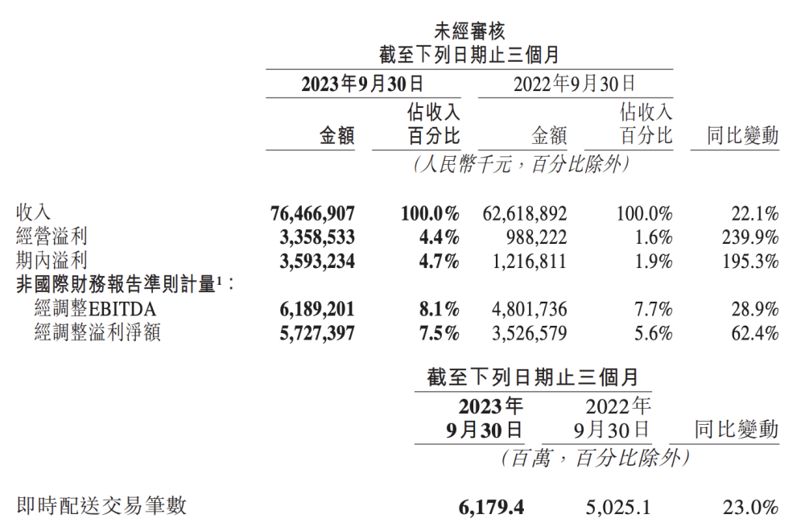

# 美团第三季度营收746.7亿元 同比增长22%

腾讯科技讯 11月28日消息，美团第三季度营收764.7亿元，同比增长22%，预估760.1亿元。

第三季度调整后息税折旧及摊销前利润61.9亿元，同比增长29%，预估71.3亿元。

第三季度调整后净利润57.3亿元，同比增长62%，预估52.9亿元。

第三季度净利润35.9亿元，预估29.2亿元。

第三季度营业利润33.6亿元，预估31.6亿元。

第三季度新业务收入187.8亿元，同比增长15.3%，预估192.3亿元。

第三季度核心本地商业收入576.9亿元，同比增长24.5%。

截至三季度末，年活跃交易用户数、年度活跃商家数和用户购买频率均创下历史新高，即时配送总订单量达到62亿笔，同比增长23%。其中，餐饮外卖日订单峰值于本季度突破7800万单，美团闪购日订单峰值突破1300万单。

“得益于在服务零售和商品零售的持续创新与投入，本季度美团业务继续取得了稳健增长。”美团CEO王兴表示，“我们将继续执行‘零售+科技’的公司战略，通过科技赋能生活服务各行业的数字化转型，助力本地实体经济，为广大消费者和从业者追求美好生活贡献更多力量。”

