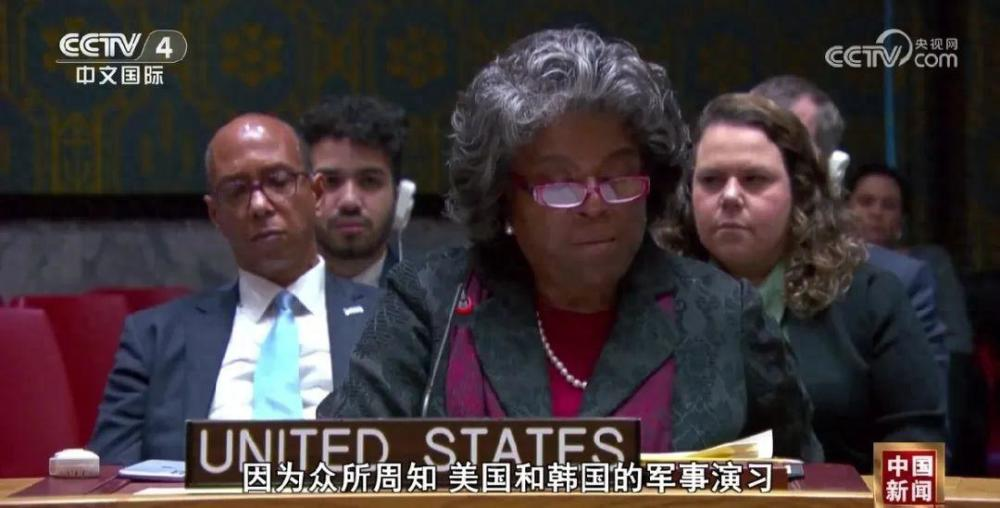
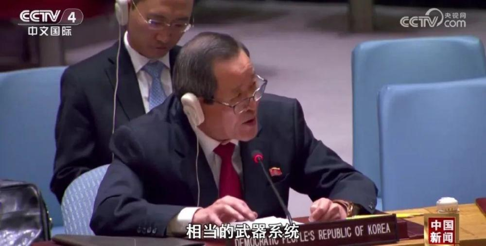
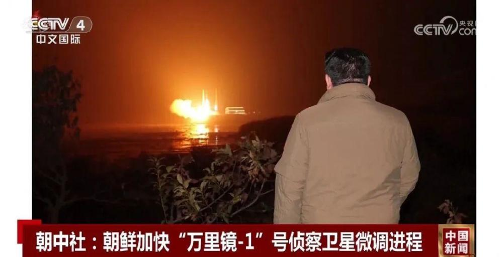

# 美朝代表罕见交锋！

据朝中社27日报道，朝鲜国家航空航天技术总局平壤综合管制所当日说，朝鲜侦察卫星“万里镜-1”号的微调进程正在加快，旨在比原计划提前1至2天完成。同一天，在联合国安理会的一次会议上，美国和朝鲜常驻联合国代表就朝鲜发射侦察卫星展开激烈争论。路透社称，这是双方在公开场合下一次罕见的直接交锋。

_美国常驻联合国代表 托马斯-格林菲尔德_

朝鲜声称这是自卫行为，但这种自卫行为并不存在。因为众所周知，美国和韩国的军事演习是常规的、是防御性的，我们通过提前宣布演习的日期和活动有意降低风险，追求透明度，这都不同于朝方所为。

_朝鲜常驻联合国代表 金星_

一个好战的一方——美国，正在用核武器威胁我们。作为另一方——朝鲜，我们有合法权利发展、试验、制造和拥有与美国已经拥有或正在开发的武器系统相当的武器系统。

就在朝美常驻联合国代表在安理会交锋的当天，朝中社报道，朝鲜国家航空航天技术总局平壤综合管制所27日表示：朝鲜侦察卫星“万里镜-1”号的微调进程正在加快，旨在比原计划提前1至2天完成。朝中社援引朝鲜外务省负责国际机构的副相金仙景的话说，朝鲜发射侦察卫星是“合法且正当行使防卫权”。报道称，朝鲜劳动党总书记、国务委员长金正恩对侦察卫星运行准备工作的顺利进行表示满意。据朝中社此前报道，金正恩日前多次到国家航空航天技术总局平壤综合管制所视察侦察卫星运行准备情况，并察看卫星拍摄的图片。

朝鲜国家航空航天技术总局21日晚成功发射“万里镜-1”号，卫星顺利进入轨道。该机构说，“万里镜-1”号将经过7至10天微调程序后，自12月1日起正式开始执行侦察任务。

来源：CCTV4《中国新闻》

