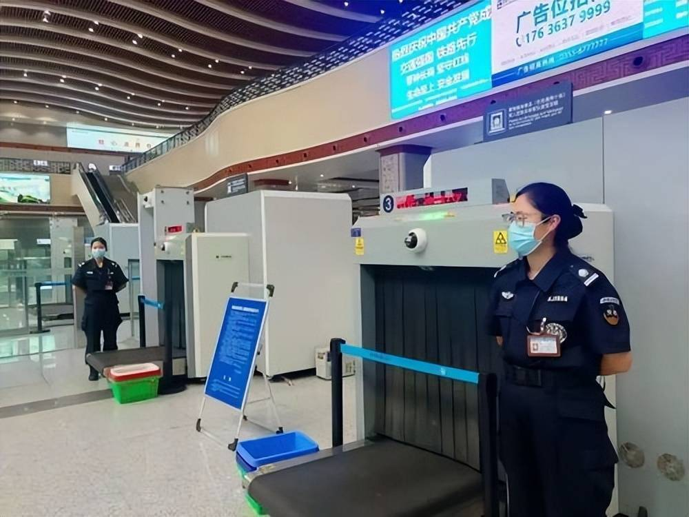

# 胡锡进：我们城市里的安检过度普及了，这是非常巨大的资源浪费

我们城市里的安检过度普及了。除了机场安检肯定是全球最严的之一，中国火车站、地铁站都设安检。另外保安也很多，很多城市的公交车上有安全员。还有，中国城市里的隔离栅栏特别多，有些广场进出要刷身份证，进入一些大学要登记，甚至要预约。

这是非常巨大的资源浪费。尤其是，最近十多年中国社会治理取得很大进展，重大安全风险，比如新疆暴恐得到根本遏制，社会福利等公平建设，比如扶贫也取得很大成就，社会治安呈总体向好改善之势。

在社会面越来越安全的情况下，安检、保安队伍的逆势扩充以及各机构对安全的加码投入是不合时宜的。当然了，在公共交通领域普遍设置安检的确会增加一些人的安全感，也会有部分人乐见安检在地铁等交通线上的普及，但是必须指出，这当中的实际安全收益与巨大付出是不成比例的，安检过度增多也加剧了一些城市地铁的亏损。世界的经验是，单独通过增加安检来提高公共交通的防犯罪安全不是好办法，这是一个社会综合治理的大课题。我们的社会不应进一步引导公众形成“越安检越安全”的不切实际期待，一个显而易见的情况是，世界绝大多数国家的地铁站不设安检，印度首都新德里的地铁也有安检，但是其治安情况和发生恐袭的潜在风险与中国完全不可同日而语。

 _印度部分地区进入商场也需要安检_

中国的坏人显然不能说比世界绝大多地方更多，更不能说我们的社会治安更差。中国的犯罪率，尤其是恶性犯罪率远低于美国等西方主要国家，而在一个相对安全的社会里大动干戈编织更多起到心理安慰的安检网，它的效果难免会有些畸形。

有人说，多搞安检，四处设卡，能够促进就业。如果有哪个地方真这么想，无疑走的是“就业邪路”。

恐怕还是“怕出事”“怕担责”的心理过度蔓延发酵使然，形成了各地社会安全领域从众、攀比和莫名其妙的形式主义规范。维稳加码一定得是有效的，有现实针对性的，现在国家和社会都好好的，怎么一进地铁火车站，那些安检非要告诉我们正在经历一个很不安全，一刻都不能放松警惕的世道呢？

建议国家搞一拨专项整治，把没必要的安检和保安多撤些，把城市里过多设置的栅栏也尽量拆除，把很多场所的预约制能取消也取消了。我们的社会需要有必要的承受力，基层治理如果也追求绝对安全，反而会把社会的免疫力破坏了，使集体心理变得脆弱，这对国家从长远看一点好处都没有。

