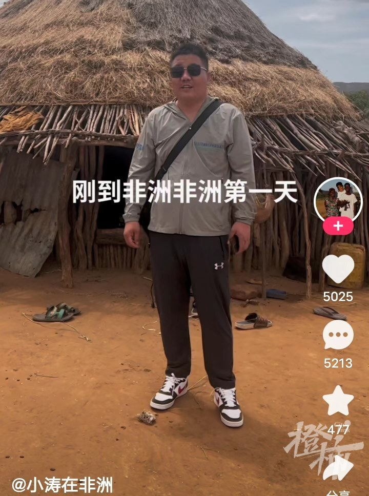
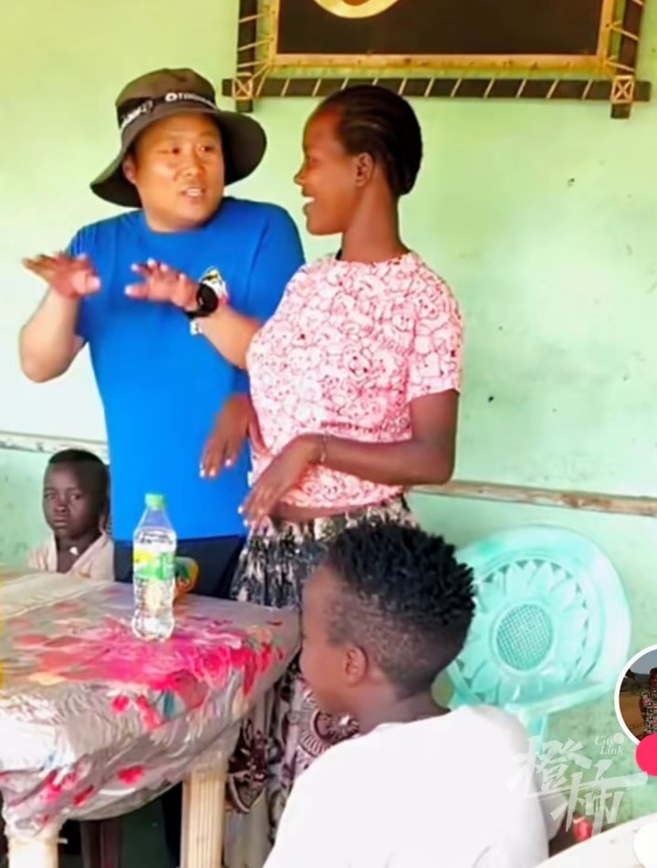
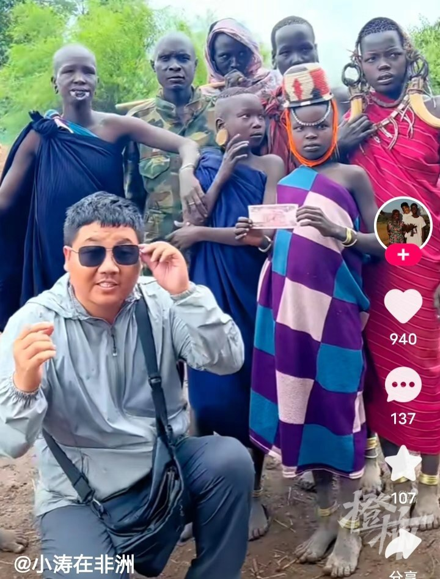
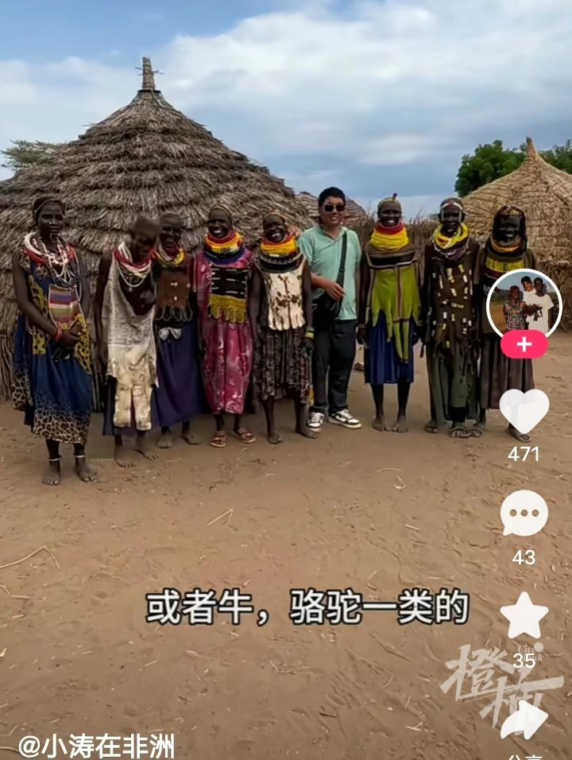
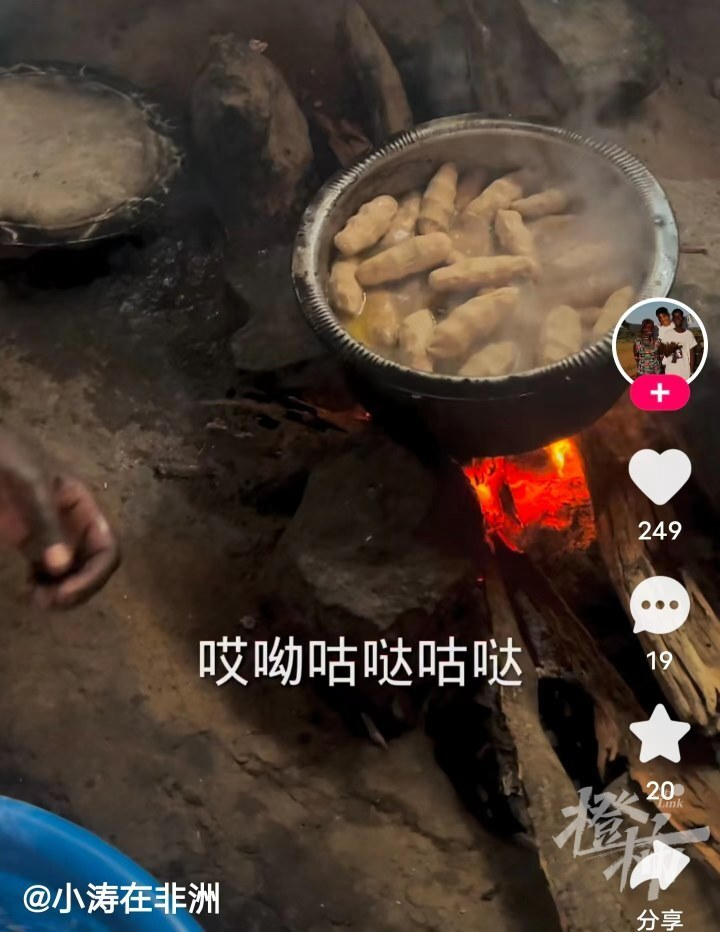

# 视频博主“小涛在非洲”遇害：在非洲做视频才3个多月，刚攒起7万粉丝

11月28日，视频主播“小涛在非洲”在埃塞俄比亚遇害的消息，受到了全网关注。

据小涛朋友介绍，小涛是于当地时间26日遇刺的。当时小涛在5楼大厅睡觉，嫌疑人看到小涛身边的手机就顺手牵羊，小涛发现后和嫌疑人扭打，最后被嫌疑人用刀捅伤致死。有人描述说小涛身上有7处刀伤。

小涛在非洲的账号此前有6.4万粉丝，获赞4.6万，目前“小涛在非洲”快手账号的粉丝数量已经增至7.0万，获赞数也升至5.2万。

目前在各大视频平台上，有大量博主组建团队拍摄视频创业，小涛也是其中的一员。

38岁的小涛今年8月在非洲埃塞俄比亚组建团队并开始拍摄业务，录制的视频内容是一些当地人的原生态生活。

小涛曾经走进埃塞俄比亚的当地部落，和当地的年轻人和孩子一起互动，带着观众们认识非洲当地部落最原始的衣着，饮食和生活。

他还实地探访埃塞俄比亚本地人是如何烹煮当地一些著名美食的，并与自己的团队成员和当地人一起载歌载舞。

刚到非洲时，他还曾经夸赞过非洲的蓝天白云是如此的漂亮。还笑称刚来非洲的第一天就有人给自己介绍对象。

仅仅3个多月的非洲生活，从视频的记录来看小涛的被晒黑了很多。

从不少非洲视频博主的拍摄内容中可见，在非洲拍摄生活视频虽然能够吸引大量的粉丝，但是困难也非常多。

水土不服和非洲当地糟糕的卫生情况是其一，不管是小涛的视频还是其他非洲生活博主的视频，都可以看到大量苍蝇蚊子等昆虫飞舞，各种流行性疾病在非洲也缺少特效药，对于这些视频博主来说是一个非常大的威胁。

很多非洲生活类博主的视频中，当地的饮食和生活想要适应都非常不易。非洲当地人卖东西时抬高价格，卖东西不找零，都是经常发生的事情。甚至有一些视频博主在家里都雇佣一队当地人当保镖，来保障安全。

另外，非洲大部分地区治安环境较差。以这次小涛遇害事件为例，仅仅是为了一部手机，就闹出了人命。不过，从目前曝光的视频画面来看，嫌疑人似乎不是非洲当地人，也是一副背包客的打扮。

此事发生之后，大量小涛的粉丝都在网上发表了自己的意见。

网友世界机器人称：有的主播在非洲是要安排好几个当地部落保镖的，在外一定要注意安全。

网友漫漫悠则表示：在国外确实需要注意安全，很多国家用手机拍照都要小心。

网友丘风林则认为这种情况要多宣传，提供风险意识，并希望小涛能够一路走好。

网友Innocence银阁分享了自己父母的经历：我爸妈在埃塞5、6年了，我爸手机被抢过，我妈被偷过，别头铁去追，我妈同事就去追了，断了3根肋骨。

不少网友都认为，在外面，尤其是国外遇到危急时刻，财物都是次要的，生命最要紧。别杠，要啥都给，只要人生别被伤害就行。

关于小涛在埃塞俄比亚遇害的事件，我们将继续关注事态的发展。

