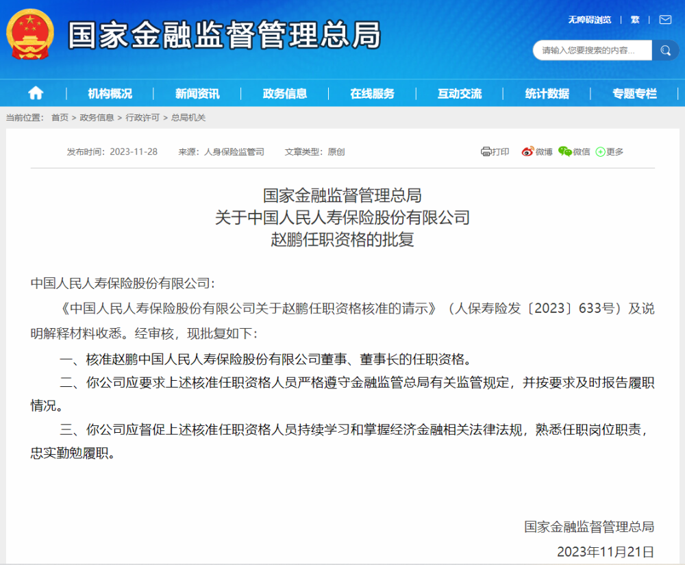
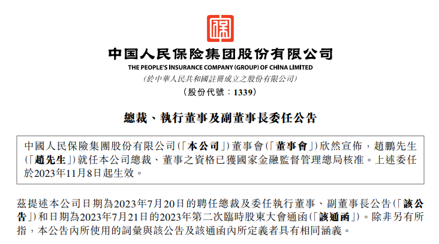

# 赵鹏任人保寿险董事长资格获核准

**【大河财立方消息】** 11月28日消息，国家金融监督管理总局批复，核准赵鹏中国人民人寿保险股份有限公司董事、董事长的任职资格。

值得注意的是，中国人民保险集团11月9日在港交所公告，赵鹏就任公司总裁、执行董事、副董事长和董事会战略与投资委员会委员的资格已获国家金融监督管理总局核准。上述委任于2023年11月8日起生效。

责编:陈玉尧 | 审核:李震 | 监审:万军伟

