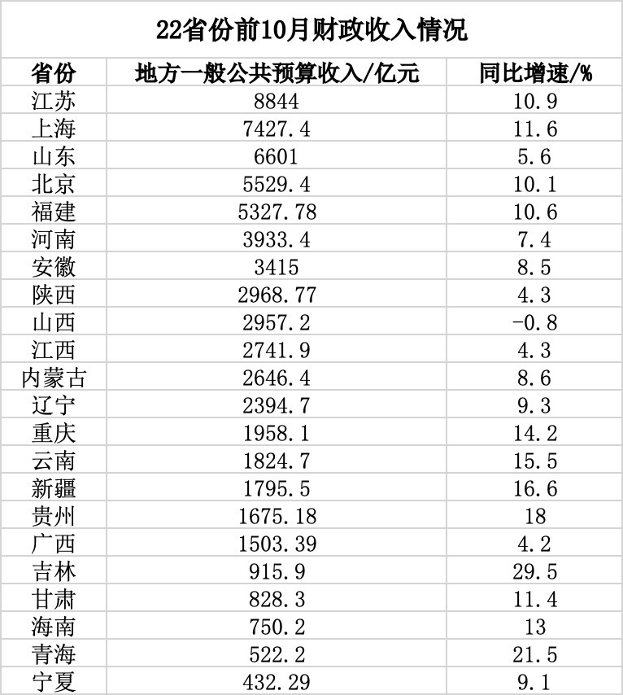

# 超20省份公布前10月财政账本：财政收入恢复明显，卖地收入仍旧下滑

近来，多地陆续公布今年1-10月财政收支数据。澎湃新闻不完全统计，截至目前，已有至少22个省份公布前10月财政“账本”，21个省份一般公共预算收入实现正增长，其中，12个省份实现两位数增长，目前，吉林（29.5%）增速最高。

_22省份前10月财政收入情况。制表：澎湃新闻；数据来源：各地财政厅。_

收入普遍正增长，12省份两位数增长

财政部数据显示，前10月，地方一般公共预算收入101624亿元，同比增长8.8%；地方一般公共预算支出185463亿元，同比增长4.2%。

从已公布前10月财政收支数据的22个省份看，21个省份财政收入实现正增长，其中，12个省份实现两位数增长，分别是吉林、青海、贵州、新疆、云南、海南、重庆、上海、甘肃、江苏、福建、北京，以西部省份居多，吉林以29.5%的增速暂时领跑。

地方财政收入快速增长一个不可忽视的因素是去年同期低基数影响。中国财政科学研究院研究员王泽彩近日在接受媒体采访时表示，一方面，财政运行和经济增长相互促进，经济总体回升向好，带动财政收入较快增长。另一方面，与去年实施大规模增值税留抵退税政策、集中退税较多、基数较低等因素有关。

吉林省财政厅表示，财政收入增速较高，主要是上年国家实施大规模增值税留抵退税政策，集中退税较多，拉低基数，以及年初以来各地多渠道盘活资源资产的拉动。

能源大省山西是目前唯一前10月财政收入下滑的省份，这其中既有去年同期高基数影响，也有今年以来煤炭价格回落的因素，数据显示，去年前10月，山西一般公共预算收入2981.0亿元，增长24.3%。

从前10月一般公共预算支出看，22省份绝大多数支出大于收入，上海、福建财政收入大于支出。从前10月一般公共预算支出增速看，除云南、广西等外，基本为正增长，从支出项看，民生支出是各地财政支出的重要领域，显示出地方财政对民生的保障力度。

企业所得税有所下降、卖地收入继续下滑

分析22个省份前10月税收情况，虽然多地税收增速可观，但增值税收入是增长较快的税种，这更多与去年同期留抵退税较多、基数较低有关，企业所得税、个人所得税等在一些地方出现下滑。

比如，北京1-10月企业所得税完成1312.0亿元，下降1.6%，北京市财政局分析，下降主要是受部分企业2022年经营利润下降、汇算清缴企业所得税收入减少影响；个人所得税完成648.1亿元，下降0.9%，这主要是由于贯彻落实3岁以下婴幼儿照护、子女教育、赡养老人等专项附加扣除政策，个人所得税汇算清缴退税同比增加，拉低增幅。

经济大省江苏、山东也出现类型情况。1-10月，江苏省企业所得税1360亿元，下降4.7%，个人所得税426亿元，下降1.7%；山东省企业所得税705亿元，下降13.2%。

房地产依然拖累地方收入。受市场低迷影响，多个省份卖地收入仍在下滑。

财政部数据显示，前10月，全国政府性基金预算收入43795亿元，同比下降16%。分中央和地方看，中央政府性基金预算收入3417亿元，同比下降5.8%；地方政府性基金预算本级收入40378亿元，同比下降16.8%，其中，国有土地使用权出让收入34992亿元，同比下降20.5%。

从公布了相关数据的省份看，不少地方政府性基金收入出现下滑，比如，江西前10月政府性基金收入1197.8亿元，同比下降16.7%，其中国有土地使用权出让收入984.5亿元，同比下降21.6%；重庆前10月政府性基金预算收入完成900.6亿元，下降15.8%，其中国有土地使用权出让收入完成789.3亿元，下降19%；海南前10月政府性基金收入281.1亿元，下降11.9%。

但吉林省、内蒙古自治区等地政府性基金收入出现正增长，其中，吉林的增幅较大——1-10月，吉林政府性基金预算收入336.4亿元，同比增长42.9%，其中国有土地使用权出让收入276.7亿元，同比增长43.4%。内蒙古前10月政府性基金预算收入329.8亿元，比上年增加13亿元，增长4.1%。

