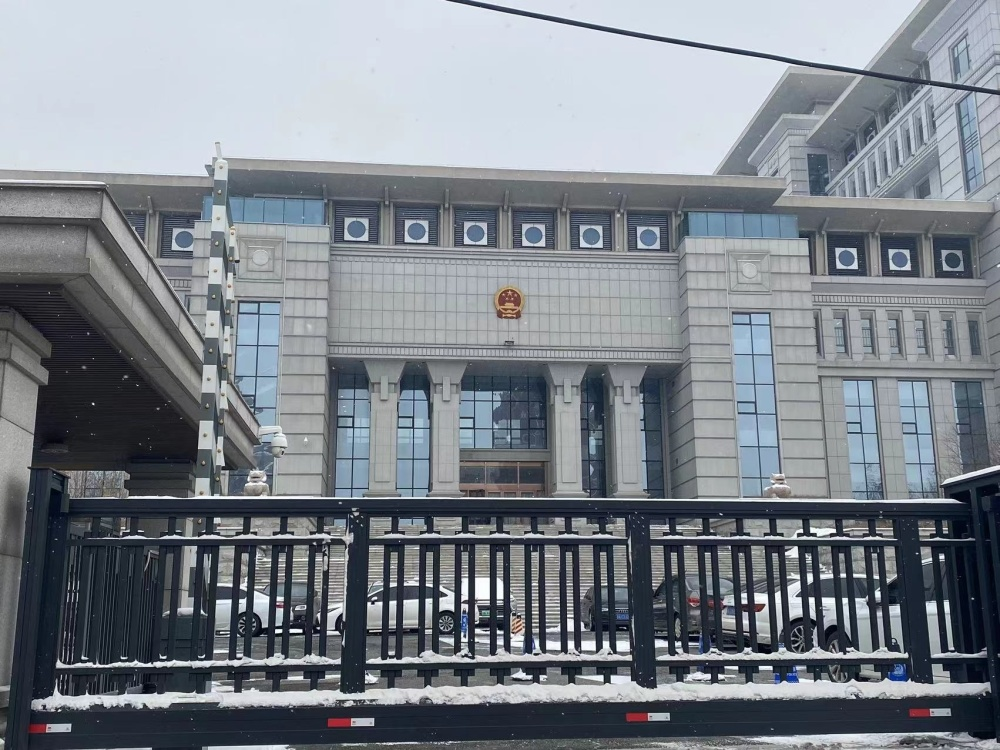
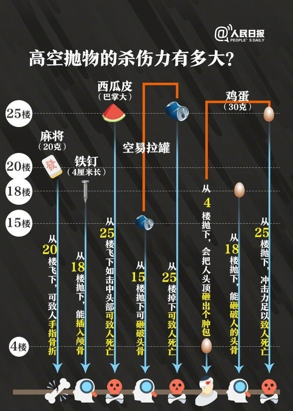

# 长春高空抛物案庭审现场：被告人庭上供认不讳，嘴角上扬面露微笑

11月27日，“6·22长春高空抛物案”在长春市中级人民法院开庭审理。

庭审现场，受害人娄某的姐姐一度情绪失控，激烈指责被告人。“妹妹死后，我们全家的生活都乱套了。”

公诉方及受害人代理律师均主张判处被告人周某死刑。在辩论环节，双方律师就证据中的《法医精神病鉴定书》是否可采信展开辩论。

历经近三小时的庭审，法院宣布择期宣判。

今年6月，被害人娄某在长春市红旗街万达广场小吃街购买小吃，晚间22时许至23时许，被周某从高楼抛下的砖头砸中身亡。

根据周某的供述，他出生于2000年，初中文化，曾在上海某精神病医院接受治疗。因生活不顺，原本计划跳楼自杀，但又不敢，于是选择高空抛物，希望被判死刑。

“我没有具体目标，砸死谁算谁。长春是随机选的，我在附近住，知道这里（注：案发地）繁华人多。”他说。

_11月27日，长春市中级人民法院。 图/九派新闻 杨臻_

**【1】被告人：恐惧自杀，欲砸死人后获死刑**

经查，周某到达长春后，多次更换住宿地点，并屡次从高处往楼下扔杂物。

长春市人民检察院起诉书显示，被告人周某不仅在6月22日21时至23时许先后投掷8块砖头，还在6月17日16时30分许和22时40分许，依次向楼下投掷2桶5升桶装水，3罐未开封可乐，这两次集中投掷均有人员被砸中，并受伤。

周某称，打死人的砖头他是在32楼的楼道内捡拾的，当时他一共抱了4块砖头，在33楼的天台处将其一块一块向楼下人群砸去。听到楼下有叫喊声后，他又回到32楼，将剩余的2块砖头从门口窗户扔了下去。随后他便乘坐电梯下楼，看见一个女孩倒在地上，地上有血。

“我认为那个女孩是被我打死的，我就沿着万达下面往派出所方向走，到了派出所我就和公安人员说我打死人了，公安机关就把我控制住了。”周某说。

关于作案动机，周某此前曾向公安机关供述，他想自杀，但是没有勇气，便想把人打死后，让公安局抓到，判其死刑，“我生活不顺利，赚不到钱，仇恨社会。我（原本）想把身上的钱花光后跳楼，但是又害怕，不敢跳，所以想到了用砖砸人。我没有具体目标，砸死谁算谁。长春是随机选的，我在附近住，知道这里（注：案发地）繁华人多。”

庭上，周某对这一情况供认不讳。

周某是江西人，出生于2000年，案发时未满23周岁。庭审现场，他穿着一件圆领深色毛衫，身材瘦削，斜倚在栏前。面对审判长和公诉人询问时，他总是要思考好一段时间，再作回答或直接不回答。神情若有所思，却又不时嘴角上扬，表情作微笑状。

综合周某本人及其辩护律师的陈述，除父母外，周某也有一个亲妹妹。十几岁时，周某便辍学独自在外打工。其父亲与母亲分别在福建、安徽打工，周某从小十分封闭，长期不与家人生活、接触，很少打电话联系亲属，家人之前认为他是“性格内向”。

今年5月，周某称自己在上海一楼顶睡觉时，被人报警。警察将其带走后，送至医院做检查，随后便移交给上海市某精神病医院。周某说，在这家精神病院里待着“很无聊，每天就是躺着，吃几粒药”。

其间，周某曾吞食牙刷柄。对此，周某称：“在那边太难受了，我就是想出去，但是不让我出去。”

据周某讲述，入院后没多久，院方给他母亲打电话，随后母亲将他从精神病院带走，他也中断医治。

庭审当天，一位自称周某父亲的男子出席旁听席。他双手插兜，眉头紧锁，报完身份证号和联系方式后，未多说一句。

庭审结束后，周某父亲迅速离开。随后，九派新闻尝试致电，其电话显示已停机。

关于周某的行为是否属于“自首”，庭上，代理律师称，从形式上看，周某有投案自首的迷惑性，但实质与他犯罪目的是相吻合的，“他的目的在数次笔录里都没有变化，就是想打死人，然后被判死刑。”

因此，代理律师认为，周某去派出所的这一行为，是在执行“打死人后，通过执行死刑来结束他的生命的一个部分”。因此，代理律师主张本案中不应当认定周某有自首的情节。

**【2】受害人家属指责：你还笑，你就是个变态**

“妹妹去世后，我们的生活全乱套了。”提及妹妹，娄青泣不成声。

庭上，家属坚决要求周某死刑，“至今一个道歉都没有，家属也从未联系过我们。”

被害人娄某的姐姐娄青（化名）坐在代理席上，一度难以控制激动的情绪，她举着妹妹的照片指向被告人周某及其家属，“你也有妹妹，你们也有女儿，如果是她被人砸死了，你这种人是不是要把他们全家都杀光？”

面对周某有意无意地微笑，娄青愤怒地指责：“你还笑，你就是个变态。”

开庭前一个月，正是娄某28周岁的生日，“我们一家人在墓地上给妹妹过的生日。”

娄青告诉九派新闻，她老家在山东，父母务农，凭自己努力供两个女儿读书成人。妹妹从小就性格开朗，孝顺懂事。长大后，主动报名学习法律专业，原本在北京一家国有企业担任法务。按照原定的计划，妹妹也即将完婚，“她有一个很稳定的男朋友，本来对方都等着娶她回家的。”

原本，被害人娄某来长春来看望在读书的好友。6月22日当天下午，被害人到达长春，不料抵达当晚就遇害。

娄青回忆，临近6月22日24时，她便接到了妹妹好友打来的电话，随后便接上父亲，即刻赶往长春，“我和父亲到了殡仪馆，看到我妹妹白白净净的额头上，那么大的一个窟窿，真是心碎了。”

原本娄青和父亲想再瞒着母亲几日，但看到父亲来长春后十分煎熬，便告诉了母亲，“妈妈知道这个事后，都有轻生的念头。给妹妹买墓地的时候，妈妈也说，把他们的墓地一起买了，她想早点下去陪妹妹。”

至今，娄青依然不敢告诉奶奶，她的孙女已经意外去世，“奶奶在家总是说想妹妹了，什么时候回来看看。”每当这时，娄青的心都揪得疼。

比妹妹年长10岁的她，看待妹妹也像看待自己的孩子一样。前段时间，娄青的孩子在夜里突然大哭，她脱口而出喊出妹妹小名，并说“姐姐在这，姐姐在这”。喊出后，娄青才反应过来，这是自己的孩子，不是妹妹。

这趟出发来长春前，娄青5岁的孩子抱着她问：“妈妈，你到长春不会死吧，我不想你死，人为什么要死呢？”娄青擦了擦眼泪，手里攥着的纸巾湿了又干，干了又湿。

被害人的好友也十分难受，她在庭审现场数次低头啜泣，“我非常自责，当晚知道消息直接晕过去了。”

庭审当天，曾在6月17日被周某高空抛物砸伤的受害人小宋也参与旁听。她告诉九派新闻，自己在长春读书，事发当天在案发地附近健身，当时正在小吃摊前坐着吃饭，“突然一个东西掉下来，直接把我眼镜砸飞了，我当时都懵了。”

等小宋坐定一看，才发现是裂成碎片的可乐罐。好在她坐的地方距离跌落地还有一定距离，只是额头有擦伤，无生命危险。

小宋称，事发后好长一段时间，她都心有余悸，也不敢和父母多说，怕他们担心，“有段时间都不敢去那个夜市了，有心理阴影。”

**【3】焦点：被告人涉案时是否具备完全刑事责任能力**

庭审现场，辩护律师就证据中吉林省公安厅安康医院司法鉴定中心开具的《法医精神病鉴定书》提出了意见。

该份证据给出了周某精神状态无异议认定，认为其涉案时具备完全的刑事责任能力。同时周某的母亲、哥哥等亲属，和其监室室友等人作为证人，均证明其精神状态正常，具有工作和社交能力。

辩护律师认为，鉴定结论的主要依据，鉴定检材并不充分，鉴定方法不完善，鉴定结论应为无效。

其指出，相关证人的证词具有主观性，他们长期未与周某生活在一起，且其都不具备专业的医学知识，对精神分裂症的症状表现都不了解，无法做出客观判断。

另外，在客观依据中，有一份专门针对精神分裂症的检查报告，周某在此检查中的数值均存在严重异常，符合在临床中确认的患者患有精神分裂重疾病的条件。但最终的鉴定结果与分析，与该客观报告的结果相悖，因此，辩护律师认为鉴定结论错误。

对此，公诉人表示，在此份鉴定报告中，鉴定人所采用的依据，经其审查后认定其充分，没有法律依据规定该份鉴定意见不被采纳。

其认为，辩护律师针对证人证词的异议没有事实依据。关于检查报告中的异常数值，已结合临床分析，公诉人认为，相关鉴定机构和人员应当是注意到了相关研究的不同特质才给出的结论。

因此，公诉人提示法庭应当采信该份鉴定意见。

同时，代理律师补充道，鉴定结论由专业人士、专业机构作出，未经法定情形不得予以撤销，也不能重新启动鉴定程序。

**【4】律师解读：若案发时未处于精神病发病状态，需担责**

近年来，高空抛物的危害已多次在公众前面被强调。

据《人民日报》，从25楼往下抛掷，一枚30克的鸡蛋、一块巴掌大的西瓜皮、一个空易拉罐都可致人死亡。而在本案中，被告人周某犯案的楼层集中在33楼、32楼，抛掷的物品均为砖块、5升水桶、未开封易拉罐等重物。

 _高空抛物杀伤力。 图/人民日报_

九派新闻注意到，周某选择作案的地点位于长春市繁华地带，彼时正值夏季夜晚，人流量大，这也在一定程度上加强了人员伤亡的概率。

受害人家属称，后续还将追究涉事物业等相关机构、部门责任。家属称，涉事公寓物业为长春国信谦诚物业服务有限公司。据企查查消息，该公司成立于2023年1月18日，法定代表人为王佰林。

对于此案，河南泽槿律师事务所主任付建指出，中国《民法典》第一千二百五十四条明确规定：禁止从建筑物中抛掷物品。从建筑物中抛掷物品或者从建筑物上坠落的物品造成他人损害的，由侵权人依法承担侵权责任。

目前，中国高空抛物法律规定主要集中在刑法领域，对违法行为的处罚力度逐渐加强。但在实际执行过程中，对于高空抛物行为的预防、处罚力度以及受害者救济方面仍有待完善。

至于本案中关于被告人是否患精神疾病的争议，付律师指出，案件审理过程中，司法部门会依法对被告人进行精神疾病鉴定，以确定其在案发时是否具有刑事责任能力，鉴定过程通常是由具有专业资质的司法精神病鉴定机构进行。

如果鉴定结果显示被告人案发时确实处于精神病的发病状态，且无法辨认或控制自己的行为，那么根据法律规定，可以减轻或免除其刑事责任；反之，如果鉴定结果显示被告人案发时并未处于精神病发病状态，那么其需要承担相应的刑事责任。

此外，在类似案件中，事发地夜市、商场物业是否要承担赔偿责任也要根据案件情况而定。如果物业公司未采取必要的安全保障措施，比如未能及时清理可能导致高空抛物的杂物，或未能在小区内设置明显的禁止高空抛物标识，则会根据其过错程度及当事人受损程度，承担相应的赔偿责任。

九派新闻注意到，此前较为大众熟知的高空抛物案发生在2014年9月16日。当时在重庆一小区内，一名2岁多小女孩被楼上扔下的酸奶瓶砸中，当场昏倒，医疗费花费8万余元。经过历时两年多的取证审理，该案宣判448户居民都不能排除实施加害行为的可能性，每户向原告补偿360元。

**九派新闻记者 杨臻 吉林长春报道**

**编辑 曾金秋**

【来源：九派新闻】

