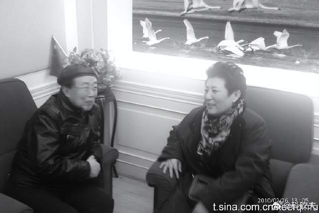
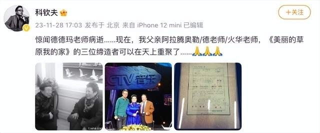
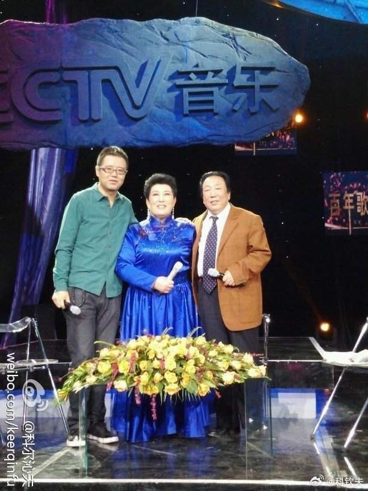

# 音乐人科钦夫发文证实歌唱家德德玛去世，代表作《美丽的草原我的家》

11月28日，科钦夫发文：“惊闻德德玛老师病逝……现在，我父亲阿拉腾奥勒/德老师/火华老师，《美丽的草原我的家》的三位缔造者可以在天上重聚了……”

公开资料显示，德德玛，中国蒙古族女中音歌唱家，国家一级演员。1947年出生于内蒙古阿拉善盟额济纳旗。代表作有《美丽的草原我的家》《草原夜色美》《草原上的风》。

**【来源：九派新闻综合当事人账号、公开资料】**

