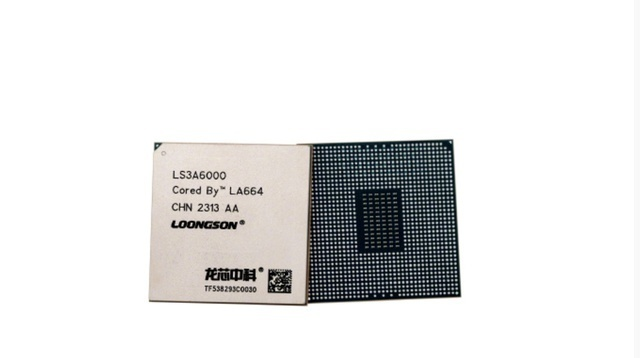

# 龙芯上新！无需依赖任何国外授权技术，新一代国产CPU正式发布

11月28日，新一代国产CPU——龙芯3A6000在北京发布。

据介绍，龙芯3A6000采用我国自主设计的指令系统和架构，无需依赖任何国外授权技术，是我国自主研发、自主可控的新一代通用处理器，可运行多种类的跨平台应用，满足各类大型复杂桌面应用场景。

它的推出，标志着我国自主研发的CPU在自主可控程度和产品性能方面达到新高度，我国自主研发CPU的性能达到国际主流产品水平。同时推出的还有打印机主控芯片龙芯2P0500，这是国内首款基于自主指令系统的打印机主控芯片，作为打印
/ 扫描整机中的核心控制部件，龙芯2P0500的研发成功将助力推动更多国产打印机走向市场。（总台央视记者任梅梅 赵迎晨）

**【来源：央视新闻】**

