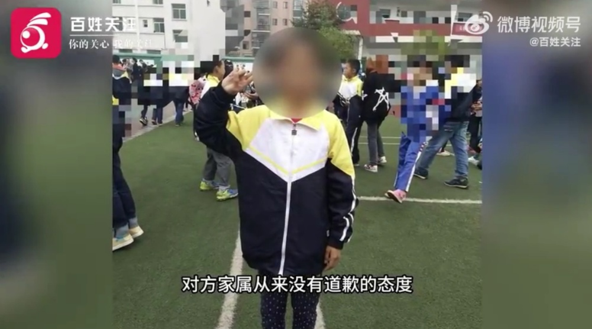
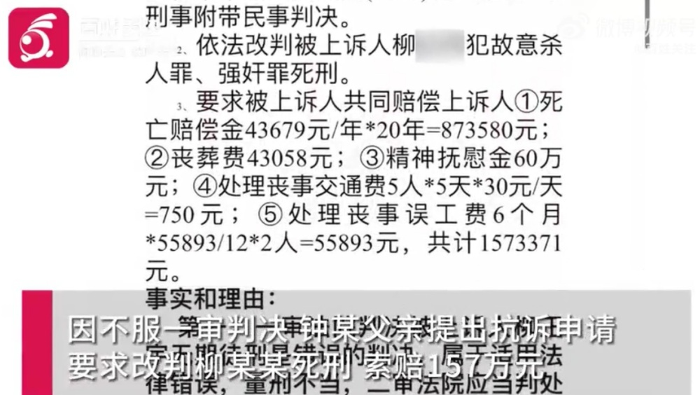
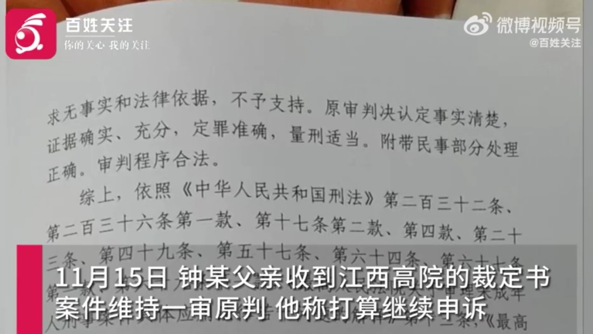

# 15岁女生被同学奸杀案二审维持原判：家属无法接受5.5万赔偿，将申诉

11月29日，据贵州广播电视台“百姓关注”报道，11月29日，记者从被同学强奸杀害的江西15岁女生家属处得知，案件经过江西高院二审，裁定维持原判。

2022年，柳某某浏览暴力色情小说后将居住同小区的同学钟某骗至家中，欲与其发生性关系遭拒；柳某某将逃至楼下的钟某拖回，砍其颈部数刀并实施猥亵。

死者姑姑钟女士称：“我们当然是坚持他能一命抵一命死刑，如果死刑，赔偿我们可以不要。”

2023年7月宜春中院以故意杀人罪、强奸罪判处柳某某无期徒刑，支付赔偿5.5万余元。

钟某家属提出抗诉和上诉，二审后江西高院做出维持原判的裁定。钟某父亲称打算继续申诉。

**【来源：九派新闻综合贵州广播电视台“百姓关注”】**

