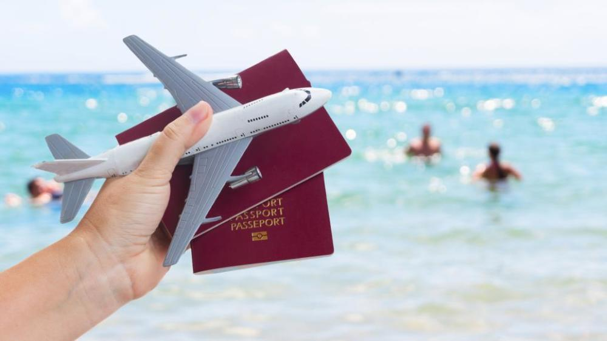

# 中国宣布面向六国免签政策后，有驻华大使希望欧盟成员国都享受此待遇

11月24日，外交部发言人毛宁宣布，为便利中外人员往来服务高质量发展和高水平对外开放，中方决定试行扩大单方面免签国家范围，对法国、德国、意大利、荷兰、西班牙、马来西亚6个国家持普通护照人员实行单方面免签政策。2023年12月1日至2024年11月30日期间，上述国家持普通护照人员来华经商、旅游观光、探亲访友和过境不超过15天，可免办签证入境。

这一消息发布后，包括马来西亚和法国在内的多个国家反应积极，并采取相应的免签举措，以回应中方的免签政策。

据新华社援引马来西亚当地媒体报道，马来西亚总理安瓦尔在11月26日表示，该国将从12月1日开始，对来自中国等国游客实施30天免签证入境措施。安瓦尔强调，马来西亚面向中国游客的免签举措旨在迎接马来西亚与中国建交50周年。同时，安瓦尔也向中国对马来西亚持普通护照人员试行单方面免签政策表示感谢。

马来西亚槟州旅游发展与创意经济行政议员黄汉伟表示，马方采取对等的免签政策，将使外国游客入境马来西亚更加便利，相信将有助于马来西亚本地旅游业的发展。

据报道，在马来西亚宣布将从星期五（12月1日）起，对中国游客实施30天免签证入境措施后，中国各大旅游平台的马来西亚旅游热度迅速上涨。截至目前，马来西亚旅游搜索热度环比上涨173%。马来西亚酒店搜索热度环比上涨112%。

11月24日，正在中国访问的法国外长卡特琳·科隆纳对中方向法国实行免签政策这一消息表示欢迎。她表示，中国面向法国的免签政策将极大地促进两国之间的人员往来。科隆纳在社交平台“X”（前推特）上写道：“王毅外长在我访华期间宣布了一个好消息！”
外交部长王毅与科隆纳会面时表示，“现在疫情的阴影已经消散，我们期待中法两国人民的互访、接触和交流有所增加”。

同时，法国政府于同日宣布，拥有硕士学位的中国人，无论其学位是在中国还是在法国获得，都可以向法国有关部门申请为期五年的旅行签证，条件之一是至少在法国学习过一个学期。有分析称，这项措施将便于中国学生在中法两国之间自由往返，并将吸引更多中国学生前往法国留学。

德国驻华大使傅融（Patricia Hildegard
Flor）于24日表示，中方的免签政策将为许多德国公民赴华旅行提供前所未有的便利。“我们希望中国政府能为所有欧盟成员国开放免签”，她在“X”上发帖称。傅融还表示，免签政策将提高本国公民的流动性，让中国和欧盟国家加强文化和经济关系。

德国工商会（DIHK）外贸负责人沃尔克·特雷尔称赞免签政策是“促进旅游业和经济交流的重要信号”。特雷尔在接受媒体采访时表示：“最重要的是，免签政策有利于德国的专业人员前往中国，方便德国企业在华进行机械维护，保证‘德国制造’的质量，并促进企业和人员交流。”

中国欧盟商会也表示，此举将有助于提振企业信心。在一份声明中，中国欧盟商会表示：“这表明中国相关部门正在采取措施促进民间交流，这是积极的信号。”

据新华社11月29日综合报道，意大利、荷兰、西班牙三国企业界和文化界人士纷纷对这一免签政策表示欢迎。意大利蒂维尼酒庄首席执行官蒂齐亚诺·马赞蒂表示，中方对意大利的免签政策将有助于意大利酒企商人前往中国，开展商务交流。

荷兰欧亚文化交流基金会创始人扬·斯塔普强调，免签政策将给荷兰文化艺术界人士前往中国旅行和工作访问带来极大便利，大幅促进两国人民的相互交流。

西班牙企业组织国际联合会总裁玛尔塔·布兰科认为，随着西中经贸、文旅、学术等各领域交流与合作深入展开，相关积极措施将鼓励西中民间更频繁的交往。

