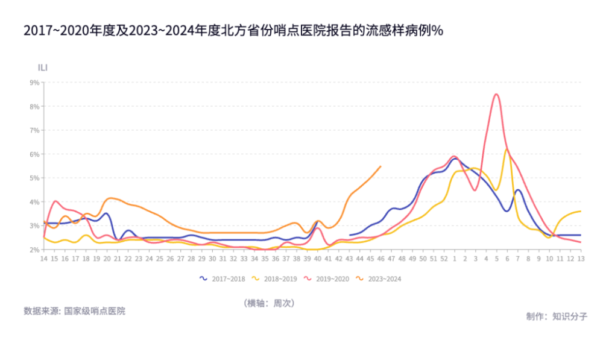

# 儿科爆满惊动世卫，成人病例增多，专家：真该担心的是将至的流感高峰

_图源：pixabay_

撰文 | 严胜男 李珊珊

制图 | 冀思宇

这个后新冠时代的第一个秋冬是从儿科门诊爆满开始的。

十一月的北京，儿科诊室水泄不通，候诊时间不是以小时来计算，而是半天、一天甚至是一整夜……从9月开始，一种几乎名不见经传的病原体——肺炎支原体的爆发式增长，拉开了这个不寻常的秋冬的序幕。

而今，曾吸引了世卫“密切关注”的儿童肺炎支原体峰值已过，然而，拥有更高传播能力、重症率和死亡率的流感正紧随其后。北京疾控中心发布的数据显示，北京法定传染病报告数自第41周以来已连续6周上升，并于第46周（11月13日－11月19日）突然加速，峰值一举超过5月份的新冠疫情（二阳）峰值。

坏消息还远不止如此，本轮感染的特征：多病原体叠加；多位专家表示：流感尚未达峰……这一切也许注定了，今年的秋冬，会是新冠疫情后呼吸道疾病面临的第一次大考。

神秘的支原体和提前的流感季，这一切究竟是什么原因，是否与免疫欠债有关？经历了三年新冠，今天，面对即将到来的秋冬呼吸道传染病高峰，我们的医疗系统是否足以应对？
以及，我们究竟该如何应对那个即将来到的流感高峰？

**惊动了世卫的儿科爆满**

候诊、化验、缴费、取药、输液，每一轮都是漫长的等待，露营车、婴儿手推车在无处下脚的大厅里撑起一片片坐卧的空间，或盖着塑料披风隔绝冷气与污染。目光所及的每一堵墙上都挂着粘钩，简易的输液室坐满了墙根儿……

在这个秋冬，爆满的儿科诊室上了各大平台的热搜，然而，即便是今天拥挤的儿科，也已经是资源调整过一轮的结果。首都儿科研究所附属儿童医院（简称“儿研所”）的新闻稿显示，今年9月下旬以来，呼吸道感染的患儿逐渐增多，单日接诊最高量为9378人次。出诊医生较以往增加86.36%，开辟第二输液留观区，输液座位比日常增加48.7%。市六院的改造为在走廊增加两排候诊座椅，将两张观察室改成输液室扩容。朝阳医院的公示则显示发热门诊值班医生由5名增至9名……

患儿却并未与医疗资源的扩增此消彼长，随着天气渐冷，就诊者像灌不满的水缸，水缸不断变大，但水流不见消退，源源不断。

一路向南，儿科的状况稍见改善，但总体而言应对起来也并不轻松。据“浙医在线”报道，今年暑期至今，浙大儿院就诊人数持续处于高位。尤其是进入八九月份以来，发热门诊人数远超历史同期。10月份的门诊数据超过40万，同比增长了9万多，相当于每天增加3000多号。据澎湃新闻报道，深圳市第三人民医院院长卢洪洲表示，自10月14日以来，深圳市第三人民医院儿童发热门诊进入接诊高峰，高峰期患者候诊时间长达3小时，儿科住院部“一床难求”，等待住院人数多达70余人。

中国北方儿科呼吸道传染疾病的“爆发”甚至也引发了世界卫生组织的“密切关注”，不过经过一番调查后，世卫在11月23日发布声明：在中国，并未检测到任何“异常或新型病原体”，目前在中国北方传播的呼吸系统疾病增多是由于“多种已知病原体”造成的。

多种呼吸道疾病发病率攀升，然而从数据上来看，却并非特别夸张。深圳市儿童医院小儿呼吸科主任郑跃杰告诉《知识分子》，目前本院儿科的就诊人数相比于疫情前确有增加，但重症的不多，可能是五六年一遇的水平。

并非创纪录的感染数据，却导致了具有国际影响的儿科医疗紧张的情况，对此，多位儿科医生向知识分子表示：目前的情况暴露的是儿科诊疗资源的现状。即便在2020年新冠疫情前，每年的秋冬，儿科爆满，儿科医生荒都会是个问题，而今年的另一个特殊情况则是：儿科的门急诊已经超负荷运行太久了。

许多医生表示，今年儿科的淡季格外短暂。由于去年12月新冠感染潮的出现，流感潮时间推迟至三月，八九月份又遇上3-7年周期性的支原体感染，再到十一月提前到来的流感。卓正医疗上海诊所儿科医生高峥表示，相比于3月甲流那波，这一次感染的时间跨度更长，从10月到现在一直处于高位，没有回落过，估计会持续到春节。

支原体和流感的交叠，让儿科几乎没有调整和喘息的时间，但好在支原体的流行在逐步下降。北京市疾控中心副主任、流行病学首席专家王全意21日在接受《新京报》采访时表示，最新的监测数据看，肺炎支原体已经进入下降阶段，北京儿童医院、首儿所等儿科医院的儿童门诊就诊病例中，肺炎支原体流行强度下降到了第4位。儿童前三位是流感、腺病毒、呼吸道合胞病毒。

王全意还表示，“由于多种病原体共同流行，可能会导致高位平台期延长，医疗需求也会增加，医疗机构要做好应对压力的准备”。另据中国疾控中心免疫规划首席专家王华庆26日新闻发布会上介绍，近期呼吸道感染性疾病在不同年龄群体间流行的主要病原体不同。1至4岁人群以流感病毒、鼻病毒为主，5至14岁人群以流感病毒、肺炎支原体、腺病毒为主，15至59岁人群以流感病毒、鼻病毒、新冠病毒为主，60岁及以上人群以流感病毒、人偏肺病毒和普通冠状病毒为主。

儿科爆满、多病原体叠加，在封锁三年之后，儿科缘何面临如此紧张的诊疗态势？免疫欠债是否存在？我们该如何应对远未抵达的高峰？

**今冬的呼吸道感染潮，**

**是因为免疫欠债吗？**

排队时间长、医院水泄不通，提起儿科的爆满，许多人会自然而然想起：由于疫情时限制社交距离，人们接触病原体少了，免疫出现了一个缺口，而恢复正常后病原体凭借缺口乘虚而入。它被赋予了各种各样的称呼，“免疫债”“免疫欠账”“免疫鸿沟”。

一些专家提示，所谓的“免疫债”并不是一个科学名词。一位免疫学家解释道，人类接触病原体抗原，只能增强其针对这种病原体的特异性免疫。在通常生活情况下，一般一次接触的某种病原体数量较少时，往往是通过非特异性的固有免疫方式清除或者防御。这种固有免疫是与生俱来的，与抗原刺激无关的。只是和遗传，年龄，性别，营养，代谢等等因素有关。

“具体到这次流感来说，2021年流行的是Victoria株，2022年流行的毒株多是H1N1，今年是H3N2，都是不同的毒株，这说明即使前两年得了流感，因为是不同的毒株，今年也会感染H3N2的。没有免疫缺口的话，也会有这么多人感染”。

前述免疫学家认为，儿童患病的增多主要是因为非特异性免疫的不足造成的。不同于前述免疫学家认为“免疫欠账”为伪概念，一位流行病学家告诉《知识分子》，“从公卫的角度讲，部分传染病的免疫欠账是存在的。但流感而言，由于每年的流行株都不同，因此基本不存在有免疫欠债”。平常大家所说的限制社交距离导致病原体接触减少可以理解为“人群免疫水平下降”，
他补充说道，“不能因为有免疫债，就感觉我们无能为力，等着自然流行，这样是不正确的”。

香港大学教授、病毒学家金冬雁则表示，“免疫债是有的，但应该比想像中少很多”，将《流感周报》今年的数据和疫情前2017年、2018年的曲线比较，现在的最高值尚未达到原来的峰值。

国外面对解除封锁后的第一波流感潮时亦有讨论，反对者的意见主要集中于“免疫欠债”应是一种群体概念，而非需要个体偿债。

据《金融时报》报道，萨里大学免疫学教授黛博拉·邓恩-沃尔特斯 (Deborah Dunn-Walters)
表示，“免疫系统并不被视为必须一直使用才能保持形状的肌肉，如果有的话，情况恰恰相反。”
她补充说，巨细胞病毒等常见病原体的持续攻击意味着免疫系统开始出现故障，并随着年龄的增长而减弱。她否认感染在某种程度上对健康有益的观点，并表示疫苗接种是增强人群免疫力的更安全的方法。

伦敦帝国理工学院免疫学家 Peter Openshaw
教授表示，免疫债务错误地表明“免疫是我们需要投资的东西，通过保护自己免受感染，我们正在积累最终必须偿还的赤字”。这对公共卫生来说不是一个好消息：如果按照这个想法得出合乎逻辑的结论，我们仍然会拥有开放的下水道并饮用被霍乱污染的水。”他补充说，推迟RSV感染实际上可能是有益的，因为该病毒对六个月以下的婴儿来说是最致命的。在全球五岁以下儿童中，五分之一的死亡是由呼吸道合胞病毒引起的。

**涌向塔尖、连续挂号的支原体肺炎**

当然，病毒学家、免疫学家以及流行病学家均曾向《知识分子》表示：免疫欠债对于当下儿科爆满的影响有限，那么，究竟是什么造成了今冬爆满的儿童医院？

一北京三甲医院院长认为，爆满的儿科实际上是医疗资源配置结构异常的产物。他表示，“北京医疗资源整体虽丰富，但能看儿科的却不多。北京二级及以上医院有281家，三级有118家比北京上海加起来还要多，但只有十几家医院看儿科，三甲专科医院只有两家。一些医院看门诊的就一个大夫，病床只有三五张。说起来特别残酷的一件事，儿科爆满从来不是今年一年的事情”。

上海某私立儿童医院院长介绍到，“北京儿科资源相对紧张，上海有四家三甲儿童医院，北京只有两家，而且上海的民营医疗供给也相对丰富”。

天津市卫生健康委副主任刘先夺23日在当日召开的新闻发布会上介绍，“今年冬春季流感高峰期提前，诊疗需求增加明显、供需平衡受到影响，再加上习惯优先选择儿童医院以及大型综合医院就诊，就出现了媒体报道的大医院局部的‘儿科爆满’现象”。

基层的救治能力弱阻碍着诊疗的下沉，“许多社区卫生院基本上遇到发烧的儿童都会提出转诊”，前述三甲医院院长介绍，“比如今天看100个发烧的，如果一个没有检查出来延误治疗最终导致死亡，连赔偿都赔偿不起，就连三级医院发热门诊都会出现这样的状况，更别提基层卫生院了”。

除了老生常谈的分级诊疗问题，支原体耐药，疾病治疗周期渐长，一轮轮人潮冲击的儿童医院，号源是一种紧俏的资源，恐慌加重了连续挂号和反复就诊。曾在新加坡公立医疗体系工作多年的高峥，举了新加坡国立大学医院儿科急诊的例子：在流感季来临的时候，急诊分诊台的护士会根据预分诊（Triage）制度对患者的情况提前做一些判断：如果患者生命体征稳定且没有出现脱水、惊厥等特殊的症状，就代表这个病不急，就要排在最末一档，而且要接受其他病情更紧急的其他患者随时“插队”。当然，候诊的同时会有护士根据孩子的体重先给退烧药。有些孩子的家长等候了3-4小时还没见到医生，这时候孩子烧也退了，干脆选择不继续等下去而先回家了。即便3-4小时之后能见到医生，这类病情简单的患儿通常也只能见到低年资的住院医，而且如果发烧时间不太长还未必给做抽血化验。这种情况下，急诊的工作人员也会给家长一张“优先复诊卡”并允许他们在未来的7天内随时来工作时段的普儿科门诊就诊，不用预约也尽量不用排队。其实只要看到孩子退了烧，无论是否见到医生，似乎来急诊的目的也基本达到了，家长当下就没那么焦虑了。“这是一颗定心丸，家长不会担心看不上病，有了这张门票很开心就回家去了，而且7天内再次回到门诊的其实并不多，毕竟80%的儿科发热性疾病都是自限性的”。一两次类似的经历下来，家长就不再着急带着刚刚开始发热第一天且病情简单的孩子往急诊跑了，而是会选择先在家给退烧药并观察一两天再决定是否就医。

至于反复提及的多种病原体共同流行，金冬雁介绍，混合感染一般占社区获得性肺炎的10%以下，不是今年特有的现象。即便查出来许多病原体，也不一定都起作用，许多是无症状。高峥表示，影响病程的主要还是一到两种病原体。

相比于往年，一中部省份三甲医院急诊科主任指出，“现在病原体检测手段比以前先进方便了许多，以前大医院应该都有，但是医务人员和患者对病原学检测的重视程度没有疫情后那样高”。他还记得孩子8月发热急诊入院，儿科医生当晚就取了痰液送检，很快就查出来2种细菌和支原体，然后针对性治疗。很快就出院了。检查费用只需要800多，自费。“以前这种方法和速度，基本上是不可能做得到的”。

该主任认为今年的多种病原体感染增多很可能与病原学检测增多有关。金冬雁和前述流行病学家也持相同看法。不过对于病原检测两人的态度却不一致。

金冬雁不赞成对门诊患者进行先检测后治疗，“像鼻病毒、腺病毒、肺炎支原体等很多人常年无症状携带，都送去检测的结果就是越测越多。其次，目前的检测也不一定就准。只要简单区分一下细菌还是病毒，进行试验性投药就好了。过分精细的检测会增加就诊时间和患者向大医院聚集”。

前述流行病学家表示，检测还是有必要做一下的，能够提高诊疗的精度，不过目前检测条件要求高，无法大规模实现。

活跃了几个月的儿童感染不见消减，而成人病例也逐步增多。前述急诊科主任介绍，“最近一两周急诊发热病人急剧增多，达总患者人数的1/3以上”。比起儿童，我们更需要的担心的是在即将到来的流感高峰中，如何保护老年人？

**真正该担心的，即将到来的流感高峰**

11月26日的国家卫生健康委新闻发布会上，中国疾控中心免疫规划首席专家王华庆表示：近期我国呼吸道疾病流行过程中监测的结果显示，目前监测到的病原主要以流感病毒为主。

儿童肺炎支原体的高峰已过，在此之后，我们最需要提防的是可能会到来的流感高峰。

国家流感中心发布的第46周《流感周报》显示，11月13日－11月19日，北方省份哨点医院报告的ILI（流感样病例）%为6.2%，高于前一周水平（5.0%），高于2020~2022年同期水平（2.5%、2.8%和
2.1%）；南方省份哨点医院报告的ILI%为6.4%，亦高于2020~2022年同期水平（3.7%、3.4%和3.0%）。南、北方省份流感病毒检测阳性率持续上升，以甲型H3N2为主，全国报告205起流感样病例暴发疫情，而前两年同期的数据分别为92起、19起。

作为传播能力在呼吸道传播疾病中排名前列的传染病，在去年秋冬欧美的呼吸道疾病“反弹”中，流感也一直是主力。德国埃森大学医学院病毒研究所教授陆蒙吉向《知识分子》提到，在去年秋冬的德国，流感感染占感染者的一半左右，呼吸合胞病毒占比约25%，新冠约4%……《自然》杂志11月27日发布的一篇文章亦曾提到：2022年11月，美国因流感住院的人数是自2010年以来同期最高的。

而在当下的中国，“流感的数据已经起来了，目前部分地区爬坡趋势非常明显”，一位资深感染科医生告诉《知识分子》。

这场从北向南的流感，何时会达峰？11月13日的新闻发布会上，中国疾控中心病毒病所国家流感中心主任王大燕曾表示，“一般在1月份左右达到峰值”，我国各地冬春季的流感流行季一般是从每年10月中下旬到次年的3月中上旬左右。不过，亦有受访专家向《知识分子》指出，达峰时间可能在12月中下旬就会发生。

“今年的流感来得偏早，不仅中国如此，美国的数据也提前了。也许是因为过去3年的新冠大流行影响了其他传染性疾病的传播规律，今年的全球流感高峰可能都会提前”，一位传染病专家这样解释道。

无论是否提前，流感高峰将在未来的几周或1-2月内到来几成定数，针对这种情况，金冬雁提到：流感的主要风险人群是老人，他们“易感”，且“重症死亡率高”。前述资深感染科医生同样担忧地提到，”流感的重症率和死亡率远高于之前的肺炎支原体，给医疗系统带来的冲击也完全不同。”

根据《柳叶刀》杂志2019年发布过的中国大陆流感相关的呼吸道疾病死亡数据：从2010年秋冬的流感季至2014年秋冬的流感季，中国平均每年有8.8万例流感相关呼吸系统疾病超额死亡，其中60岁及以上老人流感相关超额死亡数占全人群的80%。

即将到来的流感高峰所考验的是中国的三级诊疗体系——基层医院能否有足够的诊疗、检测能力，能否有充足的药物储备，并可以真正发挥作用？真正实现基层诊治轻症病人，将重症病人分流至上级医院？二级、三级医院是否可以真正实现对基层医院的帮扶，重症患者能否实现顺畅的转诊？

前述感染科医生表示：目前看来，有了今年3月流感季的经验，多家国内药企对流感药物加大了产能，中国的相关药物储备是充足的。如果能够真正实现分级分层分流救治体系，做到动态监测门急诊、发热门诊接诊量，在城区范围合理分配医疗资源，本轮流感季中，医疗系统的表现预计会优于刚刚过去的支原体肺炎面前的表现。

然而，准备工作的另一面，疫苗的情况，却仍令前述专家担忧不已。虽然已有大量证据显示，流感疫苗可以显著降低接种者罹患流感及相关并发症的风险，降低重症率和死亡率，并可以避免患流感后传染给他人，但中国的流感疫苗接种率，长期以来一直在个位数徘徊。

一份《中华预防医学杂志》在2022年发布的数据显示，2020-2021和2021-2022流行季我国总体接种率为3.2%和2.5%。与之相较，陆蒙吉告诉《知识分子》，去年，德国有基础疾病的成人流感疫苗接种率是35%，60岁以上的人群接种率达到43%。而根据昆山杜克大学疫苗交付研究创新实验室收集的数据，在美国，65岁以上老年人的流感疫苗接种率常年维持在60%以上，近年来已接近75%；而在英国，英国65岁以上老年人接种率自2004年以来一直维持在70%以上……

截止目前，今年中国的流感疫苗接种情况尚无官方公布的数据，不过，多位相关专家都向《知识分子》提到了预估数值——低于5%。

对于这样的接种比例，前述资深感染科医生表示：这样的疫苗接种率“对免疫屏障的构建意义非常有限”。也许正是考虑到这样的接种率，11月26日的国家卫生健康委新闻发布会上，王华庆特意呼吁公众根据卫生部门发布的疫苗接种建议，只要符合接种条件，都积极接种疫苗，以预防重症的发生。

**参考文献**

[1]https://www.nature.com/articles/d41586-023-03732-w#:~:text=Some%20nations%20grappled%20with%20flu,after%20viral%20infections%2C%20says%20Cowling.

[2]https://www.thelancet.com/journals/lanpub/article/PIIS2468-2667(19)30163-X/fulltext#

[3]赵宏婷, 彭质斌等. 2020-2021和2021-2022年度流感流行季我国流感疫苗接种政策和接种情况调查[J]. 中华预防医学杂志, 2022,
56(11): 1560-1564.

[4]https://www.ft.com/content/0640004d-cc15-481e-90ce-572328305798

