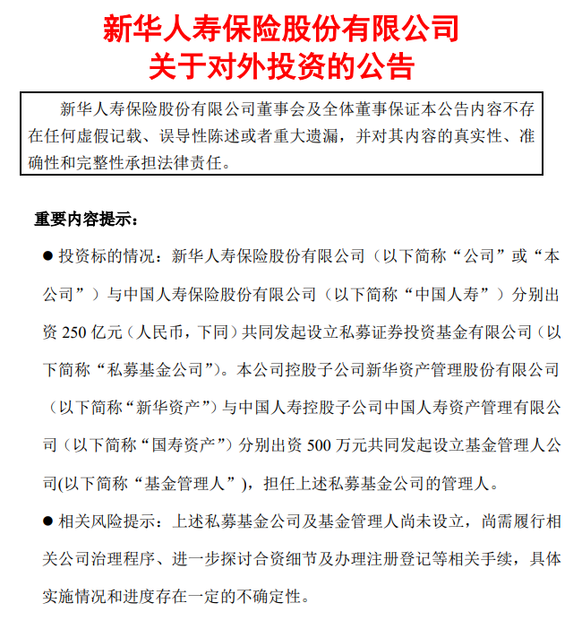
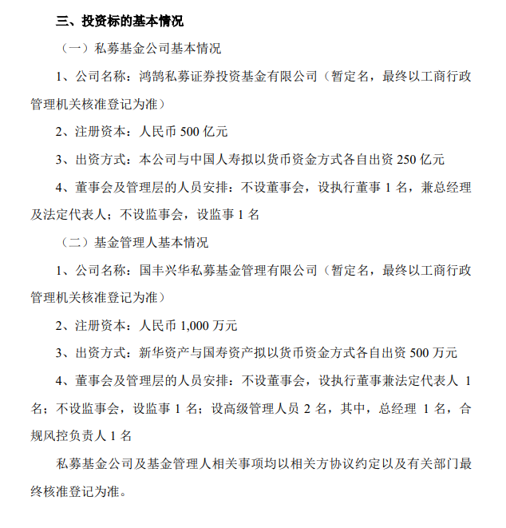

# 合计出资500亿！新华保险与中国人寿共同发起设立私募基金公司

财联社11月29日讯，今日晚间，新华保险发布对外投资公告称，公司与中国人寿分别出资250亿元共同发起设立私募证券投资基金有限公司。本公司控股子公司新华资产与国寿资产分别出资500万元共同发起设立基金管理人公司，担任上述私募基金公司的管理人。

根据公告，基金公司名称为鸿鹄私募证券投资基金有限公司（暂定名，最终以工商行政管理机关核准登记为准）。注册资本为人民币500亿元。

基金管理人公司名称为国丰兴华私募基金管理有限公司（暂定名，最终以工商行政管理机关核准登记为准），注册资本为人民币1,000 万元。

对于本次对外投资对公司的影响，新华保险在公告提到，本次投资事项符合国家相关政策以及未来公司整体战略发展方向，进一步增加符合公司投资策略的长期投资资产，优化保险资金资产负债匹配，提高资金使用效率，不会影响公司正常的生产经营活动，不会对公司正常生产经营产生重大不利影响，不存在损害公司及全体股东利益的情况。

（财联社）

