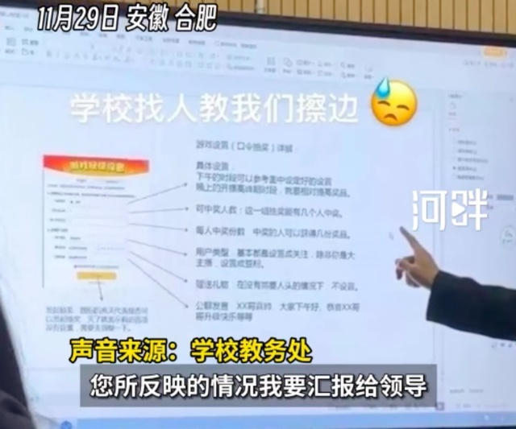

# 学院被指开设擦边直播课程，学生：包含“要礼物技巧、xx哥真帅”等，为必修课不能请假；学校：会调查

据新黄河“河畔视频”报道，11月29日，一则关于安徽文达信息工程学院的课程设置引起了广泛关注。

一名该校23级（专升本）播音主持专业的学生小莹（化名）爆料称，学校安排的一门课程竟然涉及擦边直播内容。

小莹透露，这门课程名为“专业认知实践”，学校竟然允许直播公司直接入驻校园，在校内的教学楼内搭建直播间。不仅如此，学校还安排直播公司的运营人员为同学们授课。

小莹表示，尽管同学们都对这门课程表示抗拒，但学校方面施压，称该课程为必修课，不允许请假、旷课，否则将面临挂科风险，甚至可能影响毕业。

小莹提供的上课照片显示，课程PPT中包含“主播要礼物技巧”、“xx哥真帅”、“恭喜xx哥升级快乐”等直播行业术语。这让同学们感到十分不适，纷纷表示对该课程的开设表示不满。

记者就此情况联系了安徽文达信息工程学院的教务处，对方表示将对此事进行调查。

**【来源：新黄河“河畔视频”】**

