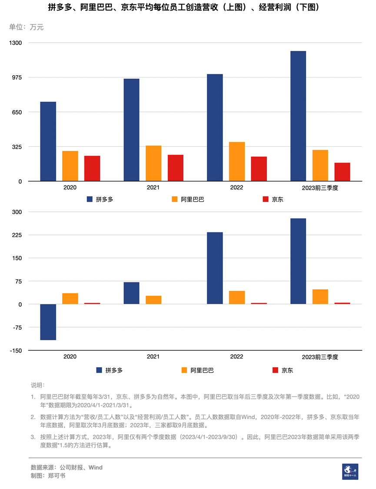
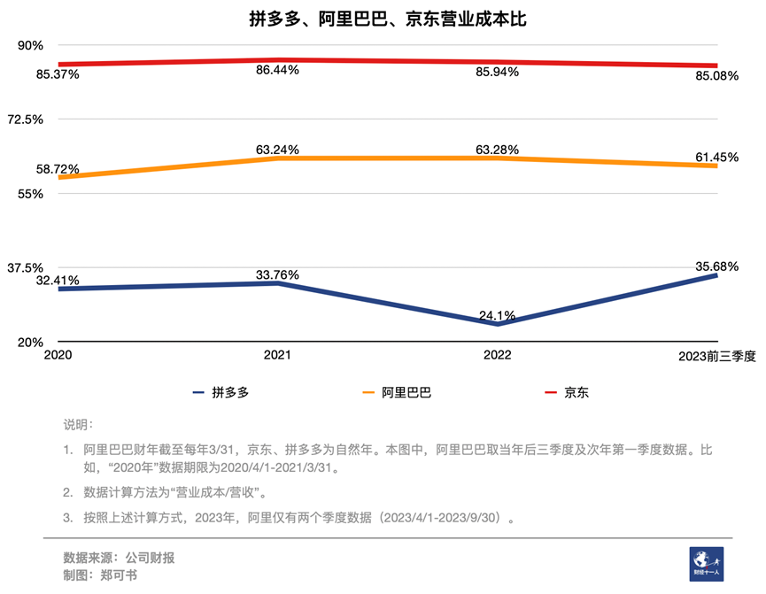

# 拼多多的疯狂三季度：人均创收1222万元

拼多多员工在2023年前三季度人均创收1222万元，是同期京东的7.07倍，预估是阿里的4.17倍

**文 | 郑可书 刘以秦**

**编辑 | 刘以秦**

11月28日，拼多多（PDD.O）再次交出一份超过市场预期的财报：2023年三季度，营收688亿元，同比增94%；经营利润167亿元，同比增60%。前三季度，营收、经营利润同比增速分别为75%、71%。财报发布后，拼多多市值一度达到1830亿美元，与阿里巴巴（BABA.N）差距缩小到100亿美元，是京东（JD.O）的4倍多。

相较于去年三季度，除了主站、买菜两项，今年拼多多还多了海外业务Temu。Temu快速扩张，自去年9月1日首站上线美国以来，已经进入48个国家和地区。这导致三季度，拼多多的销售和市场费用同比增55%，营业成本同比暴涨262%。2023前三季度，两项费用同比增速分别为52%、151%。

但是，人力成本“一般及行政开支”反而在三季度同比下降16%，在2023年前三季度同比下降7%。

这些数据再次诠释拼多多的极致效率：在新业务Temu持续烧钱、仍未盈利的情况下，整体经营利润依然提升；增加了一项体量庞大的重要业务，人力成本不增反降。Wind数据显示，截至今年9月底，拼多多员工人数保持在1.3万人左右，是阿里的1/18、京东的1/35。

极致效率背后，是拼多多业务的高度聚焦。相比其他电商平台和互联网大厂花样百出的新业务，拼多多除了电商和买菜，没有其他业务。业务聚焦帮助拼多多能够在一段时间内将所有资源投入到重点业务中，不断复制过去的经验并优化，效率得以提升。

拼多多的极致效率

**1、拼多多人均创收约为阿里的4倍、京东的7倍**

按照2023年前三季度1588亿元的总营收计算，拼多多员工前三季度人均创收1222万元，是同期京东的7.07倍，预估是阿里的4.17倍；人均经营利润是京东的55.8倍，预估是阿里的5.81倍。（阿里数据估算方法详见下图“说明”部分）

2020年-2022年，拼多多的人均创收保持在阿里2.6倍-2.9倍（计算方法详见上图“说明”部分）、京东3.1倍-4.3倍的水平。

2021年，拼多多首次扭亏为盈。2021年、2022年，拼多多人均创造经营利润约为阿里的2.6倍、5.4倍（计算方法详见上图“说明”部分），京东的71倍、58.5倍。

在业内，拼多多以薪酬高、工作时间长闻名。公司实行11-11-6工作制（上午
11点上班，晚上11点下班，一周工作6天），有时要加班到凌晨；员工一周工作时间超过70小时，一个月近300小时。有Temu合作方称，Temu员工经常半夜回消息。法定节假日也时常被占用，遇上电商大促等关键节点，员工可能需要“上13天班休1天”。

拼多多的认同者认为，公司人际关系纯粹、工资高。一位前员工告诉《财经十一人》，在拼多多的工作经历非常愉快——没有其他大厂形式主义的无效会议、日报、周报，只需完成自己的工作；至于工作时长，要想多赚钱、就要多做事，是理所应当。

管理费用率上，三家公司中京东最低，保持在1%左右的水平。2023年前三季度，尽管有Temu这一投入巨大的新业务，拼多多的管理费用率依然从去年全年的3.04%降低到1.37%，接近京东。

**2、拼多多营业成本比约30%，淘宝60%、京东85%**

拼多多营业成本在总营收的占比在三家公司中保持最低。也就是说，每挣一元钱，拼多多花的营业成本比阿里、京东都要少。2023年前三季度，这个数字大约是阿里的六成、京东的四成。（计算方法详见下图“说明”部分）

这是因为拼多多的业务更加聚焦。如今，拼多多只有主站、买菜、海外Temu三个主营业务，且倾向于在已有业务稳定之后，再谨慎地选择有把握的业务，扩展版图。团队可以复用：买菜拓荒团队从主站抽调，Temu初期团队又从买菜抽调。经验可以复用：飞速增长、上线不久即登上应用商店下载排名榜首的Temu，复制了主站低价、社交电商的玩法和经验。

供应链也可以复用：为拼多多供货、擅长低价的中小商家，可以入驻Temu，把便宜的产品销往海外。业务聚焦，以及将“便宜”贯彻到底的决心，带来了极致的效率。

与之形成对比的是，阿里、京东，都拥有更庞大、也因而更分散的商业版图。阿里电商业务覆盖toB和toC，在中国电商领域，就开设有淘宝、天猫、淘特、1688等App，在海外运营速卖通、Lazada、国际站等五个平台。另外，阿里还涉足本地生活、物流、数字媒体及娱乐等业务。今年，阿里已将各业务分拆成六大业务集团。京东也类似，电商之外，还运营数字科技、物流、技术服务、健康、保险、物流地产等多项业务。

**3、2023前三季度，拼多多经营利润率是京东的7倍**

拼多多2021年首次扭亏为盈，录得正经营利润。当年，其经营利润率即大幅超过京东，逼近阿里，并于次年反超阿里、保持领先至今。2023年前三季度，拼多多经营利润率是京东的7倍，约为阿里的1.4倍（计算方法详见下图“说明”部分）

其中，拼多多与阿里皆使用第三方物流（阿里也有自建物流菜鸟，但同样依靠通达系等第三方物流公司），京东自建物流。物流是重资产投入的苦生意，会影响京东的经营利润率。

效率背后是业务聚焦

拼多多成立于2015年，自2021年开始有正向经营利润，2022年后，营收和利润都保持高速增长。拼多多用八年时间建立“低价”的品牌形象且持续加强，在任何时候，“低价”都是零售的利器，尤其是电商领域的基础设施逐渐成熟，电商平台在购物体验上很难做出明显差异，“低价”的吸引力会越来越强。

成立初期，拼多多依靠低佣金率，吸引大量小商家和白牌商家。天猫和京东的佣金率根据品类不同会有差异，天猫佣金率基本在2%—5%，京东大多是3%—8%，个别品类超过10%。拼多多的佣金率是千分之六，远低于其他平台。同时，借助微信的社交属性，加上各类拉新玩法，包括“砍一刀”、“拉新返现”等，迅速提升活跃用户数。

以“低价”为核心吸引到卖家和买家后，拼多多通过流量倾斜，进一步加强“低价”策略，在拼多多的平台上，只有更低的价格才能拿到流量推荐。而在其他电商平台，一个商品是否能获得流量推荐，原因复杂得多，包括用户喜好、店铺等级、好评度，以及商家的广告投放等。

卖家们卷入了拼多多建立的“低价—流量”循环。其他电商平台上，如果用户退货，平台不收佣金；而在拼多多只要交易发生，佣金就会扣除。卖家们只能用更高销量来抵消退货成本。

相比其他电商平台和互联网大厂，拼多多最明显的特点是“克制”，拼多多除了电商和买菜，没有其他业务。拼多多创始人黄峥曾多次表示，不会投入到自己不擅长的行业或是已经很成熟的领域，例如支付和物流等。

多多买菜是拼多多过去唯一一次电商领域之外的尝试。多多买菜于2020年上线，当时拼多多的月活跃用户数已经超过7亿，增长空间不大，拼多多需要一个能承接流量，并带来新用户增长的业务，一位拼多多人士告诉《财经十一人》，买菜业务能够很自然地承接住拼多多“低价”和“下沉市场”的流量池，对于拼多多是来说是“一定能赢”的业务。

2022年，多多买菜稳居行业第一，此后净利润大幅增长。过去拼多多主站的流量大多是免费的，自去年开始陆续商业化，卖家需要花钱买，广告收入随之增长。因为有主站的基础，复制到海外市场，不需要很高的成本，就能迅速起量，带动营收和利润。

近期，拼多多有了新动作。11月中旬，拼多多官网上挂出多个大模型相关的招聘需求。其他大厂都在今年上半年陆续对外公布了大模型相关计划和产品，除了基础大模型，不少大厂还推出了针对特定场景的垂直大模型，或是为大模型提供算力、数据等基础服务。而拼多多的大模型依然聚焦于电商。

