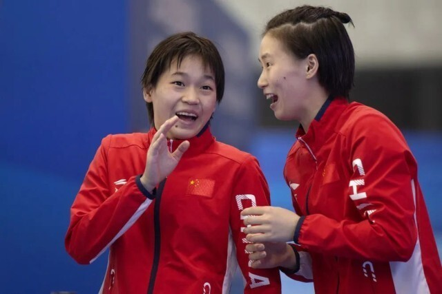
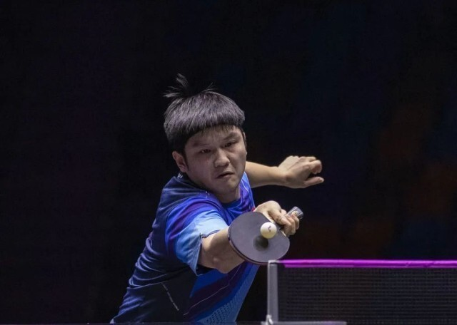

# 新华社：别让全红婵再因这事儿“刷屏”

**体育时评：体育“饭圈化”当休矣**

全红婵再次刷屏！在日前进行的2023年全国跳水锦标赛女子10米跳台决赛中，陈芋汐夺冠，全红婵获得亚军。赛后有观众现场质疑裁判，网上各种版本的“黑幕”更是层出不穷，引发网民关于体育“饭圈化”的热议和抵制。

_11月22日，广东海印队选手全红婵（左）和上海队选手陈芋汐在全国跳水锦标赛女子10米台决赛后谈笑风生。新华社记者 肖艺九 摄_

**“饭圈”现象起源于娱乐圈，其显著特征之一就是“爱豆”必须无往而不利。**
一旦“爱豆”的表现没有达到预期，一些人就会认为，必有“黑幕”，一些非理性的声音会瞬间甚嚣尘上。 **“饭圈”的另一个显著特征则是侵扰他人隐私。**

体育“饭圈化”存在已久。此前，樊振东、王楚钦和杨舒予等知名运动员曾公开呼吁抵制这一现象。这一次，作为全红婵的师兄，跳水奥运冠军何冲也批驳“全红婵被压分”的说法，表示“饭圈化的思维和言行十分可怕”。

**体育“饭圈化”对体育项目的推广和运动员的成长而言，有百害而无一利。**
首先，公众的关注点发生偏移，对于运动项目本身的关注减少，只聚焦场外情况发出莫须有的恶意猜测，不利于运动项目推广和可持续发展。其次，给当事运动员以及相关人员造成困扰，增添思想负担和心理压力，降低自我反省和学习的能力，长此以往不利于提高竞技水平和良性竞争。更深层次的危害则是打击了我国蓬勃发展的体育事业，社会各界努力打造的“公开、公平、公正”以及“道德、风格、干净”的赛事环境被视而不见。

_10月29日，樊振东在2023世界乒乓球职业大联盟（WTT）法兰克福冠军赛中。新华社记者 张帆 摄_

当前，刹住体育“饭圈化”之风，为体育事业发展营造风清气爽的舆论环境十分必要。

**竞技体育的魅力所在就是难以预知结果，拼的就是不到最后一刻决不言弃的坚毅品质。**
作为看客，我们每个人有支持和喜爱某位运动员的权利，但这种支持和喜爱应该出于理性，且有一定边界，要学会理性看待运动员的表现和输赢。

**运动场上没有常胜将军，运动员正是通过一次次的成功和挫折考验，不断汲取经验教训，继续前行。**
我们希望运动员在面对纷繁复杂的外界言论时，能守住初心、保持“人间清醒”。

在互联网高度发达的时代，运动员很难做到“两耳不闻窗外事”，外界的过度追捧和盲目讨伐，容易让人产生错误认知。一些平台在类似事件中应及时采取措施，防止相关话题的传播和发酵，不能“作壁上观”坐收流量红利。

两年前，中国奥委会曾经发布声明，号召社会各界尊重运动员个人权益，理性追星，避免不当言行，坚决杜绝“饭圈”乱象向体育领域蔓延。

**作为体育爱好者，我们应尽可能提供更多正能量的“阳光雨露”，助力运动员“茁壮成长”。**

来源：新华社

