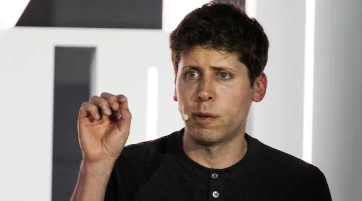

# 白忙活了！OpenAI预计不会向微软等投资者提供董事会席位

**划重点**

  * _1_ OpenAI新董事会可能不会向微软等投资者提供董事会席位，继续优先考虑加强AI安全。
  * _2_ 奥特曼将不会成为董事，也无法确认首席科学家苏茨凯弗是否会继续担任现任职务。
  * _3_ 微软销售人员正试图利用OpenAI的混乱来吸引新客户。

腾讯科技讯
11月29日消息，据一位知情人士透露，OpenAI重组后的董事会不打算引入外部投资者的代表。这表明，新董事会仍将优先考虑加强人工智能技术的安全措施，而不是投资者回报。

OpenAI的新董事会尚未正式就任，情况可能还会发生变化。但知情人士称，微软和其他股东，如Khosla Ventures、Thrive
Capital和Sequoia Capital，预计不会获得OpenAI新的九人董事会席位。

11月17日，OpenAI董事会解雇了首席执行官山姆·奥特曼（Sam
Altman），这让投资者们感到措手不及。六天前，在微软和其他投资者与OpenAI董事会进行了一系列谈判后，奥特曼得以复职。但作为协议的一部分，他没有获得董事会席位。

知情人士说，OpenAI董事会一直担心，那些与OpenAI技术有经济利益关系的成员会损害该公司的利益。OpenAI董事会控制着一个非营利性实体，后者负责监督OpenAI的营利性业务。该董事会宣布的使命是让“安全的人工智能广泛造福于人类，而不是OpenAI投资者”。

这意味着，微软和其他已经购买了价值超过3.5亿美元OpenAI股票的投资者，可能无法看到未来的董事会决策。微软已经向OpenAI承诺了超过110亿美元的投资，并成为OpenAI最重要的合作伙伴。

知情人士说，新董事会的三名最初董事的任命预计最早将于本周得到确认，他们包括董事长布雷特·泰勒（Bret
Taylor）、美国前财政部长拉里·萨默斯（Larry Summers）和美版知乎Quora首席执行官亚当·德安吉洛（Adam
D'Angelo）。其中，德安吉洛将是解雇奥特曼的原六人董事会中唯一留下的董事。

新董事会的组建计划突显了这家全球领先的人工智能开发商的脆弱性，以及董事会与奥特曼之间的微妙关系。奥特曼还面临着一项独立调查，主要针对促使原董事会罢免他的活动。这一现实意味着，OpenAI与微软的深度合作比这场闹剧之前更加脆弱，甚至可能更令人头疼，尽管双方都已表示，他们的合作依然牢固。

然而，在奥特曼上周复职后，Thrive
Capital和其他投资者计划推进一项收购要约，以收购价值数亿美元的OpenAI员工股票。这意味着，该公司的账面价值约为850亿美元，高于今年之前收购要约中给出的270亿美元。

**微软求一席位而不可得？**

在新的三人董事会正式上任后，其工作是再挑选六名董事会董事。一位知情人士说，即使没有席位，奥特曼预计也会就扩大后的董事会的候选人提供意见，因为他需要与他们密切合作。另一位知情人士说，在九位董事就位之前，预计奥特曼不会被考虑担任董事会席位。

在上周奥特曼和原董事会达成复职协议之前，微软一直希望在新董事会中获得一个席位，或者是在没有投票权的董事会中获得一个观察员席位。在奥特曼被解雇后，鉴于OpenAI对微软业务的重要性与日俱增，微软因缺乏对OpenAI事务的了解而受到股东的批评。

但法律专家表示，像微软这样的投资者如果要求获得非营利实体的董事会席位，可能会与美国国税局(IRS)和加州司法部等监管机构发生冲突。例如，美国国税局警告说，董事会由与该组织有商业关系的成员主导的非营利组织可能会失去免税资格。此外，加州法律要求非营利实体的董事会成员回避对任何与他们有商业利益的交易进行投票，加州司法部建议将这些交易提交该州进行预先批准，这为包括股东在内的董事会设立了一个潜在的法律雷区。

据第三位知情人士透露，即使微软和其他投资者不能在OpenAI的董事会中占有一席之地，他们与这家初创公司现有的协议也可能会限制董事会的行动。例如，这些协议禁止OpenAI出售营利性部门或将其与竞争对手合并。尽管如此，OpenAI原董事会上周还是对此进行了尝试，当时其一名代表就潜在的合并事宜与竞争对手初创公司Anthropic进行了接洽。

**首席科学家去留引担忧**

与此同时，员工们仍在努力让公司重回正轨。该公司的一位发言人拒绝透露伊利亚·苏茨凯弗（Ilya
Sutskever）是否会继续担任首席科学家。苏茨凯弗曾投票支持解雇奥特曼，后来态度有所转变。他负责该公司的许多技术突破，包括最近曝光的新模型Q*的基础工作。没有迹象表明苏茨凯弗计划离开，但熟悉他的人表示，他已经从艰难的一周中恢复过来，包括同事们要求他撤销投票的巨大压力。

在此之前，OpenAI的业务发展迅猛，但上周的剧变导致许多主要客户陷入恐慌。因为大多数员工威胁说，如果不把奥特曼带回来，他们就会集体辞职。据一位熟悉OpenAI业务的人士透露，上周，微软似乎准备招聘OpenAI的几乎所有员工，这一举措可能会导致其每年工资支出超过10亿美元，其中还不包括股票薪酬。

现在，OpenAI可能面临着说服大型企业直接从该公司购买服务的更大挑战。这样的企业销售已经受到来自OpenAI竞争对手以及微软的压力，微软向自己的云客户销售OpenAI软件和其他人工智能技术。一位知情人士表示，在上周的混乱之后，微软销售人员更加坚定地引导OpenAI客户使用该公司的自有产品。

美国当地时间周二，微软在云销售领域的主要竞争对手AWS在拉斯维加斯举行的年度会议上对客户表示，OpenAI几近崩溃提醒他们，他们应该让自己的人工智能服务提供商多样化。（编译/金鹿）

