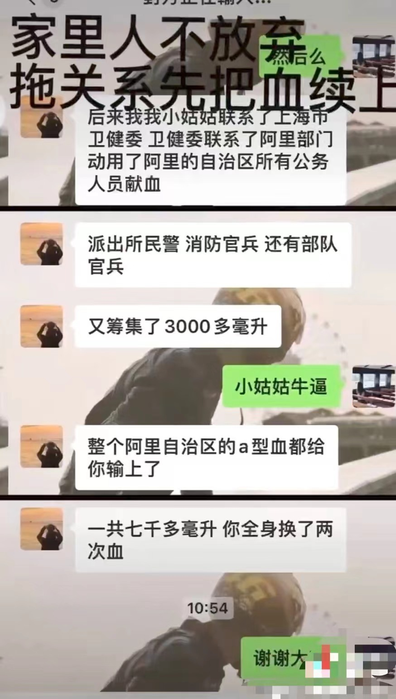

# 网传一女子在西藏阿里遇车祸，当地动用“全体公务员”献血，多方回应

阿里地区人民医院工作人员告诉记者，当地血站中，与涉事女子血型匹配的存血不够，15日便开始缺血。经医院向职工、社会人士求助，家属向当地多个部门求助后，15至17日有不少人来血站献血，其中，有数十名公职人员，最终筹到了足够的血。

新京报讯（记者 丛之翔 左琳
俞金旻）近日，网传一上海籍女子在西藏阿里地区因车祸重伤，为救治她，其丈夫通过亲戚联系到上海市卫生健康委员会（下称“上海市卫健委”），再由上海市卫健委联系到阿里地区相关部门，动用阿里地区所有公务人员为其献血。11月29日，涉事女子的丈夫陶先生告诉新京报记者，上述情况不属实。

聊天记录截图显示，陶先生告诉妻子，“我小姑姑联系了上海市卫健委，卫健委联系了阿里部门，动用了阿里的所有公务人员献血。”陶先生告诉新京报记者，该聊天发生在妻子抢救结束苏醒之后，因妻子伤势太重，为了鼓励妻子求生，他才说出这段话。

陶先生称，事实上，他的小姑姑不是上海公职人员。只是在妻子车祸后，当地相关部门建议向上海市卫健委求助，他们家人、朋友，包括小姑姑才去想办法联系上海市卫健委。献血则由阿里当地医院和卫健委组织，并非他们的个人行为。

对于争议较大的“全地区公务员献血”，陶先生回应，是医院的工作人员在朋友圈和群里发消息，希望有好心人去献血。自己也联系到当地派出所、消防等部门，希望得到他们的帮助，15至17日，陆陆续续有人去血站献血。

“献血不是强制的，都打过电话、征求过意见。剩下的血也会被存在医院血库，不是只给我们用。”陶先生说，在援藏医生的建议下，10月18日，妻子的父亲联系了医疗专机，自家出钱将妻子运下高原，目前妻子还在上海住院。

陶先生回忆，10月14日，他与妻子驾车旅行，在海拔5000多米的地方出现高原反应，缺氧后晕厥，出了车祸，妻子被安全带勒到腹部，导致肝脏破裂、腹腔出血，情况危急，被送往阿里地区人民医院。

“阿里人口密度低，血库没有多少血，医院就为我们开通了绿色通道筹血——只要是生命垂危的老百姓，医院都会开通。”陶先生说，自己与妻子的户籍地都在上海，阿里地区医院和卫健委工作人员告诉他，当地医疗手段不高，医院在想办法，“你们也要自己想办法。”工作人员建议他们联系上海市卫健委，请援藏医生来支援。

“我们通过朋友、亲戚，辗转联系到上海市卫健委。10月16日，上海援藏的医生来到医院为我妻子会诊。”陶先生说。

阿里地区人民医院工作人员告诉记者，14日晚，涉事女子入院接受救治。该女子肝脏破裂严重，亟须手术。术中，女子出血大约2000毫升，输入了8个单位红细胞悬液、800毫升新鲜冰冻血浆。此后至18日，该女子又输入了13.5个单位红细胞悬液、1950毫升新鲜冰冻血浆和1000毫升全血。

工作人员介绍，当地血站中，与涉事女子血型匹配的存血不够，15日便开始缺血。经医院向职工、社会人士求助，家属向当地多个部门求助后，15至17日有不少人来血站献血，其中，有数十名公职人员，最终筹到了足够的血。

记者从上海相关部门获悉，经调查，事发时，卫健部门接相关部门函件，请求正在西藏日喀则市的援藏医生前往涉事医院参与救治。此事不存在因私人关系等不正当因素导致的行动。

陶先生告诉记者，近日，妻子伤情稍有好转，昨晚，她将这次死里逃生经历制作成视频，发布在社交平台，希望能纪念一下，但遭到不少网友指责，目前，视频已经删除。现在妻子仍在住院治疗，因遭到指责心情低落，已经哭过一次。他希望网友能理性看待此事。

_涉事女子和丈夫的聊天记录。网传视频截图_

编辑 杨海 校对 刘军

