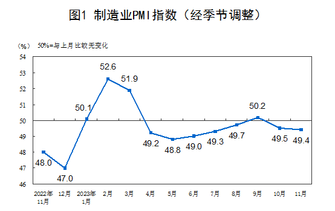
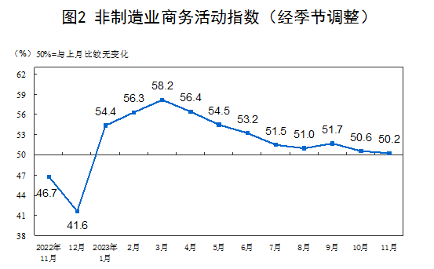

# 11月制造业PMI仍处收缩区间，回升向好基础仍需巩固

11月30日，国家统计局公布数据，11月份，制造业采购经理指数（PMI）为49.4%，比上月下降0.1个百分点，制造业景气水平略有回落。

11月份，非制造业商务活动指数为50.2%，比上月下降0.4个百分点，仍高于临界点，非制造业继续保持扩张。

11月份，综合PMI产出指数为50.4%，比上月下降0.3个百分点，表明我国企业生产经营活动总体持续扩张。

国家统计局服务业调查中心高级统计师赵庆河表示，11月份，制造业采购经理指数、非制造业商务活动指数和综合PMI产出指数分别比上月下降0.1、0.4和0.3个百分点，我国经济景气水平稳中有缓，回升向好基础仍需巩固。

**制造业PMI收缩区间内再度下降**

11月制造业PMI略低于上月0.1个百分点，在收缩区间继续下滑。上个月，制造业PMI结束连续四个月反弹，降至收缩区间。

英大证券公司首席宏观经济学家郑后成认为，制造业PMI连续2个月位于荣枯线之下，创近4个月新低，表明当前我国宏观经济压力犹存。

东方金诚首席宏观分析师王青表示，市场普遍预期，11月制造业PMI将有所反弹，但具体读数进一步较上月下行。

赵庆河指出，11月制造业PMI下滑，主要是受部分制造业行业进入传统淡季，以及市场需求不足等因素影响。

从分类指数看，生产指数（50.7%，比上月下降0.2个百分点）和供应商配送时间指数（50.3%，比上月上升0.1个百分点）高于临界点，新订单指数（49.4%，比上月下降0.1个百分点）、原材料库存指数（48.0%，比上月下降0.2个百分点）和从业人员指数（48.1%，比上月上升0.1个百分点）低于临界点。

赵庆河分析称，新订单指数为比上月略降。从行业看，医药、汽车、铁路船舶航空航天设备等行业新订单指数均高于53.0%，相关行业市场需求较快释放。同时调查结果显示，制造业企业中反映市场需求不足的企业占比超六成，市场需求不足仍是当前制造业恢复发展面临的首要困难。

“当前制造业需求不足的一个重要原因是居民商品消费偏弱。”王青说，“当前消费需求偏弱，物价水平偏低，意味着年底前政策面促消费空间较大，这包括较大规模发放消费券和消费补贴等。”

分别看外需和内需情况。外需方面，11月新出口订单指数较上月下滑0.5个百分点至46.3%，创近4个月新低。郑后成分析，展望11月，虽然面临来自基数下行的利多，但是在PPI当月同比大概率小幅下行的背景下，叠加10月美国零售和食品服务销售额总计同比较9月下行0.35个百分点，创近3个月新低，11月出口金额当月同比大概率还将位于负值区间，不具备大幅上行的基础。

内需方面，郑后成表示，虽然“新订单指数-
新出口订单指数”录得3.1个百分点，但主因是新出口订单指数下滑幅度较大，且新订单指数连续2个月位于收缩区间，叠加在房地产投资增速大概率继续承压的情况，认为当前我国内需还面临一定压力，宏观政策尚需“更加注重做好跨周期和逆周期调节”，“加强货币供应总量和结构双重调节”
。

从生产端看，王青分析，在市场需求连续两个月环比收缩带动下，11月生产指数也有所下行，但仍连续六个月处于荣枯平衡线之上。

“在11月新订单指数承压，以及原材料库存指数、产成品库存指数（48.2%，比上月下降0.3个百分点）双双较前值下行的背景下，结合实体经济方面，我国出口增速与房地产投资增速持续承压，尤其是10月工业企业产成品存货同比掉头向下等情况，意味着短期之内我国生产可能还将面临一定压力。”郑后成说。

从价格端看，11月出厂价格指数（48.2%，比上月上升0.5个百分点）、主要原材料购进价格指数（50.7%，比上月下降1.9个百分点）“一升一降”，王青认为，这与近期国际原油等大宗商品价格下行相印证，显示近期制造业企业价格压力明显缓解，有利于巩固制造业利润回升势头。

还有一些积极因素值得关注。11月生产经营活动预期指数（55.8%，比上月上升0.2个百分点），创2023年3月以来新高，“在此基础上，考虑到2022年11月工业增加值当月同比位于相对低位，预计在基数效应作用下，2023年11月工业增加值当月同比可能不会差。”郑后成说。

“11月制造业从业人员指数边际改善，制造业企业预期处于扩张区域，反映制造业对后续市场需求保持乐观预期，并带动招工扩张，预示后续企业生产和投资动能将有所增强。同时，高技术制造业维持高景气度，企业对未来预期保持乐观。”光大银行金融市场部宏观研究员周茂华说。

此外，11月小型企业PMI较上月下降0.1个百分点至47.8%，仍低于临界点，同时，11月小型企业新订单指数为46.7%，较上月大幅下降1.1个百分点，王青表示，小型企业更多接近市场终端，消费需求不足对其影响最大。由于小型企业是吸纳城镇就业的主力军，预计未来一段时间稳增长政策将进一步向提振居民消费、定向支持小微企业倾斜。

**非制造业扩张步伐有所放缓**

11月份，非制造业商务活动指数为50.2%，比上月下降0.4个百分点，仍高于临界点，非制造业扩张步伐有所放缓。

“11月非制造业商务活动指数回落，主要受服务业商务活动指数回落拖累，其中，房地产、租赁等行业低迷表现对国内服务业活动构成明显拖累。”周茂华说。

数据显示，11月服务业商务活动指数为49.3%，比上月下降0.8个百分点，系今年以来首次进入收缩区间。对此，王青分析指出，一个主要原因是受假期效应消退等季节性波动影响。受前期基数较高影响，近期服务业PMI持续下行符合预期。由于服务业PMI属环比指标，近期持续下行不会改变服务业同比保持高增的态势，年底前服务业将继续在经济复苏过程中发挥主力军作用。

建筑业则扩张加快。赵庆河表示，11月建筑业商务活动指数为55.0%，比上月上升1.5个百分点，升至较高景气区间，建筑业施工进度继续加快。从市场预期看，业务活动预期指数为62.6%，在高位景气区间继续上行，建筑业企业对近期市场发展信心稳中有升。

周茂华表示，建筑业商务活动指数继续维持较高景气区间，反映近几个月国内加快专项债发行，有力推重点项目落地开工。

**未来走势如何？**

王青分析指出，整体上看，11月制造业PMI在收缩区间进一步下行，非制造业PMI出现较大幅度下滑，综合PMI产出指数比上个月回落。这显示进入四季度以来，在宏观经济整体上保持扩张过程中，复苏动能再度出现弱化迹象，与四季度财政政策集中发力的背景不相吻合。表明在当前居民消费信心偏弱、房地产行业持续处于调整阶段的背景下，经济修复基础还不牢固。判断年底前稳增长政策需要加大执行力度，其中，重大项目投资要加快形成实物工作量，稳楼市措施也会进一步加码。

展望下阶段趋势，周茂华认为，国内商品消费市场仍有较大修复空间，宏观政策资产力度不减，制造业行业盈利改善，同时，国内装备和高技术制造业维持良好扩张态势，制造业景气度有望趋势改善；但改善力度受国内需求复苏节奏、季节性及海外需求前景影响，预计未来几个月制造业PMI指数仍将维持50%附近波动。

非制造业方面，周茂华表示，从趋势看，国内经济活动已恢复常态，此前出台一系列促消费、稳楼市等增量宏观政策效果有望持续释放，居民和企业信心逐步恢复，服务业活动有望回归稳健扩张区域。

王青指出，后期影响PMI指数的主要不确定因素有三个方面，一是房地产支持政策持续发力前景下，楼市能否较快企稳回暖，“这是当前宏观经济牵一发动全身的关键点，也是决定制造业景气水平的关键所在。”二是近期财政政策稳增长显著加力后，年底前基建投资能否较快形成实物工作量；三是居民消费、特别是旅游出行等服务消费能否保持较快修复势头。

