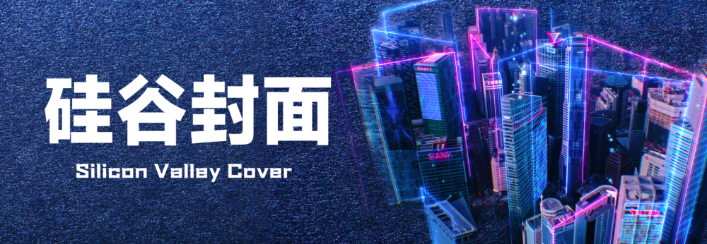
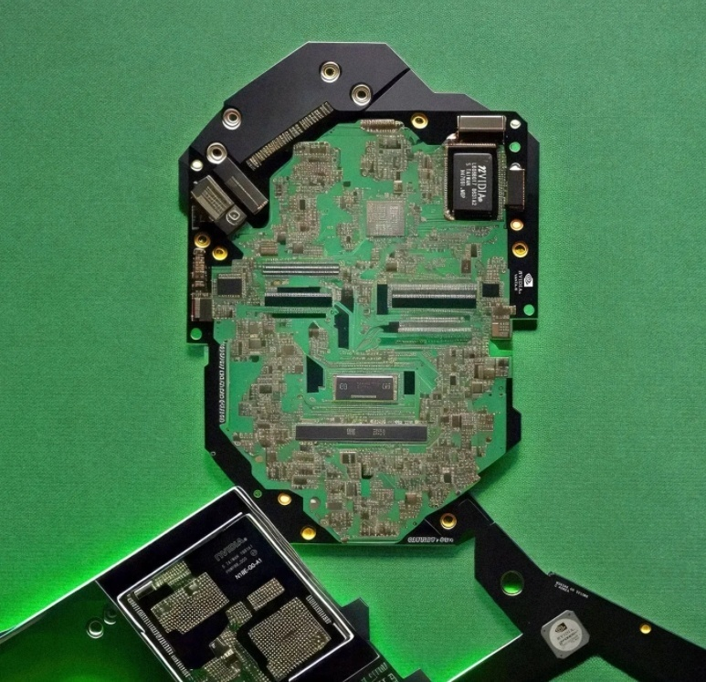

# 万字长文揭秘黄仁勋：AI“军火商”大BOSS，是如何炼成的？

**划重点**

  * _1_ AI教父辛顿及其两个学生关于神经网络的研究，为英伟达GeForce显卡的火爆销售提供了有力支撑，为人工智能技术的广泛应用奠定了基础。
  * _2_ 黄仁勋更加务实，他并不倾向于猜测或沉浸在科幻小说中，而是更偏好从最基本的原理出发，深入研究和理解微芯片当前的能力，进而精准预测它们未来的发展潜力。
  * _3_ 在创业之初，由于与微软支持的技术规格不符，英伟达曾险些破产。
  * _4_ 黄仁勋倡导灵活、高效的公司文化，英伟达没有僵化的部门划分或等级制度，员工被鼓励以“光速”般的高效行动力来推动项目的进展。

_《硅谷封面》系列聚焦硅谷科技大公司动态、科技大咖访谈、重磅研究报告等，旨在为科技资讯爱好者提供全球最前沿的深度好文。_

**编辑 / 李海丹 金鹿**

目前，人工智能初创企业OpenAI推出的聊天机器人ChatGPT在全球引发了生成式人工智能的热潮。这款聊天机器人的独特之处在于其能够利用生成式人工智能技术，与人类进行自然、流畅的对话，引发了全球范围内的关注和讨论。

其中，英伟达的超级计算机在ChatGPT的训练过程中发挥了关键作用，并在股市上引发了热烈反响，英伟达市值在2023年5月25日开盘时激增约2000亿美元，创下了股市历史上最大的单日涨幅之一。

英伟达首席执行官黄仁勋（Jensen
Huang）几个月前向投资者透露，该公司已向美国百强企业中的50家出售了类似的超级计算机，这一消息无疑进一步推高了英伟达的股价。截至收盘，英伟达市值已经超过了沃尔玛和埃克森美孚的市值总和，使英伟达成为全球市值第六高的公司。

有行业分析师将黄仁勋的商业地位与19世纪40年代末旧金山著名的勘探物资供应商塞缪尔·布兰南（Samuel
Brannan）相提并论。一位华尔街分析师曾表示：“人工智能领域正在上演一场战争，而英伟达是唯一的军火供应商。”

这一系列的动态显示出，生成式人工智能正在全球范围内引发一场革命，而在这场革命中，英伟达凭借其强大的技术和产品实力，正在成为引领这场革命的关键角色。对于英伟达来说，这无疑是一个历史性的时刻，标志着该公司在人工智能领域的影响力正在达到前所未有的高度。

**01 坚决押注人工智能，从不读科幻小说**

黄仁勋是一个有耐心且富有远见的创业者，自1993年与两位同伴在加州圣何塞的丹尼餐厅创立英伟达以来，已经走过了长达三十年的旅程。这位现年60岁，头发已经灰白的创业者，以其独特的幽默和自嘲风格，带领英伟达走向了行业的前沿。

英伟达的核心产品是图形处理单元（GPU），一块搭载强大微芯片的电路板。最初的商业模式是将这些GPU销售给视频游戏玩家，但在2006年，黄仁勋做出了一个重大的战略调整，开始向超级计算社区推销GPU。而在2013年，看到学术计算机行业研究的光明前景后，他果断地将公司的未来压在了人工智能上。

尽管人工智能领域几十年的发展历程中，曾多次让投资者感到失望，就连英伟达的首席深度学习研究员布莱恩·卡坦扎罗（Bryan
Catanzaro）也曾对此持有怀疑态度。但是，十年后的今天，事实证明黄仁勋的决策是正确的。如今，英伟达的GPU正在为人工智能的飞速发展提供动力，包括按需制作电影、为儿童提供辅导以及教授汽车自动驾驶等。所有这些进步都将发生在英伟达的GPU上，黄仁勋在该公司的股份现在价值超过400亿美元。

黄仁勋有一种务实的心态，他不喜欢猜测，也从未读过科幻小说。他从最基本的原理出发，推断出微芯片今天能做什么，然后满怀信心地押注于它们明天能做什么。他说：“我尽我所能不让公司破产，竭尽全力不让自己失败。”当被问及人工智能可能带来的风险时，他镇定地表示，他从未对此感到担忧，“它所做的就是处理数据，还有太多其他的事情需要担心。”

黄仁勋对于人工智能的理解深入到了其最本质的原理。他认为，自从IBM在20世纪60年代初引入数字计算以来，其基本架构几乎没有改变，但现在正在重新概念化。他说：“深度学习不是一种算法，而是一种方法，是一种开发软件的新方式。”

今年5月，数百名行业领袖签署了一份声明，将人工智能失控的风险与核战争的风险相提并论。黄仁勋没有在上面签字。有些经济学家观察到，工业革命导致全球马的数量大量减少，他们想知道人工智能是否会对人类产生同样的影响。但黄仁勋坚信，人类的独特性和价值是无法被替代的。他说：“马的职业选择有限。例如，马不会打字。”这句话既是他对人工智能能力的理解，也是他对人类独特价值的坚持。

**02 大学同系只有3名女生，靠做好作业抱得美人归**

黄仁勋于1963年出生于中国台湾，9岁时便和哥哥前往美国。他们在华盛顿塔科马与一位叔叔同住，后被送往肯塔基州的奥奈达浸信会学院。他们的叔叔误以为这是一所著名的寄宿学校，但实际上，它是一所宗教改革学校。他被安排与一名17岁的室友同住。第一天晚上，室友就撩起衬衫，向他展示打斗留下的无数疤痕。黄仁勋后来回忆道：“学校里的学生都抽烟，我想我是唯一一个没有折叠刀的男孩。”在这样的环境下，黄仁勋教授室友文化课，而后者教他锻炼身体，这促使他每晚都要做100个俯卧撑。

虽然黄仁勋住在这所学校，但他年龄太小，无法上课，所以他去了附近的一所公立学校。在那里，他结识了本·贝斯（Ben
Bays）。贝斯和他的五个兄弟姐妹住在一所没有自来水的老房子里，他说：“学校里的大多数孩子都是烟农的孩子，或者只是住在贫民区的穷孩子。”黄仁勋到来的时候，学校已经开学了，贝斯记得校长介绍了一个身材矮小、留着长发、操着浓重英语口音的亚洲移民。贝斯说：“他是一个完美的欺凌目标。”
但他并没有被这些困难击垮，反而培养了坚韧不拔的性格。他说：“当时没有咨询师，你只能自己坚强起来，继续前行。”

几年后，黄仁勋的父母在俄勒冈州定居，他和哥哥随后也搬了过去。黄仁勋在高中时期表现出色，不仅是全美排名靠前的乒乓球运动员，还参加了数学、计算机和科学俱乐部，甚至跳了两级，16岁便毕了业。他后来在俄勒冈州立大学主修电气工程，并在入门课上遇到了洛里·米尔斯（Lori
Mills），一位认真、书呆子式的女生。黄仁勋称：“那里大概有250个电气工程专业的学生，但只有三个女孩。”尽管黄仁勋觉得自己在争夺米尔斯注意力的竞争中处于劣势，但他通过坚持和她一起学习，最终赢得了她的芳心。

每个周末，黄仁勋都会给米尔斯打电话，请求她和自己一起做作业。他说：“我试图给她留下深刻的印象，当然不是因为我的长相，而是因为我完成家庭作业的能力。”六个月的相处后，黄仁勋终于鼓起勇气邀请米尔斯约会。而她也欣然接受了他的邀请。毕业后，两人一同前往硅谷工作，黄仁勋甚至晋升为了部门主管。几年后，他们的家庭迎来了新的成员，米尔斯选择离开工作岗位，专心抚养孩子。而黄仁勋则一边忙于工作，一边在斯坦福大学攻读研究生课程。

**03 产品理念与微软不合，创业之初险些破产**

1993年，30岁的黄仁勋与两位资深的微芯片设计师克里斯·马拉考斯基（Chris Malachowsky）和柯蒂斯·普里姆（Curtis
Priem）共同创立了英伟达。尽管黄仁勋相对年轻，但他的学习能力让马拉考斯基和普里姆深信他更适合担任首席执行官。他们三人的初衷是设计一款能让竞争对手“嫉妒得眼睛发绿”的图形芯片。公司最初命名为NVision，但后来发现这个名字已被一家卫生纸制造商使用。于是，黄仁勋建议使用“英伟达”（Nvidia），在拉丁语中意为“嫉妒”。

选择丹尼餐厅作为公司的经营地点，黄仁勋解释说，这里的环境相对安静，咖啡价格也亲民，而且他在上世纪80年代曾在俄勒冈州为这家连锁餐厅工作过。他说：“我发现，当我处于逆境中时，我会更好地思考。”

黄仁勋对电子游戏充满热情，并敏锐地洞察到更好的图形芯片市场的潜力。当时，艺术家们开始采用“基本体”形状组装三维多边形来替代手工绘制像素，这一转变节省了时间和精力，但需要新的芯片技术来支持。虽然英伟达的竞争对手选择使用三角形作为基本体，但黄仁勋和他的团队决定采用四边形。然而，这个决策后来证明是一个错误，因为微软宣布其图形软件将只支持三角形，这使英伟达陷入困境。

由于资金短缺，黄仁勋做出了一个重大决策：解雇了50多名员工，并将公司剩余的资金投入到未经测试的微芯片生产上。他说：“机会各占一半，但我们反正要倒闭了，为何不试试？”幸运的是，这场赌博取得了成功。当名为Riva
128的产品上市时，尽管公司的资金只够支付一个月的工资，但在四个月内，英伟达卖出了100万颗Riva芯片。

在随后的几年里，黄仁勋鼓励员工保持一种“绝望”的态度来继续生产产品。他在员工演讲的开场白中经常说：“我们公司还有30天就要倒闭了。”这句话如今已成为非正式的公司座右铭。

英伟达位于圣克拉拉的总部中心有两座巨大的建筑，被称为“宇宙飞船”。这些建筑不仅外观独特，其内部设计也十分先进。从沙发、地毯到小便池的防溅装置，都体现了三角形的设计元素。尽管建筑内部空间巨大、光线充足，但由于新冠疫情的影响，每天只有约三分之一的员工出勤。

值得一提的是，在股价飙升之前，英伟达就被员工调查评为美国最佳工作场所之一。公司鼓励员工把他们的办公室当作灵活的空间，在那里吃饭、编程和社交。建筑的顶部设有酒吧，可以让员工有固定的快乐时光。不过，这些建筑的内部是通过摄像头和人工智能进行全天监控的。例如，如果有员工在会议桌旁吃饭，人工智能可以在一小时内派人清理。

黄仁勋对于未来有着宏大的设想：“未来，所有移动的东西都将是自主的。”从丹尼餐厅到“宇宙飞船”总部，英伟达在黄仁勋的领导下走过了一条充满挑战和机遇的道路。而今天，英伟达已经成为图形处理单元（GPU）领域的佼佼者，为人工智能、视频游戏和多个行业提供核心技术支持。

**04 自嘲见英特尔如老鼠遇到猫，另辟路径避开强大对手**

在英伟达园区的深处，一个无窗的实验室中，质量控制技术人员面色苍白，戴着耳塞，穿着T恤，正在对英伟达的微芯片进行严苛的测试。实验室中充斥着刺耳的噪音，高分贝的风扇试图为过热的硅电路降温，不断发出嗡嗡声。这些微芯片，正是支撑人工智能革命的基石。

在传统的计算机体系结构中，中央处理单元（CPU）是完成大部分工作的核心。编码员编写程序，提交给CPU进行数学问题的计算，每次生成一个解决方案。长期以来，英特尔一直是CPU市场的主导者，多次试图将英伟达挤出市场。黄仁勋将这两家公司的关系比作猫和老鼠的游戏：“我不会去英特尔占优势的任何领域。每当他们靠近我们时，我就拿起筹码逃跑。”

然而，英伟达选择了一条与众不同的道路。1999年，公司上市后不久，便推出了一款名为GeForce的显卡。英伟达的营销主管丹·维沃利（Dan
Vivoli）将其称为“图形处理单元”（GPU）。与通用的CPU不同，GPU采用并行计算的方法，将复杂的数学任务分解成更小的计算并一次性处理。形象地说，CPU的功能就像一辆送货卡车，一次投递一个包裹，而GPU则更像是遍布城市的摩托车车队。

GeForce系列的巨大成功得益于视频游戏《雷神之锤》的推动。这款游戏使用并行计算来渲染玩家可以用榴弹发射器射击的怪物，吸引了无数PC玩家的目光。为了获得更好的游戏体验，玩家们纷纷购买新的GeForce显卡。2000年，斯坦福大学计算机图形学的研究生伊恩·巴克（Ian
Buck）更是将32张GeForce显卡连接在一起，用8台投影仪玩《雷神之锤》。他兴奋地说：“这是第一款8K分辨率的游戏设备，它占据了一整面墙。实在是太美了。”

巴克的好奇心驱使他进一步探索GeForce显卡的潜力。他发现这些显卡附带了一个名为着色器的原始编程工具。在美国国防部下属研究机构DARPA的资助下，巴克成功地破解了着色器，访问了下面的并行计算电路，将GeForce重新用于一台低预算的超级计算机。不久之后，巴克便加入了黄仁勋的团队。

作为一名计算机科学专家，巴克在过去的20年里一直致力于测试英伟达芯片的极限。自2004年起，他监督了英伟达超级计算软件包Cuda的开发工作。黄仁勋的愿景是让Cuda能够在每张GeForce上运行，“我们正在让超级计算大众化。”

与此同时，英伟达的硬件团队在微芯片上为超级计算操作分配了空间。这些芯片内部包含数十亿个电子晶体管，通过迷宫般的电路传递电流以完成高速计算。首席芯片工程师阿尔琼·普拉布（Arjun
Prabhu）将微芯片设计比作城市规划，芯片的不同区域专门用于不同的任务。他笑称：“我经常在周五晚上梦见最好的点子！”

然而，当Cuda在2006年底发布时，华尔街对此表示失望。尽管黄仁勋将超级计算带入了大众视野，但当时的市场对此并不感冒。硅谷热门播客“收购”(Acquired)的联合主持人本·吉尔伯特(Ben
Gilbert)评论道：“他们在这种新的芯片架构上花了一大笔钱。他们花了数十亿美元瞄准学术和科学计算一个鲜为人知的角落，这在当时并不是一个很大的市场。”尽管如此，黄仁勋坚信Cuda的出现将推动超级计算领域的发展。遗憾的是，这一观点并未得到广泛认同，到2008年底英伟达的股价下跌了70%。

在黄仁勋回忆中，那次访问台湾大学物理学教授邱廷伟办公室的经历，仿佛成为了他信心的一股源泉。为了更深入地探索宇宙大爆炸后的物质演化，邱教授竟在他办公室附近的实验室里自行搭建了一台超级计算机。当黄仁勋走进那个实验室时，他被眼前的景象所震撼：GeForce显卡的盒子堆满了实验室，而电脑则是由桌上的风扇来进行冷却的。邱教授深情地表示：“黄仁勋是个有远见的人，他让我毕生的事业成为可能。”

虽然邱教授对英伟达的技术给予了高度评价，但这样的客户在当时并不多见。2009年，Cuda的下载量达到了一个高峰，但随后连续三年都呈现出下滑的趋势。这样的市场反馈，让董事会的成员们倍感压力，他们担心英伟达的股价持续低迷会使其成为其他企业收购的目标。董事会的吉姆·盖瑟（Jim
Gaither）表示：“我们竭尽全力保护公司不受激进股东的影响，他们可能会进来试图分拆公司。”前NFL营销主管道恩·哈德森(Dawn
Hudson)于2013年加入董事会，他称“这是一家明显平淡、停滞不前的公司”。

为了扩大Cuda的应用范围，英伟达开始寻找各种可能的客户，包括股票交易员、石油勘探者和分子生物学家等。让人有些意外的是，英伟达曾与通用磨坊（General
Mills）签署过一项协议，模拟烹饪冷冻披萨的热物理过程。但在当时，人工智能这个领域并没有被英伟达过多地考虑，因为当时的市场认为这一领域并没有太大的商业价值。

**05 AI教父辛顿帮助打开显卡销路，迎来范式转变**

在21世纪头十年，人工智能还是一个被学术界和企业界所忽视的学科。在图像识别和语音识别等基本任务上，人工智能的研究进展都十分缓慢。而在这个已经被冷落的学术领域中，神经网络的研究更是被视为一个偏门。许多计算机科学家对神经网络持有怀疑态度。深度学习研究员卡坦扎罗回忆说：“我的导师不鼓励我研究神经网络，因为在当时，它们被认为是过时的，而且没什么用。”

但总有一些人对神经网络充满了信心，卡坦扎罗将他们称为“荒野中的先知”，其中一位就是多伦多大学的教授杰弗里·辛顿（Geoffrey
Hinton）。2009年，辛顿的研究团队使用英伟达的Cuda平台来训练神经网络，以识别人类语言。他对实验的结果感到非常满意，并在那年年底的一个学术会议上公开展示了这些成果。随后，他主动联系了英伟达。辛顿笑着说：“我发了一封电子邮件说：‘瞧，我刚刚告诉一千名机器学习研究人员，他们应该去买英伟达的显卡。你能免费送我一个吗?’
但他们拒绝了。”

尽管英伟达没有满足辛顿的要求，但辛顿还是强烈推荐他的学生们使用Cuda平台。其中一位乌克兰的学生亚历克斯·克里切夫斯基（Alex
Krizhevsky）被辛顿誉为可能是他见过的最出色的程序员。2012年，克里切夫斯基和他的研究伙伴在预算十分有限的情况下，从亚马逊购买了两块GeForce显卡。随后，他开始使用英伟达的并行计算平台来训练一个用于视觉识别的神经网络，并在一周内为它提供了数百万张图像进行训练。辛顿回忆说：“他的卧室里有两块GPU电路板在呼呼作响。实际上，是他的父母为他支付了相当可观的电费。”

苏茨凯弗和克里切夫斯基对这些显卡的性能感到惊讶。那年早些时候，谷歌的研究人员训练了一个神经网络来识别猫的视频，这项工作需要大约16000个CPU。而苏茨凯弗和克里切夫斯基只用两块英文i大电路板就产生了绝佳的结果。苏茨凯弗称：“GPU出现了，感觉就像一个奇迹！”

克里切夫斯基在父母家里训练的神经网络AlexNet，现在可以和莱特飞行器和爱迪生灯泡相提并论。2012年，克里切夫斯基让AlexNet参加了ImageNet年度视觉识别大赛。当时，神经网络并不受欢迎，以至于他是唯一一个使用这种技术的参赛者。AlexNet在比赛中得分非常高，以至于组织者最初怀疑克里切夫斯基是否作弊了。辛顿说：“那是一种大爆炸的时刻。这就是范式的转变。”

在那之后的十年里，克里切夫斯基对AlexNet架构的描述被引用了超过十万次，使其成为计算机科学史上最重要的论文之一。克里切夫斯基开创了许多重要的编程技术，但他的关键发现是，专门的GPU训练神经网络的速度可以比通用CPU快100倍。辛顿说：“如果没有Cuda，要进行机器学习就太麻烦了！”

**06 坚信神经网络将彻底改变社会，英伟达实现转型**

黄仁勋引领的英伟达在人工智能领域的崛起成为了一个引人注目的故事。ImageNet竞赛的参赛者们纷纷转向神经网络，到2015年，GPU训练的神经网络在图像识别上的准确率已经达到了惊人的96%，超越了人类的水平。这一切的成功，验证了黄仁勋过去十年所倡导的“超级计算机民主化”运动的正确性。此时的他思索着，神经网络将对整个社会带来怎样的深刻变革，而他手中的Cuda，无疑是这场变革的关键硬件支撑。

在黄仁勋看来，神经网络将彻底改变社会，他可以利用Cuda垄断必要硬件的市场。他宣布他再一次把赌注押在公司身上。英伟达副总裁格雷格·埃斯蒂斯（Greg
Estes）回忆称：“他在周五晚上发了一封电子邮件，说一切都将转向深度学习，我们不再是一家图形公司。到了周一早上，我们就成了一家人工智能公司。真的，就是这么快。”

就在黄仁勋发邮件的时候，他带着一个思想实验找到了英伟达首席人工智能研究员卡坦扎罗。后者称：“他让我想象一下，他把英伟达的8000名员工都赶到停车场。然后告诉我，我可以自由地从停车场选择任何人加入我的团队。”

尽管黄仁勋在公众面前保持低调，但他对公司的日常管理却充满了热情和参与度。他不喜欢传统的公司结构，更倾向于一种灵活、无固定部门和等级制度的管理方式。员工每周都会提交一份清单，列出他们认为最重要的五项任务，而黄仁勋则鼓励简洁明了的沟通方式。

黄仁勋的领导风格独特且充满了紧张感。他经常在公司园区内走动，随时可能停在某个初级员工的办公桌前，询问他们的工作进展。这种突如其来的关心，使得每位员工都必须时刻保持高度的工作状态。行业分析师汉斯·莫斯曼（Hans
Mosesmann）说：“在硅谷，很多人习惯于通过编造借口来逃避责任，但在黄仁勋面前，这样的做法行不通。如果你这样做，他会发火的。”

黄仁勋与员工的沟通方式也很特别，他每天都会发送数百封电子邮件，有时内容只有简单的几个字。这种独特的沟通方式在公司内部形成了一种特殊的文化。一位高管将这些电子邮件比作俳句，另一位高管将其比作勒索信。他的管理哲学中充满了各种他经常引用的格言。例如，他要求员工在安排工作时考虑“光速”，即追求完成任务的绝对最快速度。这并不仅仅意味着快速行动。相反，员工应该考虑完成一项任务的绝对最快速度，然后朝着可实现的目标努力。他还鼓励员工探索那些没有竞争对手、甚至没有明确客户的“零亿美元市场”，比如Cuda。

也许黄仁勋最激进的信念是“必须分享失败”。2000年初，英伟达推出了一款有问题的显卡，风扇声音很大。黄仁勋没有解雇显卡主管，而是安排了一次会议，让经理们向几百人介绍他们做出的导致这次惨败的每一个决定。在英伟达，向观众展示自己的失败经历已成为一项受人喜爱的仪式，但这种企业斗争会议并不适合所有人。迪克斯说：“你可以马上看出谁能在这里坚持下去，谁不能。”

尽管有时被批评为反复无常和难以相处，但黄仁勋的这种管理风格却为公司培养了一种特殊的凝聚力。许多员工表示，尽管与黄仁勋的合作有时像“把手指插到插座上”一样令人紧张，但他们也深深感受到了他对公司的热爱和对使命的执着追求。这种情感也使得英伟达的员工留存率一直保持在很高的水平。

**07 很快会有AI模型在智能上胜过人类？**

在英伟达与前沿研究机构OpenAI的紧密合作下，人工智能的历史正在被不断刷新。大约在2016年，英伟达向OpenAI交付了其首台专用人工智能超级计算机DGX-1，这一交付仪式颇具戏剧性：黄仁勋亲自带着这台超级计算机来到了OpenAI的办公室，而当时OpenAI的董事长埃隆·马斯克（Elon
Musk）则用切纸机打开了包裹，这一瞬间仿佛象征着人工智能的新纪元由此开启。

2017年，谷歌的研究人员推出了Transformer这一全新的神经网络训练架构。仅仅一年后，OpenAI的研究团队便利用谷歌的这一框架，建造了第一个“生成式预训练转换器”，简称为GPT。值得一提的是，GPT模型正是在英伟达的超级计算机上接受了训练，通过吸收大量文本，它学会了如何建立与人类相似的联系。2022年末，在经历了数次的迭代升级后，ChatGPT终于向公众发布，引发了全球范围内的关注和讨论。

随着人工智能技术的飞速发展，英伟达的人工智能芯片开始出现供不应求的局面。该公司最新推出的人工智能培训模块DGX
H100，是一个重量达到37万磅（约合168吨）的金属盒子，其价格可能高达50万美元。尽管如此，这款产品目前已经脱销了几个月。DGX
H100的运行速度是训练ChatGPT的硬件的五倍，可以在不到1分钟的时间内完成AlexNet的训练，其强大的计算能力令人惊叹。英伟达预计到今年年底将售出50万台这种设备，这无疑进一步巩固了其在人工智能硬件领域的领先地位。

最新的人工智能技术已经展现出了令人难以置信的能力，甚至它们的创造者都对其潜力感到惊讶。在接下来的几年里，英伟达的硬件将用于训练各种类似的人工智能模型，它们不仅可以管理投资组合、驾驭无人机、模仿逝者的声音、充当自主机器人的大脑、创造出基因定制的药物，还能谱曲或写诗等。随着技术的不断进步，很快就会有这样的人工智能模型在智能上胜过人类，开启一个全新的智能时代。

黄仁勋持有一个雄心壮志的愿景：将公司的计算机图形研究与生成式人工智能研究相结合。他预测，图像一代的人工智能在不久的将来会变得非常复杂，以至于能够渲染出三维的、栩栩如生的世界，并在其中填充看似真实的人物。同时，具备语言处理能力的人工智能将能即时翻译语音指令，打破语言障碍。

**黄仁勋表示：“未来的编程语言将是‘人’。”**
他设想，当这些技术与光线跟踪技术结合时，用户将能够叙述整个宇宙的存在，这一创新的想法无疑将重新定义我们与技术的互动方式。黄仁勋期望通过这种我们世界中的“数字双胞胎”来安全地训练机器人和自动驾驶汽车，这将为我们创造一个更安全、更高效的未来。此外，与虚拟现实技术结合，Omniverse还可能让用户生活在定制的现实中，这将进一步模糊现实与虚拟的界限。

英伟达的高管们正在推进曼哈顿计算机科学项目，但对于创造超人智能是否明智的问题，他们表现出了一种几乎是质疑的态度，仿佛是在被问及洗衣机的效用一样。

关于人工智能可能带来的风险，如将来可能会杀人，英伟达的首席人工智能研究员卡坦扎罗反驳称：“每年都有人死于电击。”他并不否认人工智能的潜在风险，但强调应关注其更大的益处。对于人工智能是否会消除艺术的问题，英伟达的软件部门负责人迪克斯则回应：“它会让艺术变得更好！”

然而，当谈到人工智能是否会变得有自我意识时，黄仁勋给出了一个引人深思的答案：“为了让你成为一个生物，你必须有意识。你必须对自己有一些了解，对吗？我不知道这会在哪里发生。”这个问题无疑引发了人们对人工智能未来发展的深思。

