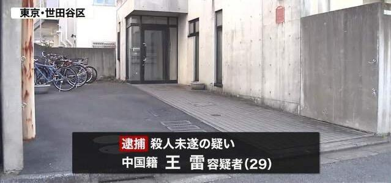
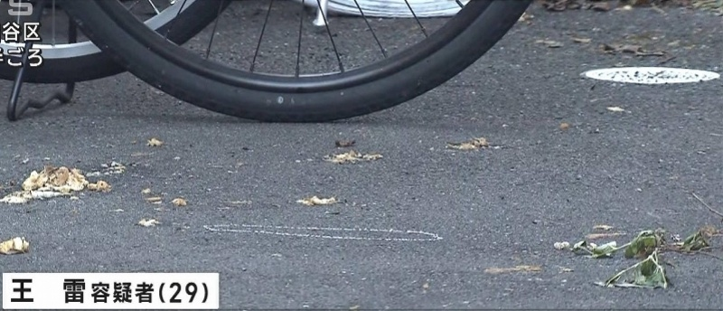

# 中国男子涉嫌用刀连刺日本女子致死，当场落网！案发现场曝光

11月30日，南都记者从日本警方获悉，一名29岁的中国公民涉嫌杀害一名24岁的日本女子被当场抓获，女子之后不治身亡。

 _日本警方在案发现场展开调查。_

当地时间28日23时55分左右，在东京世田谷区一栋公寓楼里发生了一起凶杀案。日本警方于29日公开表示，29岁的中国男性公民王雷（住址和职业不详）因涉嫌杀害24岁的日本女性小岛七海，被当场抓获。

 _当地时间11月28日晚，一名中国男子在日本涉嫌杀害一名日本女子被抓。_

据日媒报道，当地时间29日凌晨，一名路人报警称有一男一女正在发生争执。日本警方称王雷持水果刀连刺小岛七海胸部和腹部连刺数刀，小岛七海被刺伤后踉踉跄跄地走出公寓的自行车停放处，警方赶到现场后发现小岛七海血流不止。送医后，小岛七海于29日凌晨2时46分经抢救无效死亡。

_案发现场。_

警方称在案发现场的地上发现一把带血的刀，看上去像水果刀，王雷承认用这把刀刺伤小岛七海后当场被抓。该案将作为谋杀案展开调查。

日媒报道称，知情人士透露，两人曾有过一段恋情，但今年7月，小岛七海与警方联系，称王雷不愿与她分手。之后，警方根据《跟踪狂制约法》对王雷进行了警告，但两人并未分手。目前，日本警方正调查两人关系。

采写：南都记者 梁令菲

