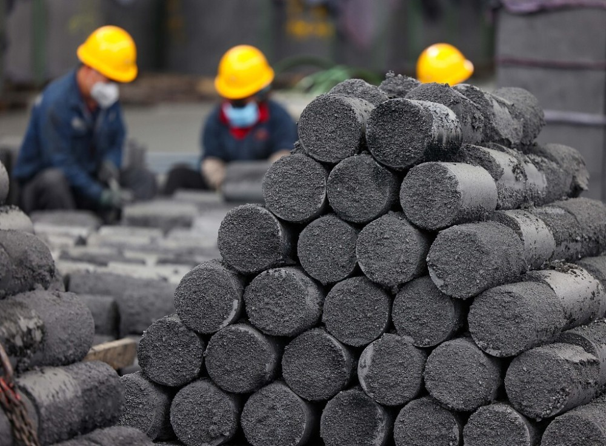

# 中国石墨限令实施在即，日韩着急

【环球时报综合报道】12月1日起，中国对特定石墨物项实施出口管制的政策正式实施。连日来，多个国家和企业都在作出密集调整。据日本广播协会（NHK）网站11月27日报道，日本企业开始推进电池原材料的多元化供应，并强化国产化能力。韩国电池企业也不得不面对原料供应无法摆脱中国优势产业链的事实。

_中国企业正在生产石墨产品。（视觉中国）_

**日韩急求石墨**

“富士石墨工业”是一家总部位于东京的公司，主要业务是将从中国进口的石墨加工后，再将相关产品提供给电池产业链下游的制造商。NHK网站报道称，为应对中国政府有关石墨的出口管制，该公司将11月份从中国进口的石墨量增加到往年的1.5倍，以确保在短期内有足量的库存。“富士石墨工业”表示，未来仍会争取从中国获取石墨，但也会根据情况变化考虑从非洲进口。

日本一家民间智库的首席研究员江藤名保子在接受NHK采访时分析称：“从事进口或加工石墨业务的日本企业要考虑使其供应链多元化，例如从中国以外的国家进口。”

《日本经济新闻》称，三菱化学集团一直从中国进口石墨，并在香川县的工厂生产负极材料。负极材料是约占电池成本14%的核心材料，去年中国负极材料产量占全球的96%，全球前10名负极材料企业基本都是中企。如果石墨进口受阻，该公司考虑与在莫桑比克和挪威生产石墨的澳大利亚公司合作，寻求多元化的采购途径。

日产汽车表示，虽然目前电池供应并没有受到影响，但已经通过供应商增加石墨库存，并在考虑从其他地区采购电池关键材料。隶属松下集团的电池业务公司松下新能源正在与加拿大的石墨公司进行共同研究，以实现负极材料的大规模生产。

韩国企业也在加快寻找替代供应。据韩国《先驱经济》报道，韩国L&F公司正在大邱建设一座新电池负极材料工厂，期望减少对中国电池供应链的依赖。

**中国供应占据全球七成**

《日本经济新闻》援引美国地质调查局的数据称，随着对电动车的需求快速增长，2022年石墨产量较上一年增长15％。其中，中国占据生产总量的70％，人造石墨的产量也很大。一直以来，中国以较低价格向国外出口石墨。名古屋大学客座教授佐藤登分析称：“石墨采购成本上升已不可避免，企业如何在承担成本的同时保持竞争力是焦点。”

中关村新型电池技术创新联盟秘书长于清教11月29日告诉《环球时报》记者，中国是全球最大的石墨生产国和出口国，其他电池原材料也有很大市场优势。日韩电池企业市场集中度较高。中日韩三国在全球电池领域“三足鼎立”的竞争格局目前相对稳固。中国在供应链方面的优势，目前其他国家难以追赶。

《日本经济新闻》援引庆应义塾大学综合政策学部白井教授的分析称：“全球贸易和生产供应链已经形成。然而，无论是中美竞争还是俄乌冲突，人们都在重新意识到地缘政治的巨大风险。”

日本政府尝试通过外交途径确保重要电池原材料的供给。日本经济产业省在2023年度的修正预算案中拨款2600亿日元（约合124亿元人民币），用于援助致力于人造石墨国产化的日本公司。日本政府还将加强与拥有资源的发展中国家的合作。

在韩国，POSCO Future M是唯一一家同时生产阴极和阳极材料的公司。目前，POSCO Future
M正在浦项建设一座产能为1万吨的二期人造石墨工厂，预计将于明年下半年竣工。此外，该公司计划到2025年再增建一座工厂。

**很难不受中国产业链影响**

除石墨外，中国政府已于8月1日加强了对稀有金属镓和锗等关键原材料的出口管理。NHK称，三菱化学集团表示，面对镓原料供应问题，公司计划先以目前的库存应对，未来将努力寻找其他国家替代供应。

日本企业不仅对中国出口管制范围内的原材料分散采购，还在通过其他方法应对。关东电化工业正在试验使用南美等其他地区的化合物解决电池原料需求；住友金属矿山与电池回收公司开展了从废旧电池中回收锂的实验。

“中国垄断全球电动车供应链，韩国企业处于四面楚歌境地，”韩国《亚洲经济》29日的报道称，有观点认为，中国在电池原材料市场占据主导地位，在美国《通胀削减法案》和欧洲《关键原材料法案》的影响下宣布退出中国的韩国企业几乎不可能实现供应链的多元化发展。此外，虽然韩国企业投入了“天文数字级别”的资金进行电池原材料开发项目，但由于中企的价格竞争力，预计将难以保证盈利。

《亚洲经济》的报道还提到，全球最大锂生产商美国雅宝公司近日宣布放弃对澳大利亚一家锂生产商的收购。目前雅宝在全球锂市场的份额为13%，作为单一公司排名全球第一。然而，中国企业的市场份额合计高达63%，中国在电池原材料方面实际上已经处于领先地位。雅宝公司表示：“由于矿产价格下跌，公司已经撤回投资计划，第一名的位置也可能被中企夺走。”

韩媒称，美国希望通过《通胀削减法案》夺取全球矿产霸权的意图很强烈，但现实却是全世界很难找到没有受到中国产业链影响的矿产国。如果想找一个在矿产地拥有生产网络，并且价格有竞争力的投资项目，那么最终很有可能是与中国公司合作。有业内人士担心，如果美欧对中国的贸易壁垒失效，韩国主要电池企业目前对美国和欧洲的大规模投资未来可能打水漂。

【环球时报驻日本、韩国特约记者 王天晴 丁玲 环球时报记者 王冬 环球时报特约记者 黄婉秋】

