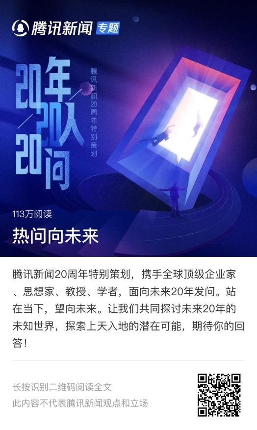
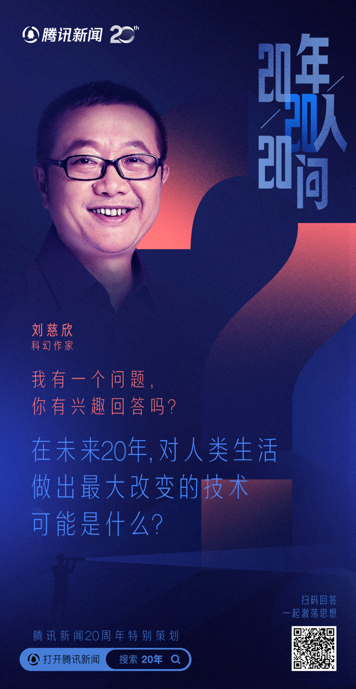
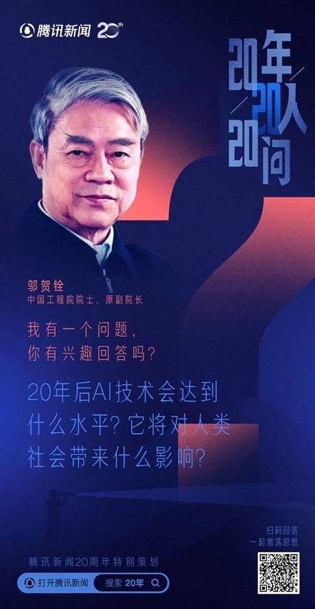
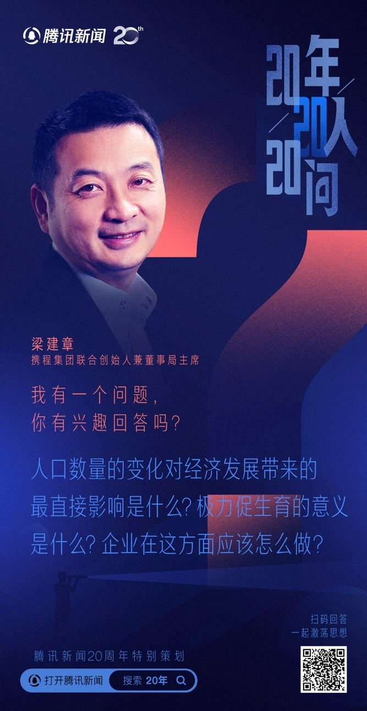
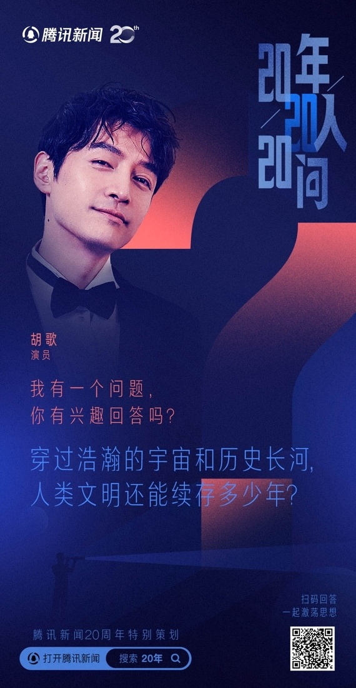

# 刘慈欣、邓亚萍、张雪峰等大咖向未来提问，共论一场人间清醒

历史洪流滚滚，文明奔涌向前。

2023年是被人工智能重新定义的一年，GPT数次更迭进化，通往AGI时代的大门向我们敞开。站在十字路口，我们回望过去，讨论充满不确定性的未来。

作为国内一线新闻资讯平台的腾讯新闻，在其成立20周年之际，携手全球最具前瞻视野的科学家、思想家、企业家、教授和学者等，发起「20年20人20问」特别策划。

提问是人的本能。邬贺铨、凯文·凯利、邓亚萍、刘慈欣、张雪峰、胡歌等数十名跨界大咖在腾讯新闻热问提问，引发全网数千万网友参与讨论。在社交媒体平台上，相关话题的阅读量累计高达数亿。

从体育网红到新式教育，从超级AI到赛博竞争，从全球气候到人类文明，这些问答中既有仰望星空的未来畅想，也有脚踏实地的现实问题碰撞。这场深刻的思想交锋，仍在进行着。

**01 推开虚掩的门缝，通往AGI时代的争论**

星星萤火指引，脚下的路正通往AGI时代。

在科幻作品《三体》中，一种由高级人工智能及三体人操控的微观粒子“智子”贯穿全篇，文中人类文明与三体文明的交战，一定程度上讲，也可看做“后科技时代”人类对自我与未知的假设。

“智子”是虚构的，那么这次，刘慈欣向现实世界提问： **在未来20年，对人类生活做出最大改变的技术可能是什么？**

作为现代科学的基础，我们先来看看物理学角度的回答，中国科学院物理研究所研究院、博士生导师罗会仟认为，未来20年里，基于传统电磁功能材料的许多应用场景已经逼近极限，超导材料将是实现电磁突破的关键。

而放眼回答区， **AGI** 成为讨论频次最高的热词。Tiamat创始人毛钰炜直言：我几乎脱口而出AGI。

AGI，也就是通用人工智能，简单来说，这是一种能力远大于AI的高级人工智能，能够执行复杂任务，完全模仿人类智能的行为，可以实现自我学习、自我改进、自我调整，进而解决任何问题而不需要人为干预，可以说是人工智能领域的一大“质”的飞跃。

不少答主展望：在未来，AGI将实现跨学科融合与创新，人类的第二大脑、AI伴生有望走向现实。

而AI同样占有极高的热度，中国工程院院士邬贺铨认为：绝不能低估生成式大模型所代表的AI技术的深远影响，生成式AI具有涌现能力，这是向通用AI发展的基础。强人工智能或超级AI有望诞生，AI的未来20年将开创智能革命的新时代。

这也引出了一个长期备受争议的话题，未来世界，万千产业将如何被AI技术深刻塑造？猎豹移动董事长兼CEO、猎户星空董事长傅盛在回答中提到，人工智能、智能机器人、可再生能源，将为我们带来更智能、更健康、更可持续的未来，而在推动这些技术发展的同时，我们还需要面对伦理、隐私和社会方面的诸多挑战。

比如，人工智能改变了体育运动，但也带来了争议。中国女排世界冠军张常宁认为：以排球为例，AI可以帮助队伍以最快的时间做出技术统计，生成扣球线路图，便于运动员临场应变或赛前研究对手，但AI不能代替运动员在场上发挥。

科幻作家韩松也提出疑问：未来人工智能、元宇宙会对两性关系产生怎样的影响，家庭概念会消失吗？

他认为，随着人工智能的发展，有可能家庭存在的必要性进一步降低，提前实现哲人预言的家庭的消失。也许在未来，两性关系可能不再局限于肉体存在，情感连接和精神共鸣可能成为主导。但也有一种可能，智能机器将被广泛用于巩固家庭和婚姻关系，阻止它们的破裂。

AGI时代的门缝已难虚掩，关于技术的竞与和，回到原点，还是人类如何自处的问题。

**02 生而为人数千年，巨变之下何为我们？**

在腾讯新闻热问上，网友们也发出了灵魂拷问，例如：未来还需要这么多人吗？

这种想法来源于技术的冲击。回看人类文明史，已匆匆走过数千年，AGI裹挟着如今的时代发展，虚拟偶像、AI医生等的兴起让不少职业的存续画上了问号，未来是否会像农耕替代畜牧、信息代替工业，新型的AI生产力将推翻此刻的文明？

真格基金联合创始人王强由此设问：AI时代，如果工作都交给人工智能，人去干什么？有了虚拟偶像就不需要演员、偶像了吗？如果AI可以操作手术，就不需要医生和专家了吗？

当前舆论主流认为，AI是工具，工具不可能替代人。正如演员刘涛所言，虚拟演员无法完全模拟出人类的情感、思维和表演技巧，而这些恰恰是演员的重要特质，演员的丰富情感和灵动表现也是难以被替代的。

每当有新技术诞生，总会有一些原始的工作被替代掉，但也会创造出新的工作机会，人工智能时代同样如此。
人类更需要思考的并不是AI与人的竞争，因为AI发展高度依赖于应用场景的丰富、杰出人才的贡献以及财力的丰沛，而这些都需要巨量的人口基数为基础。

但现如今，我国的生育率持续走低，2022年我国的总和生育率已经下滑至1.09，甚至比日本的1.29还要更低……因此，携程集团联合创始人兼董事局主席梁建章发问：人口数量的变化对经济发展带来哪些影响？极力促生育的意义是什么？

人口学者何亚福认为，中国出生人口减少，老龄化程度加深的现状，将会导致未来对幼师和教师的需求减少，而养老护工的需求会大幅增加。对一个国家、一个社会来说，如果生育率长期低于更替水平，人口萎缩，将连锁导致国力和经济衰退。

换言之，人始终是一切的基础。梁建章主张应促进生育，在这个过程中，政府应该起到主要作用，企业起到辅助作用，毕竟人力资源既是社会的宝贵财富，也是企业发展的核心力量，企业提供生育福利符合政策支持的大方向。

单单鼓励生育就够了吗？显然没有这么简单。人口增长有一个最为基本的前提——有个家。正如全球化智库特邀高级观察员黄文政所言，解决低生育率危机，需要辅之以户籍和土地制度的深层改革。

国内尤其是一线城市的住房问题凸显，城市中的低收入群体“无家可归”的问题首当其冲。低收入人群在我国并不是少数，占全部人口比例超20%。原国家房改课题组组长孟晓苏提出了近五分之一中国人胸中之问：当前大城市房价依然较高，未来要“人人有房住”，低收入群体的住房保障问题如何解决？

总的来看，双轨制是目前的主要论调。“房地产的发展不能只有商品房的市场轨，还要有保障房的保障轨。”粤开证券首席经济学家罗志恒认为，双轨并行既能发挥出市场的激励约束作用，又发挥出政府的托底作用，实现在房住不炒大势下的“大庇天下寒士俱欢颜”，实现多层次的住房供给结构和供给体系。

叩源推委，本盛末荣。只有在社会资源层面上实现对住房供需的合理梳理，做到“刚需有保障，改善有市场”，才能在其他联动问题上逐见成效。

**03 你和我，将怎样走向2043？**

人类社会的演化是渐进式的，但组成社会的一个个“细胞”——具体的人，却需要在20年间持续拥抱变化，迎接一个可能让人感到陌生、彷徨的世界。

当旧有的学识、经验不再适用于未来，生活在其中的我们、我们的下一代，必须要赶上时代变革的步伐。

腾讯新闻热问提问官张雪峰发问： **20年以后，我们还需要上大学吗？**

在他看来，答案无疑是肯定的，我们仍然需要上大学，因为人类需要长期学习、坚持学习的过程。随着下一次以大数据、人工智能主导的工业革命时代到来，各行各业将发生巨变。到了大学职业教育阶段，教育的方式、方法、内容要因时而变；比如，传统洪堡式教育模式下的专业培养方案也许不再适用，中国大学可以学习欧美高校增加“gap
year”，以丰富学生实践经验；部分专业甚至可以把学制缩短成三年等。

“张雪峰之问”引发了无数共鸣。一方面，如今社会教育竞争加码、学历门槛逐年提升，“卷”学历的浪潮裹挟着无数学子。另一方面，数百万大学生“毕业即失业”，就业压力连年递增，“读书无用论”之言甚嚣尘上。

清华ACCEPT研究院院长李稻葵的问题也问到了不少人的痛点上：年轻人应该培养哪些技能，应对未来的复杂世界？

诺奖得主中村修二曾极力批判东亚教育对创造力的桎梏：当今社会需要的是具有创造力、充满好奇心并能自我引导的终身学习者，需他们有能力提出新颖的想法并付诸实施。不幸的是，如今的教育完全忽视了人与人之间异常美妙的多样性与细微差别——正是这些多样性上的细微差别，让人们在智力、想象力和天赋方面各不相同。

武汉大学哲学学院教授苏德超认为，尽管未来大学的教授内容和大学的授课形式有了某些变化，但大学运行的根本制度并没有改变。人类知识的创新和新知识的传播，依然要靠大学。

争论激烈，多数人并不反对大学作为“象牙塔”意义。技术进步铺就的道路，让这座高塔的光芒可以照到更多角落。不过，对未来的一切保持适度的灵活性，终身学习新知识显得尤为重要。

在基础教育领域，清华大学心理学系主任刘嘉的「20年20人20问」的提问是：“未来，通用人工智能可以实现‘千人千面’的一对一因材施教，传统的基于班级的学校教育还有必要存在吗？”

中国教育发展战略学会学术委员会委员陈志文的回答可谓精辟：知识的学习可以压缩，可以快速地跨越，但人生的成长无法压缩。他认为，尽管AI可以帮助我们提高学习效率，但它替代不了的，是传统学校这个环境的教育，是人与人之间的复杂教育。

我们不仅需要知识应对未来世界，如何学会与他人相处，如何善待他人、善待自己，更是常常被我们忽视的角落。

**04 弹指间白云苍狗，我想触摸到这个世界**

未来如何，无人知晓。

腾讯新闻「20年20人20问」展示了一个全局化的视角，从科技进步到人口消长，从音乐艺术到竞技体育，从城与乡的变迁到人与家的情感，从全球气候变化到人类文明的曙光......总而言之：向未来二十年的一切可能性发问。

流行音乐创作人方文山问， **未来20年华语流行乐坛能不能走向世界？** 他说，一定可以，要相信我们炎黄子孙的智慧。

蔚来汽车CEO李斌问： **20年后的汽车，和现在会有什么不同？**
他认为这个答案可以概括为三个数字：0、0和100，第一个0，指的是0交通事故；第二个0，指的是0排放。100，指的是100%懂你。

乒乓球世界冠军邓亚萍问， **运动员成为各个平台网红对竞技体育是好事吗？** 她说，运动员还是运动成绩最重要，但能让粉丝喜欢上一项运动，也是竞技体育的魅力。

作家阿来问， **人类活动到底在多大程度上影响未来气候？**
中国科学院大学岗位教授钱诚的论文刚好呼应了这一问题：人为气候变化使得类似2020年“水深火热”空间复合型极端事件的发生概率至少增加了10倍。

演员胡歌问， **穿过浩瀚的宇宙和历史长河，人类文明还能续存多少年？**
在《繁城之下》导演王铮看来，也许，人类文明的存续会比人类这个物种存续的时间更长。有网友响应道：给岁月以文明，而不是给文明以岁月。

可以看到，当人们忙碌于低头寻找生活中六便士的时候，也有一拨人看到了未来，抬头寻找月亮，思考世界的终极。

过去几年，在全球性疫情肆虐的余波下、在地缘战争的硝烟前，人类社会原有的集体乐观主义显得尤为脆弱。冲突、隔阂、暴力......互联网上定义我们时代的词语充满了威胁。这个充满混乱和纷争的世界，我们应该如何去感知、如何去触摸？

提问是解答的开始。每个人的答案都不尽相同，正如鲍勃·迪伦所唱，一切在风中飘荡。我们需要真正走进生活，走进未来，探寻属于每个人的下一个二十年。

**结语**

20年后是我们的下一代主导的世界。在未来，Ta们生活在什么样的世界之中？Ta们能够听到20年前的我们发出种种疑问吗？

这场跨越科技、财经、医疗、教育、人文等多个领域的思想交锋，在腾讯新闻热问数十名大咖提问官的带领下，仍在一个又一个的回答中不断生长。或许，我们的这场对话，会在将来的某一处、某一刻产生回响。下一个20年，下一批20人，下一组20问，我们等你一起，聆听思想的对话，共同书写关于未来的篇章。

