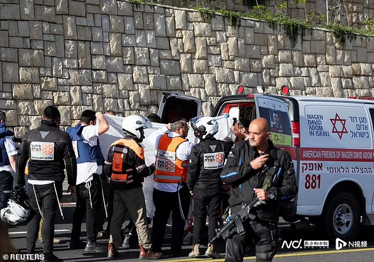
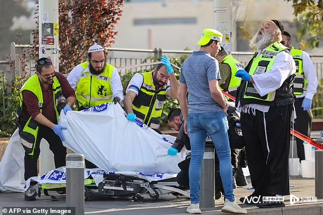
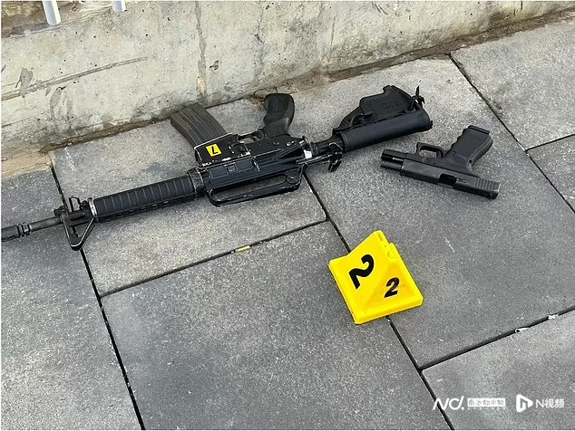
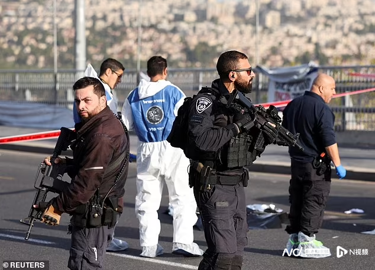
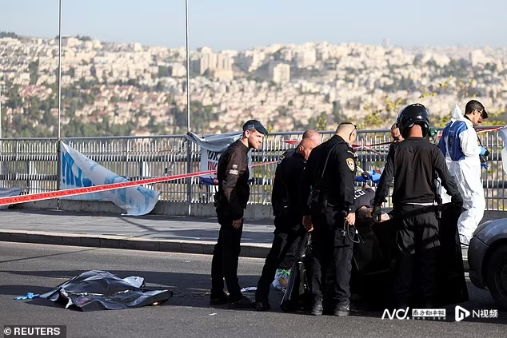

# 哈马斯两兄弟乱枪扫射耶路撒冷公交站，造成两人死亡八人受伤

当地时间11月30日上午，耶路撒冷发生枪击事件，来自巴勒斯坦武装派别哈马斯的两兄弟在一个公交站向人群开枪射击，造成至少两人死亡，八人受伤，两兄弟随后被警方“当场制服”。

_警方在现场救援伤者。_

据报道，以色列警方表示，袭击发生在早高峰时段，一名24岁的妇女和一名70多岁的男子在袭击中丧生。

枪手是来自东耶路撒冷的两兄弟，分别是38岁的穆拉德·内梅尔和30岁的易卜拉欣·内梅尔，他们被“当场制服”。

警方表示，穆拉德曾在2010-2020年间因与加沙地带有关的恐怖罪行而服刑，而易卜拉欣则在2014年因恐怖活动而入狱。

 _枪手使用的武器。_

耶路撒冷警察局长多伦·托尔奇曼（Doron Torgeman）表示，两名恐怖分子乘坐一辆汽车来到现场，其中一人手持
M-16（突击步枪），另一人手持手枪，并开枪射击。

哈马斯声称发动了这次袭击。

 _警方在现场警戒。_

社交媒体上流传的现场录像显示，武装警察包围了两具躺在地上的尸体。

其他片段显示，人群在枪声中奔跑，汽车则加速驶离现场。

据悉，一年前，一枚炸弹在同一公交车站爆炸，造成一名16岁男孩死亡，18人受伤。

该公交站附近没有检查站把守城市入口。

文/南都记者 陈林

