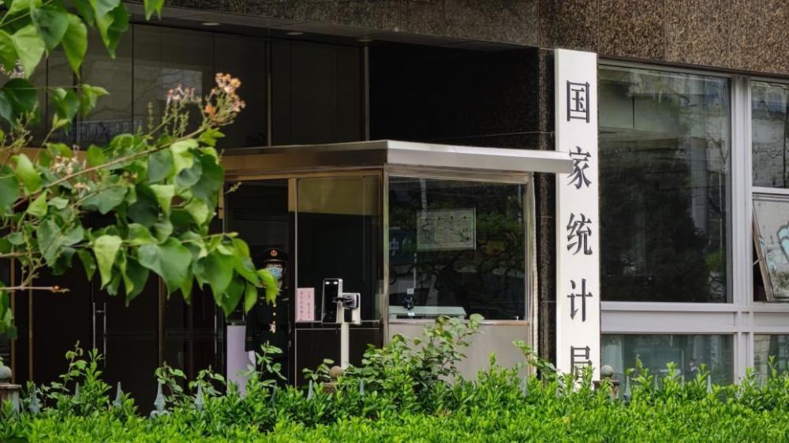

# 国家统计局点名：有市县党政领导尚未认识统计造假的极端危害性

11月30日，“统计微讯”微信公众号公布了国家统计局2023年专项统计督察第1督察组向陕西反馈专项统计督察意见和第5督察组向贵州反馈专项统计督察意见。

按照党中央、国务院要求，国家统计局于2023年11月29日向陕西省委、省政府反馈了专项统计督察意见。国家统计局党组书记、局长康义通报专项督察意见，陕西省委书记赵一德主持会议，省委副书记、省长赵刚作表态发言，省委常委、常务副省长王晓，国家统计局2023年专项统计督察第1督察组有关负责同志，省直有关部门、相关地市负责同志参加会议。

根据党中央、国务院授权，2023年7月25日至8月7日，国家统计局2023年专项统计督察第1督察组对陕西省开展了专项统计督察。

督察发现，陕西省统计工作仍然存在一些问题，主要表现在：

一是深入贯彻落实习近平总书记关于防治统计造假重要讲话和指示批示精神仍有差距，有的市县党政领导干部尚未从讲政治的高度深刻认识统计造假的极端危害性和防治统计造假的极端重要性、紧迫性，防治统计造假的思想共识尚未完全形成；

二是引导推动地方党委政府和有关部门树立和践行正确政绩观方面尚存短板，有的地区过度追求数据排名，政绩冲动和考核压力助推统计造假；

三是有的地方县级政府有关部门以调度经济名义调度统计数据，存在干预统计报送问题；

四是统计造假专项治理行动成效还不够明显；

五是首轮统计督察反馈问题整改仍不到位，个别地区存在形式主义、无效整改问题。

按照党中央、国务院要求，国家统计局于2023年11月29日向贵州省委、省政府反馈了专项统计督察意见。国家统计局党组成员、副局长毛盛勇通报专项统计督察意见，贵州省委常委、省政府常务副省长吴强主持会议并作表态发言

根据党中央、国务院授权，2023年7月27日至8月8日，国家统计局2023年专项统计督察第5督察组对贵州省开展了专项统计督察。

督察发现，贵州省统计工作仍然存在一些问题，主要表现在：

一是深入贯彻落实习近平总书记关于防治统计造假重要讲话和指示批示精神仍有差距，有的地区对统计造假问题严重性及其背后深层次原因认识不到位，违规干预统计工作问题仍有发生；

二是组织推动统计督察和国家统计执法检查反馈问题整改不够有力，一些统计违纪违法案件责任人责任追究不及时、处分处理“宽松软”，统计造假“一票否决制”落实不到位；

三是落实统计造假专项治理行动要求不够严格、不够彻底，专项治理期间仍存在统计造假行为，部分地区专项治理行动不及时、打折扣。

澎湃新闻记者注意到，上述国家统计局2023年专项统计督察督察组反馈的意见，提到了陕西“有的市县党政领导干部尚未从讲政治的高度深刻认识统计造假的极端危害性和防治统计造假的极端重要性、紧迫性”；贵州“有的地区对统计造假问题严重性及其背后深层次原因认识不到位”。

此前，国家统计局已开展了多次统计督察。

2019年以来，国家统计局先后对31个省（区、市）、新疆生产建设兵团和12个国务院部门开展统计督察，实现了对省级地区党委和政府常规统计督察“全覆盖”。

2022年，国家统计局对5个省（市）和2个国务院部门开展统计督察“回头看”。

2023年7月，国家统计局组建督察组对河北、黑龙江、河南、湖南、贵州、陕西等6省开展专项统计督察，那也是首次专项统计督察。

11月13日，2023年常规统计督察动员部署会在京召开。在动员部署会之后，四川、云南、广西等省份，已迎来了统计督察组。

