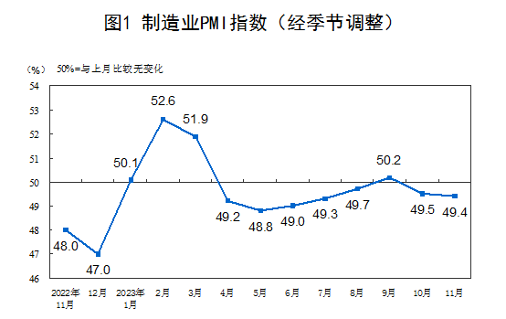
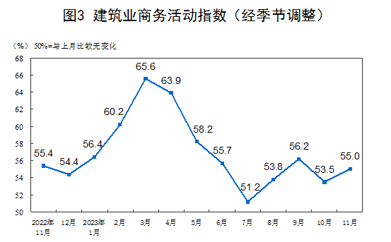
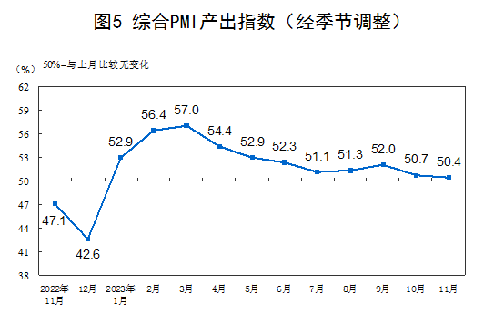

# 国家统计局：11月份制造业PMI为49.4%，与上月基本持平

国家统计局服务业调查中心

中国物流与采购联合会

**一、中国制造业采购经理指数运行情况**

11月份，制造业采购经理指数（PMI）为49.4%，比上月下降0.1个百分点，制造业景气水平略有回落。

从企业规模看，大型企业PMI为50.5%，比上月下降0.2个百分点，继续高于临界点；中型企业PMI为48.8%，比上月上升0.1个百分点，低于临界点；小型企业PMI为
47.8%，比上月下降0.1个百分点，低于临界点。

从分类指数看，在构成制造业PMI的5个分类指数中，生产指数和供应商配送时间指数高于临界点，新订单指数、原材料库存指数和从业人员指数低于临界点。

生产指数为50.7%，比上月下降0.2个百分点，仍高于临界点，表明制造业生产保持扩张。

新订单指数为49.4%，比上月下降0.1个百分点，表明制造业市场需求有所回落。

原材料库存指数为48.0%，比上月下降0.2个百分点，表明制造业主要原材料库存量减少。

从业人员指数为48.1%，比上月上升0.1个百分点，表明制造业企业用工景气度略有回升。

供应商配送时间指数为50.3%，比上月上升0.1个百分点，表明制造业原材料供应商配送继续加快。

**二、中国非制造业采购经理指数运行情况**

11月份，非制造业商务活动指数为50.2%，比上月下降0.4个百分点，仍高于临界点，非制造业继续保持扩张。

分行业看，建筑业商务活动指数为55.0%，比上月上升1.5个百分点；服务业商务活动指数为49.3%，比上月下降0.8个百分点。从行业看，水上运输、电信广播电视及卫星传输服务、货币金融服务等行业商务活动指数位于55.0%以上较高景气区间；房地产、租赁和商务服务等行业商务活动指数低于临界点。

新订单指数为47.2%，比上月上升0.5个百分点，仍低于临界点，表明非制造业市场需求收缩幅度收窄。分行业看，建筑业新订单指数为48.6%，比上月下降0.6个百分点；服务业新订单指数为46.9%，比上月上升0.7个百分点。

投入品价格指数为49.8%，比上月上升0.1个百分点，仍低于临界点，表明非制造业企业用于经营活动的投入品价格总体水平仍略低于上月。分行业看，建筑业投入品价格指数为53.1%，比上月上升3.2个百分点；服务业投入品价格指数为49.2%，比上月下降0.5个百分点。

销售价格指数为48.3%，比上月下降0.3个百分点，表明非制造业销售价格总体水平下降。分行业看，建筑业销售价格指数为51.3%，比上月上升1.3个百分点；服务业销售价格指数为47.7%，比上月下降0.6个百分点。

从业人员指数为46.9%，比上月上升0.4个百分点，表明非制造业企业用工景气度有所回升。分行业看，建筑业从业人员指数为48.2%，比上月上升1.8个百分点；服务业从业人员指数为46.7%，比上月上升0.2个百分点。

业务活动预期指数为59.8%，比上月上升1.7个百分点，表明非制造业企业对近期市场恢复发展信心增强。分行业看，建筑业业务活动预期指数为62.6%，比上月上升1.2个百分点；服务业业务活动预期指数为59.3%，比上月上升1.8个百分点。

**三、中国综合PMI产出指数运行情况**

11月份，综合PMI产出指数为50.4%，比上月下降0.3个百分点，表明我国企业生产经营活动总体持续扩张。

**附注**

1、主要指标解释

采购经理指数（PMI），是通过对企业采购经理的月度调查结果统计汇总、编制而成的指数，它涵盖了企业采购、生产、流通等各个环节，包括制造业和非制造业领域，是国际上通用的监测宏观经济走势的先行性指数之一，具有较强的预测、预警作用。综合PMI产出指数是PMI指标体系中反映当期全行业（制造业和非制造业）产出变化情况的综合指数。PMI高于50%时，反映经济总体较上月扩张；低于50%，则反映经济总体较上月收缩。

2、调查范围

涉及《国民经济行业分类》（GB/T4754-2017）中制造业的31个行业大类，3200家调查样本；非制造业的43个行业大类，4300家调查样本。

3、调查方法

采购经理调查采用PPS（Probability Proportional to
Size）抽样方法，以制造业或非制造业行业大类为层，行业样本量按其增加值占全部制造业或非制造业增加值的比重分配，层内样本使用与企业主营业务收入成比例的概率抽取。

本调查由国家统计局直属调查队具体组织实施，利用国家统计联网直报系统对企业采购经理进行月度问卷调查。

4、计算方法

（1）分类指数的计算方法。制造业采购经理调查指标体系包括生产、新订单、新出口订单、在手订单、产成品库存、采购量、进口、主要原材料购进价格、出厂价格、原材料库存、从业人员、供应商配送时间、生产经营活动预期等13个分类指数。非制造业采购经理调查指标体系包括商务活动、新订单、新出口订单、在手订单、存货、投入品价格、销售价格、从业人员、供应商配送时间、业务活动预期等10个分类指数。分类指数采用扩散指数计算方法，即正向回答的企业个数百分比加上回答不变的百分比的一半。由于非制造业没有合成指数，国际上通常用商务活动指数反映非制造业经济发展的总体变化情况。

（2）制造业PMI指数的计算方法。制造业PMI是由5个扩散指数（分类指数）加权计算而成。5个分类指数及其权数是依据其对经济的先行影响程度确定的。具体包括：新订单指数，权数为30%；生产指数，权数为25%；从业人员指数，权数为20%；供应商配送时间指数，权数为15%；原材料库存指数，权数为10%。其中，供应商配送时间指数为逆指数，在合成制造业PMI指数时进行反向运算。

（3）综合PMI产出指数的计算方法。综合PMI产出指数由制造业生产指数与非制造业商务活动指数加权求和而成，权数分别为制造业和非制造业占GDP的比重。

5、季节调整

采购经理调查是一项月度调查，受季节因素影响，数据波动较大。现发布的指数均为季节调整后的数据。

权威解读

[国家统计局服务业调查中心高级统计师赵庆河解读2023年11月中国采购经理指数](https://news.qq.com/rain/a/20231130A01U3900)

