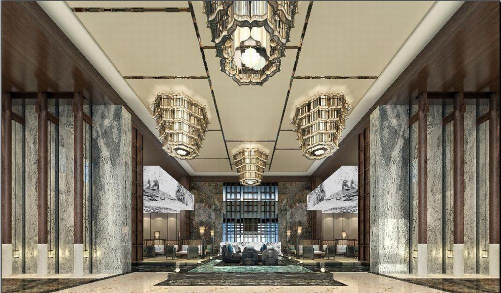
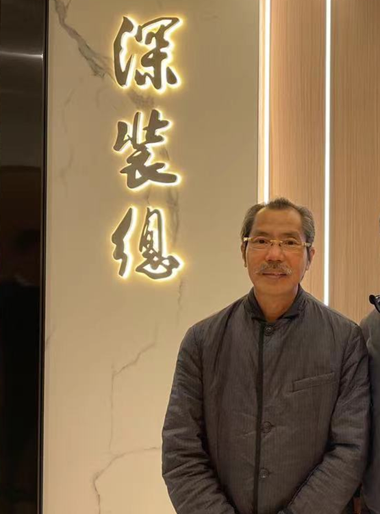

# 深圳老牌企业“宫斗”：两任董事长“互咬”，被指已无法正常发工资

11月24日，深装总建设集团股份有限公司（下称“深装总”）有“董监高”收到了一封名为《致深装总股东会、董事会、监事会的一封信》的电子邮件。邮件中包含了《关于罢免深装总建设集团郑李民董事长职务的议案》和《致深装总各位股东、董事的一封信》等，主要对这家公司的现任董事长郑李民提出指控，并提出对其进行罢免。《关于罢免深装总建设集团郑李民董事长职务的议案》由深装总原董事长李兴浩提出，《致深装总各位股东、董事的一封信》则由李兴浩和另外两位董事联名。

这已是李兴浩递出的第三份要求罢免郑李民的议案。由于被指控“涉嫌挪用资金”，李兴浩如今已被司法机关控制。

深装总是深圳一家老牌装饰企业，诞生于1983年，曾获得中国建筑工程最高奖——鲁班奖，见证了中国地产经济的崛起和辉煌。

对于李兴浩的指控，郑李民此前发布了《致深装总股东会、董事会的一封信》予以回应，直指李兴浩对其“打击报复”，“现在深装总正处于生死存亡之际，各位股东应当团结一致，共度时艰”。

此番“宫斗”正值地产行业的低谷，深装总主营业务已停滞不前，员工离职四散。

“造成公司今天这个困难的局面，最主要的原因还是股东内斗，再加上地产行业不景气。”深装总一名在职老员工对第一财经记者感慨道。

**前董事长被控**

从1983年7月设立深装总前身家乐设计装饰公司（集体所有制企业）起至今，这家老牌的装饰企业刚好走过40载历程。

郑李民比李兴浩较早介入深装总，在本世纪初参与了公司改制。经过多轮股转，截至2010年1月，郑李民通过自己控制的深圳市中亘投资有限公司（下称“中亘投资”）持有深装总84%股权。

2010年，志高空调创始人李兴浩开始介入深装总。

据深圳中院民事判决书（2020）粤03民终9533号“法院认定事实”部分记载，2010年4月20日，中亘投资与李兴浩（甲方）签订《股转协议》，中亘投资同意将其持有的深装总41%股权以6029.41万元转让给李兴浩。双方约定，“尽一切合理努力，促使标的公司在3年内向中国证监会提交境内发行上市申请文件”。但深装总并未如期实现IPO，曾挂牌新三板，后又终止挂牌，并筹划借壳上市，亦未能如愿。

在投资深装总后的前期，李兴浩并未实际参与公司经营。“主要由职业经理人团队打理，并且还承诺给股权激励，此后也兑现了。”深装总内部知情人士告诉第一财经记者。到2018年8月，李兴浩开始担任深装总董事长，郑李民为荣誉董事长。

2020年4月，深装总向公安机关举报李兴浩；同年6月，李兴浩辞去深装总董事长，由郑李民接任。

深圳市福田区人民检察院起诉书（深福检刑诉[2023]131号）显示，深装总于2020年4月14日报案至深圳市公安局，“自2018年11月8日至2019年3月13日，李兴浩利用职务便利，安排相关人员将深装总的资金挪用给5家公司。”

第一财经记者查证，起诉书所指5家公司，为志高空调的供应商。一份加盖公章的借款合同显示，起诉书指控的这5家公司均曾与深装总签订了借款合同，并约定了还款日期以及年化利率。另外一份加盖公章的担保合同显示，李兴浩为几笔贷款签署了个人担保。

2021年11月3日，李兴浩“经电话传唤后到案”。据2021年11月4日——李兴浩到案的次日——深装总股东会通过的一项议案显示，上述起诉书中提及的深装总对5家公司的债权置换给了李兴浩，原因是李兴浩曾以其个人及其关联公司的大额存单替深装总归还过银行贷款。另外，一份2022年5月12日深装总与李兴浩签署的《债权转让协议》显示，起诉书中提及的这5家公司的全部债权均转让给李兴浩行使。

记者获悉，上述案件在今年7月底已开过一次庭。

有深装总股东指出，李兴浩所涉为刑事案件并非民事案，不存在深装总出具相关文件就能脱罪的可能。

**两任董事长“互咬”**

李兴浩被控后，对郑李民提出了相关指控，并提议罢免郑的董事长职务。深装总两任董事长的相互撕咬拉扯愈演愈烈。

自被控制后，李兴浩已经递出了三份要求罢免郑李民的议案，签署时间分别为9月7日、10月12日和11月18日。

近日，记者获得了一份由李兴浩签字的《关于罢免深装总集团郑李民董事长职务的议案》称，郑李民担任公司董事长期间，多次违反公司章程，涉嫌职务侵占，已不具备担任董事长资格。李兴浩在这一罢免议案中给出的理由包括郑李民“未经董事会批准，私自用公司资产为个人企业贷款抵押担保”。

上述议案称，郑李民未通过深装总董事会、股东会，擅自将深装总位于南山区7套宿舍为其关联公司的贷款做担保，贷款金额高达7881万元，现已逾期无法偿还。

第一财经记者获得的一份民事起诉状显示，原告中国光大银行股份有限公司深圳分行（下称“光大银行深圳分行”）将深圳市中荟新材料科技股份有限公司（借款人，下称“中荟科技”）、郑李民（保证人、抵押人）、深装总（抵押人）等主体列为被告，请求判令中荟科技向光大银行深圳分行立即偿还贷款本金7881万元、利息110.80万元等，共计8185.26万元。光大银行深圳分行还请求就前述债权对依法处置深装总名下相应的7套房产的所得价款享有优先受偿权。

天眼查工商资料显示，中荟科技是郑李民实际持股96%的企业。

深装总之所以被列为该诉讼的被告，是因为其以位于深圳市南山区沙河新岗街单身宿舍的7套房产为中荟科技向光大银行深圳分行的贷款提供担保。目前，这7套房产已被法院冻结，保全期限3年，至2026年7月13日到期。

第一财经记者获得的一份“SZZ第三届董事会”微信群截图显示，就上述郑李民所涉案件并牵扯深装总一事，有董事将案件截图发在群内并对郑李民发问。对此，郑李民在群内回应称：“欢迎各位董事来公司实际切（注：应为“彻”）查，当时为了公司多贷款年底要发工资，还增加了我（和）连州矿业公司（注：为郑李民关联公司）做的担保，工资才能发出来，有银行合司（注：应为“同”）可查。”

在上述微信群内，深装总另一位董事提出质疑，就光大银行诉求来看，深装总是承担连带清偿责任，在法律上应该是全额责任，也就是说深装总是存在全额清偿责任的法律风险，与该全额清偿责任相对应的应该是该借款合同本金7881万元是否全额回流到公司，并用于公司正常支出，否则公司承担的责任风险与获得的权益不对称，从而放大了公司风险，“退一万步讲，这种‘曲线救国’的方式也是违反公司重大决策程序的”。

11月2日，郑李民在《致深装总股东会、董事会的一封信》中称，李兴浩对他的“诬蔑都是源于其个人的私利”，“南山区宿舍的抵押贷款中，我本人以及连州市港连矿业有限公司都作为深装总向光大银行贷款的担保主体，深装总无力偿还光大银行贷款，我本人及港连矿业公司都因该笔贷款的担保而成为被告和被执行人，我本人及港连矿业都受到了牵连，根本没有任何利益可言”。

郑李民在《致深装总股东会、董事长一封信》中称：“李兴浩挪用公司资金累计高达3.996亿……是导致公司资金链断裂的最根本原因。”同时称李兴浩的罢免议案是打击报复，“想把我赶出董事会和深装总”，又称，“李兴浩这么做的目的只有一个，就是想公司给他出具让他脱罪的证明”。

对于上述李兴浩所提出的议案内容，第一财经记者致电郑李民并向其发送短信予以求证，截至发稿始终未获回复。

前述《致深装总各位股东、董事的一封信》中，李兴浩等三位深装总董事提出，“再次提起各位股东召开临时股东会议，罢免郑李民董事长职务”。

**“生死存亡之际”**

目前，尚无法看出李兴浩与郑李民的争斗将是怎样的走向，但深装总已经深陷重重困境。郑李民《致深装总股东会、董事会的一封信》中称，“现在深装总正处于生死存亡之际”。

多位深装总员工反映，目前公司已经无法正常发放员工工资。

深装总一名在职十年的老员工告诉第一财经记者，他在去年6月收到工资后，此后公司的工资发放就不正常，“偶尔几个月发一些生活费”。不过公司仍在正常给大家缴社保。

除了拖欠内部员工工资外，深装总对外的承建项目亦被曝出存在拖欠工资的行为。

第一财经记者查询深圳市人力资源和社会保障局官网披露的《深圳市拖欠农民工工资失信联合惩戒名单信息表》显示，深装总因为拖欠202名工人12个月约807万元工资，被深圳市龙华区人力资源局于2022年9月28日作出列入严重违法失信名单（黑名单）的决定。

深圳龙华区人力资源局2022年9月披露的文书显示：深装总拖欠万科和风轩小区配套幼儿园项目92名工人2021年6月至10月份工资共计406.80万元；拖欠华盛珑悦小区配套幼儿园项目54名工人2020年8月至2021年7月份工资共计209.27万元；拖欠金亨利瑜璟小区配套幼儿园项目30名工人2020年8月至2021年7月份工资共计101.48万元；拖欠中森公园华府幼儿园装修工程项目26名工人2020年8月至2021年7月份工资共计89.48万，“经责令限期改正，逾期未改正。”目前，尚不清楚是否已完成支付。

最近的2023年9月26日，深圳市福田区人力资源局作出行政处罚决定书（深福劳监罚﹝2023﹞3000077号），违法事实显示：拖欠员工朱刚2022年10月至2023年4月期间的工资14.41万元，违反了《深圳市员工工资支付条例》第五条之规定，“经人力资源主管部门责令限期改正，逾期未改正。”

国家企业信用信息公示系统显示，深装总已被列入严重违法失信名单。“公司发不出工资的原因是银行账户都被冻结了，据财务说交社保都是用的现金。”前述深装总老员工说。

多位深装总受访员工介绍，深装总之所以陷入如今的困境，一方面是股东内斗；另一方面是地产行业不景气的大环境，特别是恒大的“爆雷”。

深装总今年5月对赤水市人民医院的一份“复函”提到，“我司因受恒大爆发的巨额债务违约事件的影响，所有银行账户资金因恒大商票到期无法兑付引发的诉讼被冻结”。

根据员工描述并结合记者查阅的深装总过往内部业务信息，深装总曾经与恒大有过较多的业务合作，也受到了恒大“爆雷”的影响。

在包括李兴浩在内的三位董事联名签署的《致深装总各位股东、董事的一封信》中，称深装总已经“资金链断裂”，其中一大原因是“公司深受恒大业务的影响”。

据深装总内部知情人士介绍，对于恒大业务的风险，李兴浩管理公司其间有过多次提示，但公司并未彻底处理。“李兴浩回深装总履职后，发现公司存在对恒大公司较大的依赖，而且恒大是以‘商票’的形式给深装总支付进度款，但深装总需要以现金的形式支付农民工工资及材料款，这对公司资金造成较大的压力。李兴浩回来后的首要事情是逐步摆脱对恒大业务的依赖，并提出‘恒大商票不代表钱’。”深装总的一些内部文件也显示李兴浩有过此方面的提示。

对相关情况，第一财经同样未能获得郑李民的回应。

“目前公司大部分是像我一样，40岁以上的老员工，30岁上下的年轻员工基本走得差不多了。”前述深装总老员工说。

