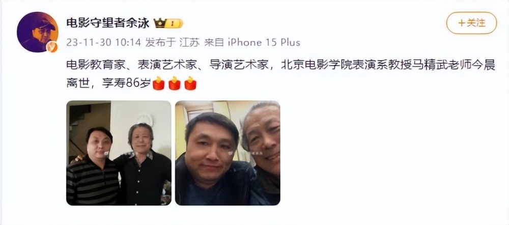

# 老戏骨马精武离世，曾是张艺谋张嘉益老师，最后露面曝光

11月30日据电影守望者余泳发文透露，电影教育家、表演艺术家、导演艺术家，北京电影学院表演系教授马精武老师今晨离世，享寿86岁。

余泳晒出了两张与马精武老师的合影，悼念他的离开，不过并未透露马精武离开的原因。

据网上资料显示，马精武在1938年出生于乌鲁木齐，他的外祖母是维吾尔族人，也正因如此，马精武的外形长得比较像妈妈，所以他五官很是深邃，外形俊朗帅气，马精武自小在乌鲁木齐长大，他热爱跳舞唱歌，他的爸爸在当地是很有名的外科医生，后来马精武在读书时，由于能歌善舞，被老师与同学们撺掇着去报考电影学院，由此开始了他的电影生涯。

就这样马精武来到了北京，考上了北京电影学院，并成为了该校的第一批本科生。在这个班上，他还遇到了他的太太李苒苒。

1958年马精武拍摄了人生中的第一部戏《风从东方来》，毕业后，马精武与李苒苒因成绩优异留校任教，作为北京电影学院的教授，在任职的四十多年间，马精武、李苒苒夫妇可谓是桃李满天下，培养了无数知名的影视明星，其中包括张艺谋、唐国强、张嘉益、王志文、周张铁林、张丰毅、方舒、沈丹萍、俞飞鸿等等。

马精武还拍摄了许多经典的影片，其中有《大红灯笼高高挂》《夜宴》《青蛇》《金光大道》《悲喜人生》等等。

同时他个人还执导过影片《被跟踪的少女》《端盘子的姑娘》《好女婿》《故乡的旋律》等。

马精武在2021年还曾以84岁高龄出演电影《超级的我》，而他最后一部参演的电影在2021年8月上映，名为《测谎人》。

可以说马精武的离开是电影界的一大损失，相信他的学生们得知老师离开的消息，也都会感到悲痛万分。

马精武离开的消息传开后，上海电影家协会副主席石川发文悼念。

翻看马精武妻子李苒苒老师的微博，能够发现她已经许久没有更新，最后一条更新的内容是与学生们聚会的合照。

发布的时间是2022年9月10日，当时的马精武看上去精神矍铄，状态很不错，而且满面春风。

马精武的学生张嘉益与他开心合影，照片中两人都笑得很开心。

要知道9月10日就是属于他们老两口的节日，李冉冉还晒出了一些其它的合影，看得出他们夫妻与学生私下的关系亲如家人。

当时还有不少网友在评论区给李老师留言，祝福他们夫妻节日快乐。

没想到时隔才一年多，马精武老师就离开了，真是太令人唏嘘了，希望他一路走好！

