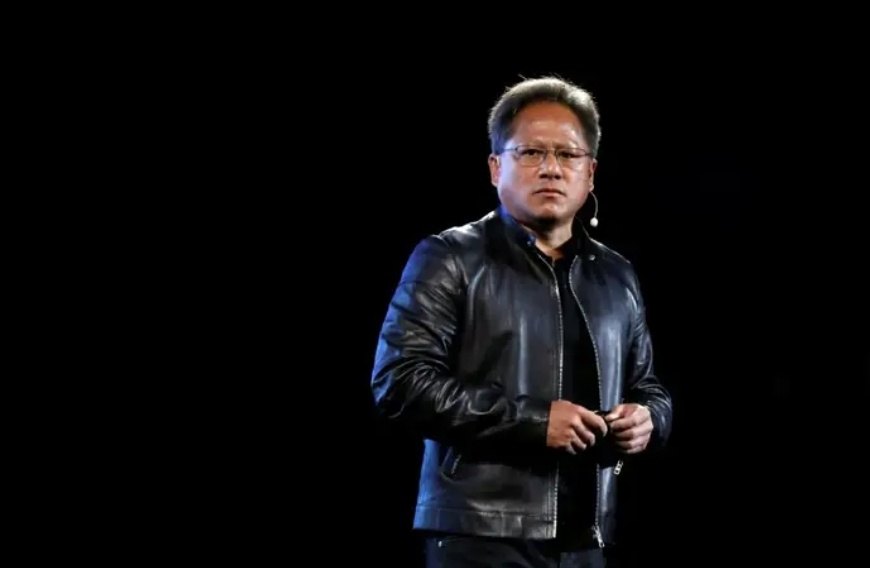

# 英伟达CEO：AI五年内将赶超人类 美国摆脱中国芯片供应链还需要20年

**划重点**

  * _1_ 黄仁勋认为，人工智能正在赶超人类，我们可能会在未来五年内看到通用人工智能（AGI）。
  * _2_ 黄仁勋披露，OpenAI的首台人工智能超级计算机是马斯克做主买的。
  * _3_ 黄仁勋表示，英伟达并不担心日益激烈的行业竞争，该公司已经保持领先十年。
  * _4_ 黄仁勋预计，要打破对海外芯片制造的依赖，建立起本土芯片供应链体系，美国可能还需要20年时间。
  * _5_ 黄仁勋称，他每天早上醒来都担心公司会倒闭。英伟达在20世纪90年代中期险些破产。

腾讯科技讯 11月30日消息，美国当地时间周三，芯片巨头英伟达首席执行官黄仁勋（Jensen
Huang）出席了《纽约时报》年度DealBook峰会。在峰会演讲和随后的采访中，黄仁勋谈了人工智能技术的未来发展方向、行业竞争、企业经营理念以及美国建设本土芯片供应链等问题。

**01 人工智能将在五年内赶超人类**

英伟达是推动人工智能革命的公司之一，其首席执行官黄仁勋周三表示，人工智能正在赶超人类，我们可能会在未来五年内看到通用人工智能（AGI）。

在《纽约时报》年度DealBook峰会上，黄仁勋被问及我们是否有望在未来10年内看到AGI。他表示：“这取决于你如何定义它，我认为答案是肯定的。”

他解释称，如果可将AGI定义为一种能够以与人类智能相媲美的方式完成测试的计算机，那么“在接下来的五年里，显然将会看到人工智能能够通过这些测试”。

虽然黄仁勋没有具体说明他想象中的AGI会是什么样子，但他被问及AGI是否指的是可以设计英伟达目前正在生产的芯片的人工智能，黄仁勋对此表示同意。他说：“事实上，如果没有人工智能，我们今天的芯片都不可能出现。”

黄仁勋特别指出，英伟达推出的H-100芯片是在许多人工智能的帮助下设计的。在谈到人工智能的潜力时，他总结道：“没有人工智能就无法编写软件，没有人工智能就无法设计芯片，一切皆有可能。”

随着各行各业对高性能图形处理单元（GPU）的需求激增，英伟达的业务正在蓬勃发展。这些GPU被用于训练人工智能模型，并在汽车、建筑、电子、工程和科学研究等行业运行大量工作负载，同时支持OpenAI的聊天机器人ChatGPT等应用。

英伟达第三财季的营收增长了两倍，而净利润则从一年前的6.8亿美元攀升至92.4亿美元。

在接受采访期间，黄仁勋还回忆了他向OpenAI交付“世界上第一台人工智能超级计算机”的情景。他透露，在一次会议上，作为OpenAI联合创始人的埃隆·马斯克（Elon
Musk）对这台设备表现出了浓厚兴趣。马斯克当时说：“我也想要一个”，并随后向黄仁勋介绍了OpenAI的情况。黄仁勋表示，他当天就向OpenAI交付了这台超级计算机。

尽管黄说人工智能的发展速度比他预期的要快，但他说这项技术还没有显示出能够展示或超越复杂的人类智能的迹象。其中一个原因在于，虽然目前人工智能在识别和感知等任务上表现出色，但在执行多步推理任务方面还存在挑战，这是公司和研究人员需要解决的首要问题。

在黄仁勋对AGI发表看法之际，多位商界领袖对他们个人认为的AGI发出了警告。

OpenAI联合创始人、首席科学家伊利亚·苏茨凯弗（Ilya
Sutskever）表示，人工智能最先进的形式将带来新的问题，如虚假新闻和网络攻击的激增、自动化的人工智能武器等。

伊恩·霍加斯（Ian Hogarth）投资了50多家人工智能公司。他表示，如果技术的快速发展得不到监管，未来“像上帝一样的人工智能将导致人类被淘汰或毁灭”。

但实际上，黄仁勋并不是唯一一个相信AGI将在不久的将来成为现实的科技领袖。今年2月，Meta前高管约翰·卡马克（John
Carmack）表示，AGI将在本世纪30年代出现，并创造数万亿美元价值。

几个月后，谷歌人工智能部门DeepMind的首席执行官兼联合创始人戴米斯·哈萨比斯（Demis
Hassabis）预测，与人类大脑一样强大的人工智能将在未来几年内出现。

**02 不怕行业竞争，已经领先对手十年**

自OpenAI凭借其广受欢迎的ChatGPT聊天机器人引发人工智能热潮以来，初创企业和科技巨头一直在争先恐后地开发人工智能芯片，为这项炙手可热的技术提供动力，希望抢占英伟达的市场主导地位。

但黄仁勋表示，他并不担心日益激烈的竞争。他说，他的公司已经领先了十年，在2012年就推出了第一台超级计算机。五年后交付的这台机器改变了计算机的工作方式，使它们能够生成句子、图像和视频。

黄仁勋在《纽约时报》年度DealBook峰会上说：“我们意识到深度学习和人工智能不是芯片问题，而是一个电脑改造的问题。你不能仅仅通过设计一个芯片来解决这种新的计算方式。计算机的方方面面都发生了根本性的变化。”

他还说，竞争对手需要时间来迎头赶上。该公司目前的超级计算机售价为25万美元，它们有3.5万个零件，并使用机器人进行组装，就像组装电动汽车一样。

谈到最近围绕OpenAI的混乱局面以及首席执行官山姆·奥特曼（Sam
Altman）的下台和复职，黄仁勋表示，他希望事情能够尽快平静下来，强调公司治理的重要性。

他说：“我很高兴他们达成了一致，我也希望他们达成一致。这是一支非常伟大的团队。这也让人想起公司治理的重要性。英伟达在成立30年后走到今天，我们经历了很多逆境。如果我们没有正确地建立公司，谁知道会发生什么。”

黄仁勋预测，随着人工智能领域的竞争日益激烈，将会出现大量现成的人工智能工具，不同行业的公司将根据自己的需求进行调整，从芯片设计和软件开发到药物发现和放射学等领域都将受到深刻影响。

黄仁勋被要求对不同公司在人工智能市场上取得的成功进行排名。对此，他称：“我不会给我的朋友排名。我承认，我想这么做，但我不会这么做。”

**03 美国摆脱中国芯片供应链可能还需要20年**

在峰会上，黄仁勋还谈及美国芯片制造商的供应链独立问题。他表示，要打破对中国芯片制造的依赖，建立起本土芯片供应链体系，美国最长可能还需要20年的时间。

黄仁勋解释说，英伟达的产品依赖于来自世界各地的无数部件，而不仅仅是台湾地区。不过，最重要的部件都是在台湾制造的。

黄仁勋称：“我们距离供应链独立还有10到20年的时间。但在未来10年或20年内，实现供应链完全独立是不现实的。”

黄仁勋给出的时间表中20年时间表明，美国可能需要比预期更长的时间来发展完全独立于中国供应商的供应链，而10年的预估则较为符合拜登政府目前的预期。

本月早些时候，美国国家标准与技术研究院主任劳里·洛卡西奥（Laurie E.
Locascio）估计：“我们预计，在十年内，美国将可以制造和封装世界上最先进的芯片。”

上个月，由于认为存在国家安全风险，美国收紧了出口管制，限制包括英伟达在内的一些公司向中国出售其最先进的技术。

对此，黄仁勋证实，英伟达将继续寻求在中国开展业务的途径，毕竟中国是世界上最大的半导体市场之一。他说：“我们必须开发出符合规定的新芯片，一旦我们符合规定，我们就会回到中国。我们试图与所有人做生意。另一方面，我们的国家安全和国家竞争力至关重要。”

但黄仁勋也警告说，这些规定可能带来意想不到的后果。他说，中国目前有多达50家公司正在研究与英伟达产品竞争的技术。如果美国企业失去收入，它们的竞争力可能会下降。

**04 直接管理50名下属，避免管理层级太多**

黄仁勋周三在接受采访时，透露了他不同寻常的管理风格，包括拥有“50名直接下属”。

黄仁勋在1993年与人共同创立了英伟达，随着这家芯片制造商在人工智能热潮中发挥的核心作用，该公司的股价今年飙升。黄仁勋的领导风格被其他科技创始人所研究和效仿，比如苹果创始人史蒂夫·乔布斯（Steve
Jobs）或Meta的马克·扎克伯格（Mark Zuckerberg）等。

大多数高管只有10个直属员工，黄仁勋说他之所以有这么多的直接下属，是因为这样可以防止英伟达出现不必要的管理层级。

黄仁勋说：“首席执行官的直接下属越多，公司的层级就越少。这允许我们保持信息流动，并使英伟达表现更好。高级管理人员应该能够独立运作，应该需要很少的管理。”

他补充说：“向首席执行官汇报的人应该需要最少的呵护，所以我认为他们不需要人生建议，也不需要职业规划指导。他们应该处于巅峰状态，非常擅长自己负责的工作。”

最近接受《纽约客》杂志专访时，黄仁勋还自称喜欢每周收到简短的邮件。他要求每位员工列出其正在做的五件最重要的事情，直接从普通员工那里获得信息，而不是严格的管理等级。

黄仁勋也喜欢每天给他的员工写数百封简短的电子邮件，其中许多邮件中只有几个字。

**05 每天早上醒来都担心公司会倒闭**

一手推动人工智能革命的英伟达，今年股价累计上涨了200%以上，截至11月29日市值达1.19万亿美元，各家公司竞相购买该公司的芯片。然而，黄仁勋表示，他仍然担心该公司有一天会倒闭。

在2023年《纽约时报》年度DealBook峰会上，黄仁勋被要求详细解释下，他为什么总是在说“会竭尽所能不让公司倒闭”。

黄仁勋回应道，考虑到英伟达过去所经历的挑战，他无法摆脱公司可能无法继续生存的感觉。该公司在20世纪90年代中期险些破产。

他说：“我认为，当你从零开始创建一家公司时，你经历了真正的逆境，你真的经历了几次几乎破产的经历，这种感觉会一直伴随着你。”

黄仁勋承认，每天早上醒来时，他都要与自己的芯片帝国崩溃的恐惧作斗争。他说：“我不会骄傲自信地醒来，每天早上醒来都担心公司会倒闭。”

黄仁勋的这种“偏执”部分可能是因为英伟达面临着来自台积电等其他半导体公司的竞争。他说：“我不认为人们试图让我破产我生活在这样一种状态中，我们一半绝望，一半渴望。”

然而，黄仁勋对失败的焦虑似乎是促使他希望让英伟达维持下去的原因。他说：“我认为在逆境中你会更专注。而当你更专注时，你可以表现得更好。我喜欢生活在那种我们即将灭亡的状态，我在那种情况下才能发挥出最好的水平。”

这位首席执行官的雄心壮志可能会给他的生活带来一些快乐。他在DealBook峰会上说：“我喜欢回家告诉我的妻子，我今天又一次拯救了公司。也许这不是真的，但我愿意这样想。”（编译/金鹿）

