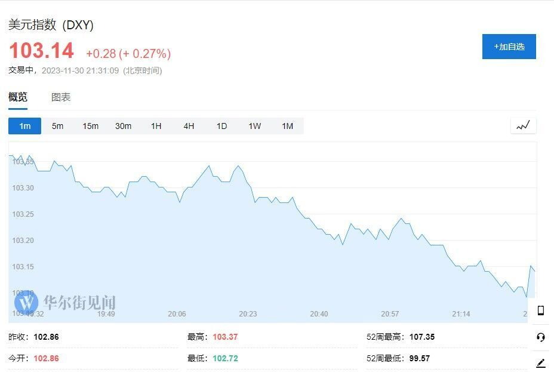
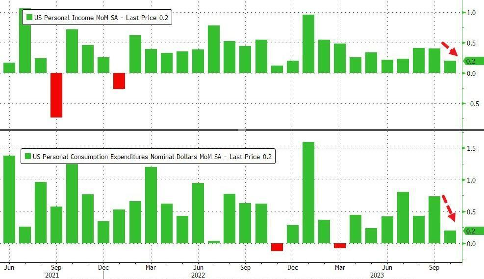

# 通胀持续降温！美国10月核心PCE同比放缓至3.5% 强化美联储降息预期

美国10月通胀继续降温，消费者支出放缓，表明经济正步入低速增长阶段，巩固美联储降息预期。

11月30日周四，美国商务部最新数据显示，1 **0月份剔除食物和能源后的核心PCE物价指数同比增速从9月的3.7%回落至3.5%，符合市场预期；**
环比增长0.2%，较前值0.3%放缓，与市场预期一致。

**由于能源价格下跌，美国10月PCE（个人消费支出）物价指数同比为3%，为2021年3月以来的最小涨幅**
，不及市场预期的3.1%；环比增长0%，也超预期放缓。

**美联储密切关注不包括住房和能源在内的服务业通胀，环比上涨0.1%，同样为今年迄今的最小涨幅。**

值得一提的是，核心PCE通胀数据是美联储首选通胀目标，但此次发布的时机使其尤为重要，这是美联储下一次货币政策会议之前最后一份个人消费支出 (PCE)
数据，也是最后一个主要通胀指标。

美国PCE物价指数公布后，美元指数短线走高约10点，现报103.19。美国10年期国债收益率短线拉升，现报4.265%。美股期货短线波动不大，纳斯达克100的指数期货维持约0.3%的涨幅。现货黄金短线波动不大，现报2041.35美元/盎司。

个人支出、收入增速均放缓，储蓄率上行

经通胀调整后，受到机动车辆等耐用品支出下降的影响，商品支出环比增长0.1%，而服务支出环比增长 0.2%。

10月份个人收入和支出均环比增长0.2%，增速双双放缓。与此同时，个人收入同比增长4.5%，为2022年12月以来的最低水平；支出同比增长5.3%，为
2021 年2月以来的最低水平。

工资增长方面，与此同时，未经通胀调整的工资和薪水仅环比上涨0.1%，是今年最小涨幅；不过个人储蓄率有所上升，从3.7%升至3.8%。

PCE降温有助于强化降息预期

美联储周三发布的最新褐皮书调查显示，由于家庭缩减可自由支配支出，近几周经济活动放缓。劳动力需求也有所缓解。

而随着美联储越来越依赖数据来评估经济和通胀的走势，PCE降温也可能有助于让政策制定者放心，从而强化市场对美联储降息的预测。

根据媒体汇编的数据，投资者目前对2024年降息幅度的定价达到115个基点，首次降息时间点预计在5月份。对冲基金大佬Ackman最近表示，他预计美联储会更早采取行动，降息可能会在第一季度到来。

