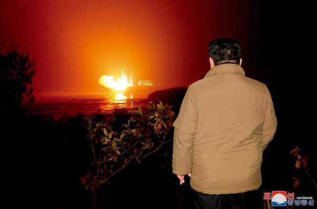
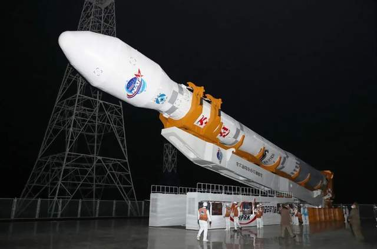
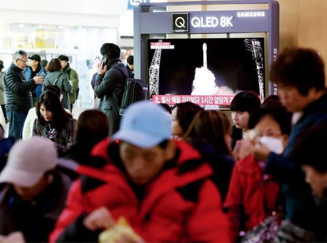

# 金正恩收到了朝鲜卫星拍摄的白宫照片

经历两次试射失败之后，朝鲜11月22日宣布，侦察卫星“万里镜-1”号试射成功。这是2016年以来，朝鲜首次成功发射卫星。朝鲜最高领导人金正恩在现场观摩了卫星发射。

11月21日22时42分28秒，朝鲜国家航空航天技术总局在平安北道的西海卫星发射场使用“千里马-1”型新型运载火箭，将“万里镜-1”号发射升空。发射后705秒，即22时54分13秒，“万里镜-1”号顺利进入轨道。24日下午，朝鲜中央电视台播放了火箭点火发射及一二级分离的视频。

25日，朝鲜进一步宣布，“万里镜-1”号已拍下了韩国、美国夏威夷、关岛等“目标地区”的影像。在卫星发射当天刚刚抵达韩国釜山军港的美国海军核动力航母“卡尔·文森”号“也被侦察卫星捕捉到”。两天后，韩国国防部官员对媒体表示，韩国军方研判朝鲜军事侦察卫星“万里镜-1”号确实发射成功并入轨运行，但是否真的拍下卫星图像“不好说”。

_11月21日，朝鲜平安北道，朝鲜最高领导人金正恩在西海卫星发射场观看侦察卫星“万里镜-1”号的发射。图/视觉中国_

11月28日，朝鲜官方媒体报道称，朝鲜最高领导人金正恩收到了侦察卫星拍摄的美国白宫、五角大楼和诺福克海军基地美国航空母舰的照片。诺福克海军基地是美国海军设于弗吉尼亚州诺福克的一处军港，也是世界最大的海军基地。韩国首都首尔和美国军事基地，还被称为“主要目标区域”。

金正恩称这次侦察卫星发射为“宝贵的胜利”。他同“敬爱的妻子和女儿”共同出席了在平壤木兰馆举办的庆祝晚宴，又同“心爱的女儿”亲临航空航天技术总局与有功人员合影。不过，常陪同金正恩观摩洲际弹道导弹发射的妻子、女儿，此番并未出现在发射现场。金正恩在卫星发射后两次前往观看卫星图像，也没有“带家属”。

另一个细节是：11月22日以来的所有报道和评论中，朝鲜官方媒体仅将“万里镜-1”号称为“侦察卫星”。今年5月、8月，朝鲜两次在西海卫星发射场试射“万里镜-1”号失败。朝鲜媒体两次都发布了报道，将“万里镜-1”号称为“军事侦察卫星”。

一波三折

11月21日晚，“千里马-1”型运载火箭矗立在西海卫星发射场的发射架上。灯光照在火箭身上，可以看到国家航空航天技术总局的蔚蓝色标识和黑色的“千里马”图像。前者源于金正恩2013年亲自指示成立的宇宙开发局标识，象征着朝鲜向宇宙“不断发射卫星”。美国有线电视新闻网（CNN）表示，这个标识“和美国国家航天局（NASA）惊人地相似”。

对于千里马标识，金正恩的解释是：新型运载火箭印上在朝鲜革命史上“作为英勇开拓和飞跃发展的象征语、代名词熠熠生辉的‘千里马’名称”，预示着“宇宙强国新时代腾空升起”。

在朝鲜媒体的报道中，为侦察卫星研发新型运载火箭的工作，在2016年就已对外披露。2022年2月和3月，朝鲜进行了两次以“研发侦察卫星”为目的的中程弹道导弹发射试验，韩美军方认为这是对“千里马-1”型新型运载火箭的初步测试。

经过至少7年的努力，今年5月31日，“万里镜-1”号首次试射，搭载卫星的“千里马-1”型运载火箭在一级分离后，二级箭体点火失败，坠入西海海域。8月24日，“万里镜-1”号第二次试射，问题还是出在“千里马-1”型运载火箭：一级、二级火箭正常运行，但第三级火箭在飞行途中因故障爆炸，发射再次失败。

朝中社透露，“千里马-1”型火箭的问题主要是新型发动机系统可靠性和稳定性较差，以及所用推进剂的燃烧不稳定。今年10月，朝鲜向日本预告了第三次试射周期，但直到发射窗口期结束也没有进行试射。11月初，韩国国防部长官申源湜接受媒体采访时表示，韩方认为朝鲜第三次试射推迟，主要还是在解决第三级火箭的问题。

自1998年以来，朝鲜共进行了9次卫星及卫星运载火箭发射试验，算上这一次共3次将卫星送入轨道，历次失败的故障主要都发生在火箭分离阶段。一般来说，具备洲际弹道导弹技术的国家，往往也拥有卫星运载火箭的研发能力，为何朝鲜的研发工作一波三折？

_11月21日，朝鲜西海卫星发射场，携带侦察卫星“万里镜-1”号的火箭。图/视觉中国_

直到2016年上一轮卫星发射，朝鲜使用的都是“银河”系列运载火箭。美国政府2012年发布的报告称，这些“银河”系列火箭的技术源自苏联制造的战术弹道导弹，与朝鲜的洲际弹道导弹研发计划并不重合。换言之，当朝鲜的导弹技术日新月异时，出于成本或其他原因，卫星运载火箭沿用的仍是上世纪80年代的技术。也正因此，韩美政府认为朝鲜过去并不重视太空计划，只是将之作为“研发洲际弹道导弹的幌子”。

另一方面，卫星运载火箭和洲际弹道导弹在技术、部件、操作都有一定的共通性。2022年以来，负责洲际弹道导弹研发的朝鲜国防科学院，多次出现在“侦察卫星计划”相关火箭试验的报道中。去年2月，美国国防部研判朝鲜的两次运载火箭试射后，认为其中采用了“火星炮-17”洲际弹道导弹的技术。

然而，运载火箭和导弹在关键技术特性上毕竟有所不同，前者的设计目标是通过多级分离，一次性将卫星送上太空轨道；后者的设计则是为了再入大气层、打击地面目标。一些分析认为，这一不同之处，可能正是朝鲜卫星运载火箭研发的“卡脖子”问题。

两次发射失败后，今年9月，朝鲜重组国家宇宙开发局为“国家航空航天技术总局”，将主管卫星研发、试射的机构上升到和导弹总局及军兵种相同的地位，朝鲜军事科学院院长张昌河出任国家航空航天技术总局首任局长。

张昌河是朝鲜洲际弹道导弹研发工作的主要负责人之一。最近两年，朝鲜洲际弹道导弹研发取得明显进展，不仅“火星炮-17”型导弹被韩美军方评估为“确已形成战斗力”，固体燃料火箭、新型导弹发射车的成功研发，也增强了朝鲜核力量的生存能力。

韩国政府则认为，朝鲜在短期内解决了“千里马-1”型运载火箭的技术难题，并不是张昌河及朝鲜科学家们的功劳。韩国国防部长官申源湜称，他认为俄罗斯“向朝鲜提供了诸多相关技术”，而朝鲜10月推迟试射卫星，就是为了等待相关技术指导到位。韩国统一部长官金暎浩本月也表达了相同的观点。

今年9月，金正恩对俄罗斯进行历史性访问，和俄总统普京在俄罗斯东方卫星发射场见面并举行会晤。俄罗斯媒体报道称，金正恩对卫星及运载火箭相关技术“尤其感兴趣”，普京也承诺将在太空技术上帮助朝鲜。不过，根据俄罗斯方面的消息，目前双方尚未就航天技术合作的具体问题达成协议，深度合作尚未展开。

值得注意的是，据韩联社报道，朝鲜11月21日向日本通报称，将于11月22日至下月1日之间的窗口期发射卫星，“但当晚提前发射”。而就在卫星发射当天，朝鲜国家航空航天技术总局研究员李成进在朝中社发表了一篇题为《旨在先发制人打击的太空军事化活动无论如何也绝不能正当化》的评论文章。该评论针对的事件是：韩国国防部近日表示，计划于11月30日在美国加州范登堡军事基地发射韩国第一颗军事侦察卫星。

近年来，朝韩双方都在大力发展侦察卫星，试图在军事侦察领域形成军事优势。今年5月朝鲜首次发射“万里镜-1”号失败后，韩国国情院就宣称，韩国于5月25日成功发射自研火箭“世界号”，或许“刺激到朝鲜”，让他们缩短了卫星发射准备周期。前述署名李成进的评论文章明确指出，在现代战争中，“侦察情报战是准备战争的首要程序，也是决定战争胜败的先决条件”。

按照韩国军方的计划，从今年11月到2025年，韩国将由美国太空探索技术公司（Space
X）帮助发射至少5颗军事侦察卫星，形成对朝鲜军事活动的纵深侦察能力。韩国自主研发的固体火箭助推器也准备在今年之内进行发射。

此外，根据美日韩三国领导人此前达成的协议，从今年12月开始，美日韩将共享朝鲜导弹发射等军事情报。日本军方亦将于2024年开始在五年内发射4颗军事侦察卫星。李成进评论称，这意味着“把傀儡加入美国的预警卫星系统”。

李成进写道，美国“勾结走狗，在地区加快完善卫星监视体系的目的在于加强对地区国家的情报搜集能力，提高反导系统的有效性和可靠性”，目的是占据对朝鲜的“战略优势”，这一情况“迫使我国进一步加快军事侦察卫星开发等自卫的外空开发工作”。

批量发射？

朝鲜卫星发射成功后，正在英国访问的韩国总统尹锡悦11月21日召开国家安全保障会议常任委员会会议，决定暂停履行朝韩领导人2018年签署的《九一九韩朝军事协议》部分条款，恢复在韩朝边境一带的对朝监侦活动。

随后，朝鲜国防省表示全面废止《九一九韩朝军事协议》，向军事分界线一带“前进部署更强大的兵力和新型军事装备”。韩国媒体27日报道称，韩军已发现朝鲜士兵在重建2018年撤除的距离非军事区1公里以内的10座哨所。此外，2018年朝韩双方同意在此前曾擦枪走火的西海海域岸炮和海军舰炮上加装盖门并日常关闭。目前，韩军侦测发现朝鲜相关军事基地的岸炮盖门正在“大量打开”。

_11月22日，韩国首尔站候车室播放朝鲜发射卫星的新闻。图/视觉中国_

分析认为，尹锡悦自2022年就任总统以来，逐步废除前政府和朝鲜签署的协议约束，就是韩国现政府的既定政策。所以，朝韩双方在常规部队方面的“升级”，并不会对半岛局势造成显著影响。真正重要的是：在有关军事侦察和威慑能力的关键“军备竞赛”中，朝鲜比韩国先发射侦察卫星，意味着朝鲜在这轮竞争中赢了吗？

韩方给出了否定答案。今年5月朝鲜发射卫星失败后，韩国军方打捞到了“万里镜-1”号卫星部件残骸。韩国国防部发言人全河奎11月27日表示，通过对残骸的分析，韩方认为朝鲜卫星技术水平较低，难以在几个月内取得突破性进展。

另有韩国军方人士对韩联社称，虽然俄罗斯可能在运载火箭技术上帮助朝鲜，但考虑到软件兼容性问题，朝鲜的卫星系统不太可能由俄方提供。他还说，通常情况下从卫星发射到拍摄图像需要数月时间，所以对于朝鲜是否真的获取了韩美军事基地的卫星图像“表示怀疑”。

2012年12月，朝鲜顺利将“光明星3号”卫星送入近地轨道。美国知名朝鲜事务智库史汀生中心研究员马丁·威廉姆斯指出，考虑到这是“金正恩就任最高领导人后几个月内实现的”，这“不仅是技术性的成功，更是革命性的成功”。但随后，美国政府称该卫星不能稳定观测地表，也无法传输信息，成为“太空垃圾”。2015年，CNN记者访问朝鲜时，朝鲜宇宙开发局科学家坦言，该卫星“存在通信和数据传输问题”。

通常而言，侦察卫星会在与赤道面夹角为90度的轨道上绕地球飞行，每完成一次轨道运行都会飞越南北两极上空，故称“极地轨道”。一次轨道运行的时间约为90分钟。随着地球不断自转，卫星每次飞行都会经过不同区域的上空，最终拍摄到整个地球。

考虑到太阳角度和阴影，每天的有效拍摄时长也有限制。总的来说，这是一个漫长的周期，所以有能力的国家往往会部署大量的侦察卫星。但这并不意味着一颗卫星不能在较短的运行周期内拍摄到朝鲜宣布已经获取的画面。卫星信息网站“Orbtrack”指出，“万里镜-1”号每天会经过朝鲜半岛上空2~4次。

马丁·威廉姆斯指出，真正值得注意的是，朝鲜的卫星技术在不被外界重视的数十年间取得了长足的进展。比如，1998年，朝鲜卫星还在采用电池供电；2009年，朝鲜研发出安装在卫星上的太阳能板；现在，朝鲜卫星已经可以使用和其他国家卫星相似的折叠式太阳能板。

又比如，2016年时，美方分析认为朝鲜卫星的图像系统分辨率很低，尚达不到10米级。但根据今年朝鲜媒体披露的画面，威廉姆斯认为朝鲜侦察卫星的分辨率可能已经达到3米级的“中等水平”，只是和50厘米、30厘米级的高分辨率仍有差距。

可以确定的是，本次卫星试射成功，只是朝韩双方密集发射侦察卫星的开端。今年4月18日，金正恩提出，朝鲜要在五年内“把大量侦察卫星”多角布置在太阳同步近地轨道上，形成自己的卫星情报网。

根据朝中社报道，在“万里镜-1”号试射成功后，国家航空航天技术总局第一时间提出了新计划：在短期内追加发射几颗侦察卫星，“继续确保对南朝鲜地区和共和国武装力量作战关注地区的侦察能力”。该计划将提请劳动党八届九中全会审议。

杂志标题：朝鲜侦察卫星的“宝贵胜利

记者：曹然

编辑：徐方清

