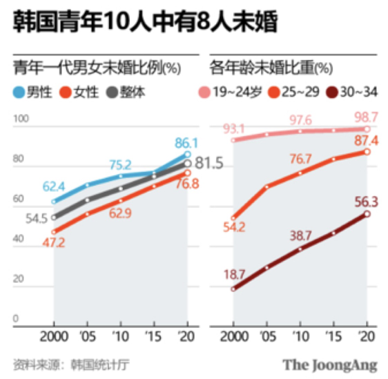
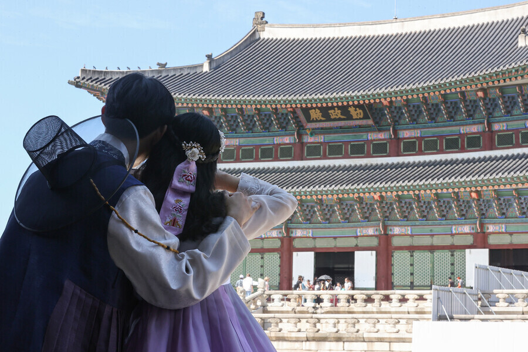
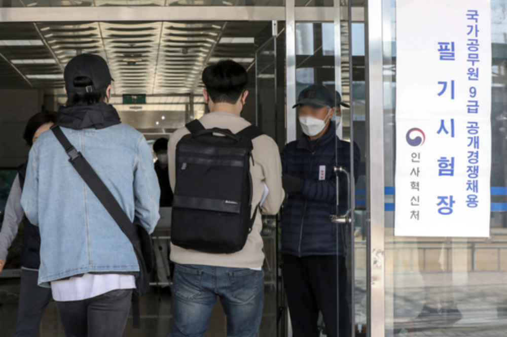

# 韩国八成年轻人不结婚，政府放大招：公务员想升职，得先生娃

本文来源：时代周报 作者：马欢

100名年轻男女聚集在韩国城南市一家酒店，他们身着名牌，打扮入时，安静地坐在一起，等待主办方安排的互动游戏。

这是一场由城南市政府组织的相亲活动。当地政府表示，5轮相亲活动共有460名单身男女参加，结束后，有198人以“情侣”身份离开活动，并同意与伴侣交换联系方式。

除了城南，包括首都首尔在内的多个韩国城市，都在组织相亲活动。

为了让年轻人谈恋爱、结婚、生孩子，韩国政府可谓操碎了心。

“对婚姻的消极态度在韩国社会继续蔓延，”城南市市长申相镇说，“我们政府的职责，是为那些想要结婚的年轻人，创造更多条件。”

现实数据不太乐观。就在11月27日，韩国统计局发布的数据显示，随着出生率持续低迷，2050年韩国青年人口将降至2020年水平的一半。

_韩国医院里空置的婴儿床。（图源：社交媒体）_

据韩联社报道，韩国青年人口占总人口的比重在1990年达到顶峰，为31.9%，之后逐年下降，2015年为21.5%，2020年下滑20.4%至1021.3万人。韩国统计局推算，到2050年，这个比例将降至11%，青年人口减少为521.3万人。

韩国政府急着下场催生，但问题是，连婚都懒得结的年轻人，更不想生孩子了。

八成年轻人未婚

32岁的金某住在京畿道高阳市，7年前就进入职场的他，至今仍和父母住在一起。

“虽然爸爸和妈妈总是念叨‘赶紧找对象搬出去吧’，但我暂时没有结婚的计划，”金某说，“很对不起父母，但是可以住的话，会一直这样住下去”。

在金某看来，呆在父母家压力更小，生活更方便，不需要买房，经济上也就更宽松了。金某的弟弟比他小两岁，也是上班族，也维持着单身的状态。兄弟两人和父母住在一起，日子倒也稳定。

据韩国《中央日报》报道，金某就是目前大部分韩国年轻人的状态，单身，有工作，不愿意找对象，宁愿和父母住在一起。

11月27日，韩国统计局发布的数据显示，韩国19岁至34岁的青年中，有81.5%的人（783.7万人）未婚，较五年前增加6.5个百分点。也就是说，每10个韩国青年中就有8人处于未婚状态。而在20年前，这一比例还仅为54.5%。

_图源：韩国《中央日报》_

一边是越来越多的单身年轻人，一边则是连续三年处于世界最低水平的生育率。

韩国统计厅11月29日发布的“9月人口动向”资料显示，韩国第三季度总和生育率（平均每名育龄妇女生育子女数）为0.7，同比下降0.1，创下历史新低。

受低生育率的影响，青年人的生活也发生了变化，包括一人家庭的增多、未婚比例持续上升等。

《纽约时报》引用的数据显示，虽然近年来全球范围内的结婚人数占比都有所下降，但韩国下降得尤其严重。2021年，美国每1000人中有6人结婚，而韩国每1000人中仅有3.8人结婚。

_一对韩国新人（图源：社交媒体）_

随着未婚青年人数的增加，夫妻组成家庭比重自然而然地减少，与父母仍然同住或独立的一人家庭增加。目前，19-34岁的韩国年轻人中，与父母同住的比重为55.3%，一人户的比重为20.1%，两者呈持续增加趋势。

年轻人就是不想结婚，也不想在结婚后生孩子。后果是，到2050年，韩国19岁至34岁的年轻人将萎缩至总人口的11%(521.3万人)，数量缩减到现在的一半。

对此，韩国开发研究院(KDI)国际政策研究生院教授崔瑟基表示：“这意味着未来的一些社会系统，无法正常运转。例如大学入学或入伍的青年层将会消失，劳动市场也会出现人力供应不足的情况。”

面对这种尴尬的情况，韩国政府只能持续放出大招，将催生的“大棒”挥向了公务员队伍。

据《韩国时报》报道，韩国政府人事革新处宣布，从2024年1月开始，最基层两级的公务员，如果生2个或以上的孩子，就能在晋升评比时获得额外积分。至于加多少分，怎么加，还得看孩子的数量和具体情况。

同时，各级公务员在退休后，如果拥有2位以上子女，返聘的最长年限也会由3年延长至10年。

这意味着，韩国公务员的福利和晋升，从此将与生育直接挂钩。

不仅如此，在公务员间的鼓励生育政策落实之后，韩国政府表示，接下来，可能还会把激励政策推广全国，提升韩国的社会活力。

 _一对韩国年轻夫妇（图源：社交媒体）_

很快，这一举措就在韩国引发争议。一位年轻的公务员抱怨道：“这太不公平了，以后我同事可以休产假休育儿假，我们只能帮他们分担工作，升职的机会还不一定轮得到我们。”

还有未婚的韩国公务员表示：“这是对单身人士赤裸裸的晋升歧视。”

尽管有人反对，但韩国政府目前没有任何撤回的打算。

对于希望那些拼尽全力考进体制内的韩国年轻人来说，他们上升渠道已不由自己主宰。

_韩国公务员考试笔试入口（图源：社交媒体）_

至于政府充当媒人，组织相亲活动方面，除了首尔、城南这样的城市，还有许多小城市也在赞助类似的活动，目标对象是当地27岁-39岁的单身男女。

男青年黄大彬参加了今年9月份政府主办的相亲活动，他表示，参加政府主办的相亲，节省了他参加其他社交活动或注册专业婚介所的费用。“我们面临着真正的人口危机，政府需要尽其所能。我不明白人们对此有何抱怨。”

韩国政府如此卖力，效果不一定满意。

韩国东南部城市晋州举办相亲活动已有12年，但最终只产生了11对新人；另一座工业城市龟尾也由政府出面做媒人，但自2016年以来，只有13对情侣结婚。这两个城市的官员都表示，他们不知道这些通过相亲结婚的夫妇，最后有多少个孩子。

官员们也承认，想要年轻男女培养感情，单靠相亲远远不够。

城南市市长申相镇指出，传播对婚姻的积极看法最终将有助于提高生育率，并强调相亲活动只是该市为扭转生育率暴跌而推出的众多政策之一。“低生育率无法通过单一政策解决，为想要结婚的人们创造寻找伴侣的环境，也是这座城市的工作。”

很多年轻人讨厌被这样安排感情生活，认为太过刻意。他们对媒体表示，提高出生率的真正障碍是高昂的育儿费用、负担不起的住房、黯淡的就业前景和把人压垮的工作时长。

首尔女子大学社会福利系教授郑在勋说，政府指望靠这些活动使生育率上升是“无稽之谈”。“关爱家庭，减少加班，远比相亲更有用。”

