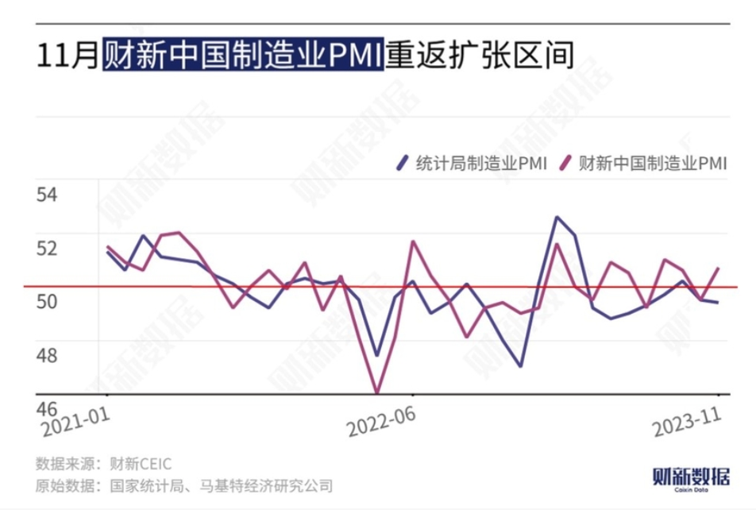

# 11月财新中国制造业PMI升至50.7 为三个月来最高

中国宏观经济回升向好，制造业景气度有所改善，11月财新中国制造业PMI（采购经理指数）升至近三个月新高。

12月1日公布的2023年11月财新中国制造业PMI录得50.7，较10月上升1.2个百分点，重回扩张区间，为近三个月高点。

国家统计局11月30日公布的11月制造业PMI录得49.4，较10月回落0.1个百分点，仍位于收缩区间。

从分项指数看，11月制造业生产由降转升，需求加速扩张，当月生产指数为近四个月第三次高于荣枯线，新订单指数连续四个月位于扩张区间并录得7月以来新高。外需持续疲弱，新出口订单指数连续第五个月低于荣枯线。

为配合增产，11月制造商采购活动恢复扩张，与市场供求较为一致的是，消费品和中间品生产企业采购量较投资品增加明显。原材料库存则有所减少，部分企业库存管理态度较为谨慎。与此同时，11月供应商供应时间指数在过去十个月中第八次高于荣枯线，物流较为通畅，运输效率提升。

11月价格水平基本稳定，制造业购进价格涨幅降至近三个月以来最低，其中化工品和工业金属价格上涨较为显著。在销售和清库存压力之下，制造业出厂价格指数略低于荣枯线，不过幅度甚微。

尽管市场景气度恢复，但制造业企业在员工使用方面仍然偏谨慎，11月就业指数在过去九个月内第八次处于收缩区间，不过消费品企业用工增加。市场需求增加的同时就业下降，导致积压工作随之增多，积压工作指数连续第六个月高于荣枯线。

制造业企业家乐观情绪从前期低位回升，11月生产经营预期指数录得近四个月以来新高。尽管如此，受访者对未来一年全球经济前景仍有所担心。

财新智库高级经济学家王喆表示，当前宏观经济回升向好，居民消费稳步提升，工业生产扎实推进，市场预期亦有所改善。不过，受各种不利因素影响，内外部需求仍有不足，就业压力仍然偏大，经济回升基础还需进一步巩固。展望未来，政策层面仍需围绕扩大消费、增加收入、促进就业、稳定预期做文章，考虑到三季度经济增长略超预期以及四季度低基数效应，全年经济增长目标完成在望，各项政策应更着眼长远，夯实经济长期增长基础，培育市场主体长久信心。

