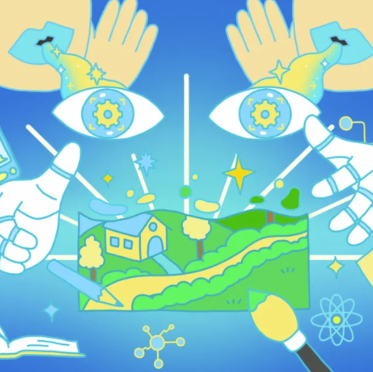
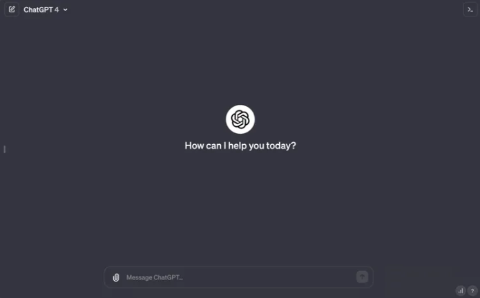

# ChatGPT发布一周年：每周吸引1亿用户，几乎改变整个科技行业

**划重点**

  * _1_ 在ChatGPT上线的一年里，这种聊天机器人几乎改变了整个科技行业。
  * _2_ 第三季度，AI领域吸引179亿美元投资。
  * _3_ 业内巨头纷纷加大投资，竞争加剧。
  * _4_ ChatGPT成为最大赢家，每周吸引1亿用户。

腾讯科技讯
12月1日消息，在现代技术时代，有几个前后截然不同的分水岭时刻。比如，网景（Netscape）向世界展示了互联网的巨大潜力，Facebook让互联网变得个性化，iPhone清楚地表明了移动时代将如何占据主导地位。还有其他的，比如ChatGPT上线。

一年前的今天，OpenAI推出了人工智能聊天机器人ChatGPT，它可能是有史以来最低调的游戏规则改变者。没有人站在舞台上宣布他们创造了未来，也没有人认为他们推出的东西会让自己变得富有。没有多少人能预见到ChatGPT会成为历史上增长最快的消费技术，但事实上，这款聊天机器人在短短一年内就已经改变了科技行业的格局。ChatGPT的火爆程度超出了所有人的预期，包括OpenAI的竞争对手、公众，甚至是平台的创作者。

**01 创企崭露头角，巨头加大投资**

在ChatGPT上线的一年里，它几乎给科技行业的每个角落都带来了改变。在风险投资大幅下降的情况里，似乎任何拥有人工智能项目的公司都能筹集到资金。市场研究机构Pitchbook的数据现实，仅今年第三季度，人工智能领域就获得了179亿美元投资。而且业内一些最大的风险投资公司正在筹集巨额资金，以便继续向该领域投入资金。

在人工智能领域的竞争格局中，有几家初创公司已经崭露头角：Anthropic正在成为OpenAI最强劲、资金最充足的竞争对手，Midjourney的图像生成人工智能正在以惊人的速度改进，甚至就在本周，Pika也突然发布了一款令人印象深刻的人工智能视频工具。几乎每天都有新的、很酷的东西出现。

与此同时，在科技巨头中，人工智能也已经“吞噬”了地球上最大的公司。作为OpenAI的合作伙伴和投资者，微软在人工智能驱动的搜索引擎必应上押下了重注，同时也将其人工智能助手Copilot集成到Office、Windows、Azure等领域。谷歌发明了现在突然无处不在的基础性技术，它匆忙推出了Bard和Search
Generative Experience，并将Duet AI构建到自己的工作场所产品中。

人工智能是亚马逊今年发布活动的核心内容，从大语言模型驱动的Alexa到为AWS客户提供的100万个新人工智能工具。Meta现在将人工智能视为其未来的重要组成部分，甚至可能比元宇宙更重要。人工智能硬件使英伟达成为世界上市值最高的公司之一。

即使是科技巨头中行动最不积极的苹果，也开始更多地谈论其在人工智能方面的努力，而且可能很快就会有针对Siri升级的大计划。还有很多类似的例子。我们可以称这种情况为繁荣，也可以称之为泡沫，但整个科技界已经很久没有对单一事物如此痴迷了。

**02 ChatGPT成为最大赢家**

尽管ChatGPT的界面看起来简单，甚至有时受到可靠性问题的困扰，但这并不妨碍它成为人工智能革命的最大赢家。上线短短5天就吸引了百万用户，两个月后用户数量飙升至1亿，现在每周都维持着这一庞大数字。

ChatGPT及其背后的大型模型也为OpenAI带来了数十亿美元的业务。令人难以置信的是，它既是数据提供商，从其他希望在GPT模型上构建应用的企业那里获得收益，同时本身也是一款深受欢迎的消费者应用。人们每月支付20美元来使用ChatGPT，而其他公司则支付更高的费用来利用其模型。

关于人工智能将如何改变一切的预测满天飞：从协助写邮件、写代码到制作皮克斯风格的电影。有些人担心失业，甚至担心人工智能可能带来的威胁。然而，事实是，目前的人工智能技术还有很多不足。例如，大型语言模型经常“产生幻觉”，即提供虚假信息；AI生成的图像在仔细观察后容易暴露出生成的痕迹；人工智能系统起草的邮件往往带有一种机械感。人工智能系统并没有超越人类的智慧和创造力，尽管它的发展速度超出了许多人的预期。

但到目前为止，人工智能的发展就像自动驾驶汽车一样，它的发展速度比任何人想象的都要快。不过，要想让它变得足够好，让它无处不在，还需要做大量的工作。现在，我们绝对没有理由认为我们很快就会开发出某种超越人类的通用人工智能。

人工智能可能还没有进化完成，但它已经比大多数人预期的要好。甚至在最近几周，OpenAI已经被ChatGPT的发展速度搅得天翻地覆。一方面，OpenAI已经开始通过应用商店和其他工具将其货币化。另一方面，首席执行官山姆·奥特曼（Sam
Altman）曾短暂被迫离职，原因我们至今仍不清楚，这是董事会成员和高管之间的权力博弈，还是人工智能安全问题上存在分歧，抑或是其他完全不同的原因?

**03 如何平衡经济利益和道德责任？**

OpenAI的初始使命是“以最有可能造福全人类的方式推进数字智能，不受产生经济回报的需要的限制”。然而，当分析师估计该公司的潜在市场规模超过1万亿美元时，这一使命变得更为复杂。

在科技行业和全球范围内，很多人都在思考如何平衡人工智能带来的经济利益和道德责任。谷歌首席执行官桑达尔·皮查伊（Sundar
Pichai）就是一个例子，他需要在为股东谋利和为人类造福之间找到平衡。从历史上看，股东往往成为赢家。如果人工智能将改变一切，它能在我们所知的科技行业和经济中做到这一点吗？我们需要的人工智能和最赚钱的人工智能一样的吗？

我们当然希望能够更快地撰写商务邮件，能够让Excel“自动生成条形图”，能够通过告诉ChatGPT我们想要应用程序做什么来编码。但是，我们想要SEO优化、人工智能生成的新闻故事取代我们曾经喜欢的出版物吗？
我们想让人工智能机器人扮演现实生活中的角色，成为我们生活中的伙伴吗？我们应该更多地将人工智能视为工具还是合作者？如果一个人工智能工具可以被训练来创作我们现在想要的歌曲、电影、图像或故事，这是艺术还是反乌托邦？即使我们开始回答这些问题，人工智能技术似乎总是领先一步。

与此同时，人工智能带来的文化、法律和道德问题也正在浮出水面。有些诉讼指控人工智能公司侵犯艺术家的版权，而美国的多名法官承认现有的版权法不知道如何处理人工智能生成的作品。立法者在人工智能的安全问题上感到头疼，而公司则继续推进他们的计划，认为阻止或减缓他们都属于是反进步的行为。

**04 AI进步速度还会加速？**

人工智能行业的风潮正在席卷全球，各种预测满天飞。回想一下，过去的炒作周期，如区块链、元宇宙，事情往往并不如我们所想。但这次，人工智能背后的动力似乎更为强大，各大公司纷纷投入巨资。GPT难道真的会走NFT的老路吗？

接下来的12个月，人工智能行业的发展速度恐怕会超越我们的想象。自从ChatGPT首次亮相以来，OpenAI及其竞争对手都取得了巨大的技术进步。整个行业都在思考如何利用人工智能为我们的生活带来便利，为其产品增添价值。新公司将涌现，专注于制造人工智能芯片、建设数据中心和其他基础设施，以确保大型模型能够快速、大规模地应用。

我们或许还在猜测人工智能是否会像互联网、社交媒体和智能手机那样带来世界变革。这些技术不仅仅是技术上的飞跃，它们重组了我们的生活方式，使之发生了根本的、不可逆转的变化。如果人工智能仅仅停留在“电脑为我们写电子邮件”的层面，那么它恐怕难以与上述技术相提并论。

然而，有众多的聪明人和数万亿美元的资金押注，他们坚信这只是人工智能故事的开端，而不是结尾。如果他们的预测是正确的，那么OpenAI发布ChatGPT的那一天，标志着一个新的时代的开始，一个我们尚未完全预见的时代。

未来12个月，我们将见证人工智能领域更多的创新和突破。新的小工具、应用和服务将层出不穷，试图解答“聊天机器人是否能将我们带入后智能手机时代”的问题。这是一个充满无限可能的时代，一个人工智能与我们的日常生活深度融合的时代。（编译/金鹿）

