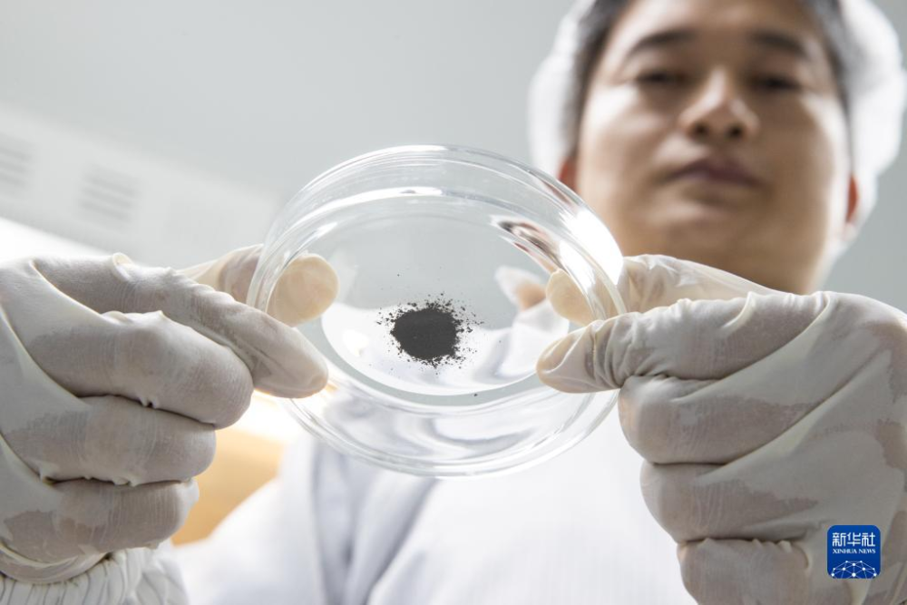

# NASA被曝求美国会“开绿灯”，助研究员申请获取中国采集的月球样品

【环球网报道 记者
张晓雅】香港《南华早报》12月1日披露，美国国家航空航天局（NASA）向其内部人员发送电子邮件，告知后者该机构已寻求让美国国会在对华航天合作方面的禁令“沃尔夫条款”上开“绿灯”，允许研究人员申请获取并研究中国采集到的月球科研样品，原因是中国采集的样品具有“独特价值”。今年10月，中方宣布嫦娥五号月球科研样品将面向国际开放申请。

_位于美国华盛顿特区的NASA总部。图自视觉中国_

受阻于美国国会2011年通过的“沃尔夫条款”，中美官方航天合作长期处于“冷冻”状态。由美国前国会议员弗兰克•沃尔夫起草、推动的这一条款，以立法形式禁止中美两国的双边航天合作。但实际上，依据“沃尔夫条款”，“例外”也存在可能性，只不过NASA须说服国会和联邦调查局，与中方接触和合作“不会造成导致技术、数据或涉及国家安全或经济安全的其他信息转移到中国或中国公司的风险”。

香港《南华早报》12月1日最新消息披露，NASA在周三（11月29日）发送的一份内部电子邮件中称，该机构已“向美国国会证明其意图”，以求允许NASA资助的研究人员向中国国家航天局申请获取嫦娥五号在2020年采集到的月球样品。

报道描述称，根据NASA发给“亲爱的同事们”的这封电子邮件，申请获取中方采集到的样品是必要的，因为中国采集的样品具有“独特价值”，而这些样品“最近已开放给国际科学界用于研究目的”。

_2021年10月15日，在中国科学院地质与地球物理研究所月球样品洁净室，田恒次副研究员在处理月球样品。新华社记者 金立旺 摄_

据新华社今年10月2日消息，记者从国家航天局获悉，在阿塞拜疆巴库召开的第74届国际宇航大会上，嫦娥五号总设计师胡浩作为团队代表，宣布嫦娥五号月球科研样品即将面向国际开放申请，欢迎各国科学家共同研究，共享成果。嫦娥五号执行的我国首个无人月球采样返回任务，一举突破月面采样、月面起飞上升、月球轨道交会对接与样品转移、跳跃式再入返回等关键技术，经过环环相扣的飞行过程，带回1731克月球样品，成为世界单次采样量最大的无人月球采样任务。

根据《南华早报》的说法，NASA上述举动表明，研究人员在获准研究中国采集到的月球样品方面被NASA“放行”，而这一潜在合作将是两国航天机构首次进行此类合作。

《南华早报》继续称，这封邮件补充说，这些样品来自“NASA尚未采样”的月球区域，预计将为月球、地月系统的地质历史研究提供有价值的见解，并可能帮助NASA制定未来的月球探索计划，“申请获取样品将确保美国研究人员与世界各地的科学家拥有同样的研究机会，”该机构说。

报道还援引美国布朗大学行星科学家詹姆斯•海德的话说，国际上对研究这些样品有“极大的热情”。他预测，既然NASA已经开放了机会，“许多同行将会申请”。“这应该是一场规模非常大的申请，”他在一封电子邮件中告诉《南华早报》。

不过《南华早报》还称，上述电子邮件同时也提及，为此次研究申请“开绿灯”是一个特例，“这项津贴专门适用于嫦娥五号任务样本；有关NASA资助项目与中国开展双边活动的正常禁令仍然有效。”

其实，“沃尔夫条款”刚出台时，麻省理工学院的学者就曾表明，这是一个“歧视性”决定，美国最终也会受到伤害。2014年，美国载人航天委员会多名科学家发布声明说，鉴于中国在太空能力方面的快速发展，将中国纳入未来的国际合作项目符合美国的最大利益。

