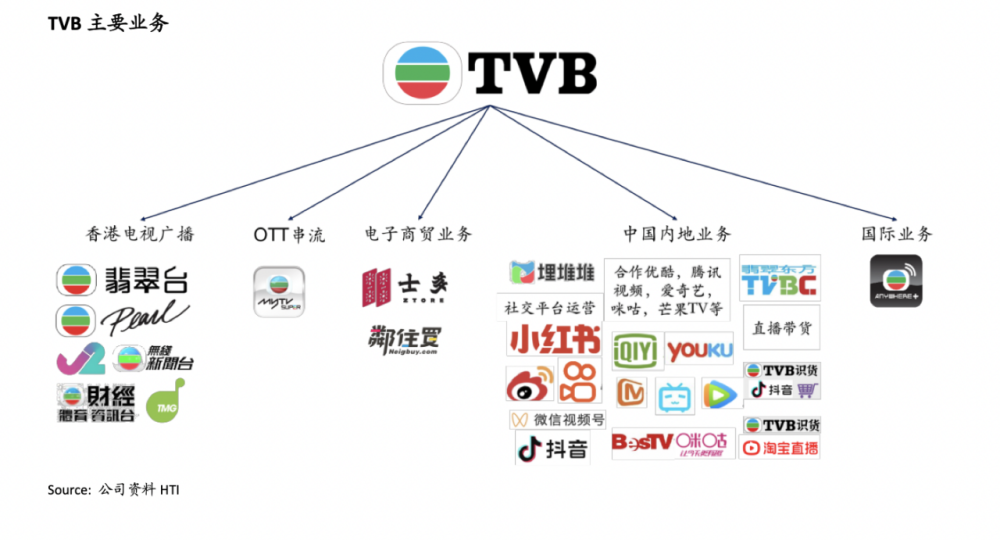
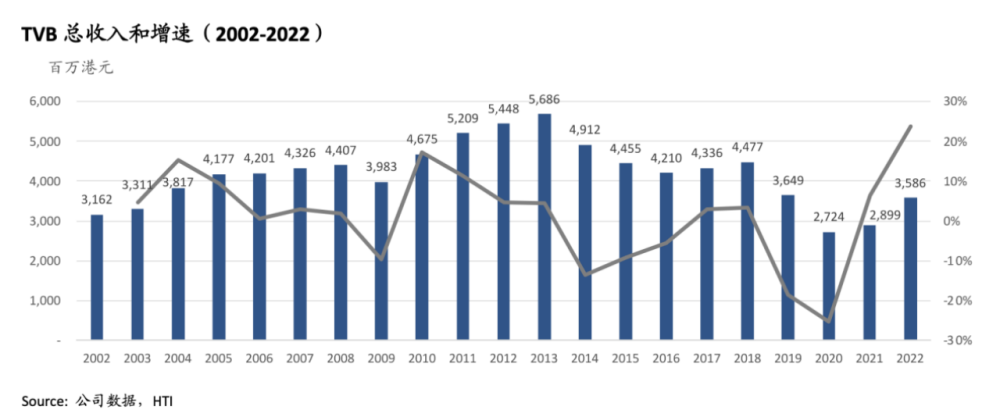

# 《新闻女王》出圈，TVB却仍在寒冬：连续五年亏损，宣布裁员超300人

最近，香港电视广播有限公司（TVB）的新剧《新闻女王》成功出圈，豆瓣评分高达8.2分，相关话题也多次登上微博热搜。

就在网友感叹56岁的TVB“宝刀未老”时，很快又传来TVB裁员的消息。

红星资本局注意到，11月27日晚间，TVB在港交所公告，董事局宣布重组电视广播和电子商贸业务，合计削减逾300人，相当于6月底雇员总数3599名的8%；同时，财报显示，目前TVB已经连续5年亏损。

种种迹象都表明，曾经辉煌一时的TVB，如今面临着经营层面的困难，而这背后，又是何种原因？

**（一）**

**业绩持续滑坡**

TVB，全称为香港电视广播有限公司，是香港首家商营无线电视台，成立于1967年，1988年在港交所上市，股票简称电视广播（00511.HK）。

从营收结构来看，TVB主要有电视广播、OTT串流、电子商贸、中国内地业务以及国际业务这五项业务；以2022年营收计，以上业务对营收的贡献分别为36%、10%、24%、19%、11%；可见电视广播、电子商贸、中国内地业务对营收的贡献较大。

具体到各业务所指范围，电视广播是指TVB在香港5个免费电视频道提供服务，赚取广告收入，以及艺人经纪服务和音乐娱乐和出版等业务。

OTT串流业务，指在香港OTT App myTV SUPER内提供广告和会员订阅服务。

电商业务，指在香港通过士多和邻住买，前者售卖家居生活百货，后者社区团购；内地则是通过抖音和淘宝直播带货。

中国内地业务，指与内地流媒体公司联合制作和授权发行影视和综艺内容，通过埋堆堆App在内地发行内容，赚取会员订阅收入，并在内地多个社交媒体平台运营账号，提供MCN服务。

国际业务，指在海外发行电视广播、视频和新媒体内容，在海外App TVB Anywhere内提供会员订阅和广告服务。

财报显示，今年上半年，TVB实现营收15.6亿港元，同比下降14.28%，多项业务相比去年同期均有所下滑。

其中，今年上半年中国内地业务营收3.13亿港元，同比下跌了22%。财报中解释称，是由于2023年合拍剧及同步剧的档期大多集中于下半年。

上半年，电商业务营收从上年同期的4.61亿港元减少至2.71亿港元，同比降低了41%。财报解释，主要是随着香港消费者恢复疫情前的购物习惯，加上疫情相关商品需求相应下滑。

净利润方面，今年上半年，TVB亏损4.07亿港元，同比大降81.34%。此外，TVB近年来已经深陷亏损泥潭，2018年至2022年，TVB归母净利润连续五年为负，累计亏损超22亿港元。

为了缩减开支，今年以来TVB密切开展裁员动作。

半年报数据显示，上半年TVB缩减了255名（相当于6.6%）员工，总务及行政开支等也下降。今年11月TVB公告显示，重组电视广播和电子商贸业务，合计削减逾300人，相当于6月底雇员总数3599名的8%。

二级市场来看，截至11月30日，电视广播收盘价为3.31港元/股，总市值为14.51亿港元，相比其巅峰时期市值已缩水超90%。

**（二）**

**“病”从何起？**

TVB为何会出现当下困境？作为一家电视媒体，其商业模式主要还是围绕内容生产与流量变现而展开。

收入层面，如果把时间线拉长，在2002年-2013年期间，TVB进入了一段高速发展期，营收从31.62亿港元增长至56.86亿港元；此后营收便开始不断下滑，2020年总营收来到27.24亿元，收入已经腰斩。

而这背后的本质，是TVB作为老牌电视媒体，内容生产的影响力在近几年明显降低，因此通过流量获取的收益也开始直线下滑。

以TVB的广告收入为例，在2014年达到39.98亿港元的高峰后便持续降低，2019年为21.49亿港元，2020年进一步降至10.76亿港元。

导致TVB内容影响力下降的原因，也是多方面的。

一方面，近年来互联网迎来快速发展，消费者的观看习惯也发生了深刻变化。

如今，用户开始习惯通过电脑、手里上的流媒体平台等新媒体渠道获取娱乐和信息，这使得TVB在传统电视板块收视率不断下滑，广告收入也随之减少。

另一方面，TVB的竞争环境也十分激烈。

近年来，内地的影视行业迎来快速发展，大量的新媒体公司和影视制作公司涌入市场，市场百花齐放，带来了更加丰富多元的影视内容。

此外，从自身出发，TVB也存在内部管理老派、优质人才流失等种种问题。

总的来说，多因素叠加导致TVB收入开始下滑，而收入的下滑，又直接影响企业的成本控制，尤其是内容成本控制。

而过度的成本控制，又会影响内容生产质量，影响后期收益，从而让TVB陷入收入与投入的“死循环”中。

早在2021年4月，时任香港TVB董事局非执行董事黎瑞刚在接受媒体采访时也表示：“这么多年TVB就是一个观点，只知道省钱，只讲控制成本，不思考战略，没有发展眼光，一路惯性，不布局未来增长动力。”

**（三）**

**直播带货，能否打开TVB新市场？**

面对不断下滑的影响力，TVB在经营模式上也在不断寻求创新。比如近年来直播带货兴起，TVB也积极进入赛道想要分一杯羹。

2022年4月，TVB开始在抖音上运营TVB识货（港式甄选）账号，当年5月开启TVB识货（港式严选）和TVB识货（美味甄选）两个账号。

来源：抖音

今年3月，TVB宣布入局淘宝直播，以官方账号（TVB识货）合作的模式，由旗下众多艺人轮流进入官方号直播。淘宝提供货品支持与流量引入，TVB旗下艺人联动平台，配合站外宣发和引流。

首播两场，TVB一线明星(陈豪、马国明、陈敏之等)为主播，爆款影视IP《冲上云霄》和《溏心风暴》，分别在3月7日和3月30日进行，为消费者带来了一波“回忆杀”。数据显示，首场直播观看人次485万，GMV（商品交易总额）为2350万元，第二场观看人次690万，GMV为7320万元。

不过，市场也有观点认为，消费者可以一时为情怀买单，但TVB也很难通过情怀牌吸引消费者的长期关注。

说到底，直播带货考验的是主播个人魅力、直播间选品、产品价格、售后服务等多方面，单纯的情怀难以构建TVB直播带货的长期竞争力。

从今年上半年财报来看，企业电商业务营收大幅下滑，也说明直播带货对于TVB来说或许同样是块“难啃”的骨头。

**小结**

显然，对于TVB来说，拍好电视剧仍是当下首要任务，只有重新构建起自己的行业影响力，才能实现更稳定更长远的发展。

近期的《新闻女王》算是一个好的开头，后期TVB还需要用更多的优质作品来证明自己。

红星新闻记者 刘谧

编辑 余冬梅

