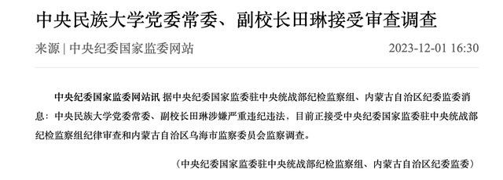

# 中央民族大学党委常委、副校长田琳接受审查调查

**中央纪委国家监委网站讯**
据中央纪委国家监委驻中央统战部纪检监察组、内蒙古自治区纪委监委消息：中央民族大学党委常委、副校长田琳涉嫌严重违纪违法，目前正接受中央纪委国家监委驻中央统战部纪检监察组纪律审查和内蒙古自治区乌海市监察委员会监察调查。（中央纪委国家监委驻中央统战部纪检监察组、内蒙古自治区纪委监委）

**【来源：中央纪委国家监委驻中央统战部纪检监察组、内蒙古自治区纪委监委】**

