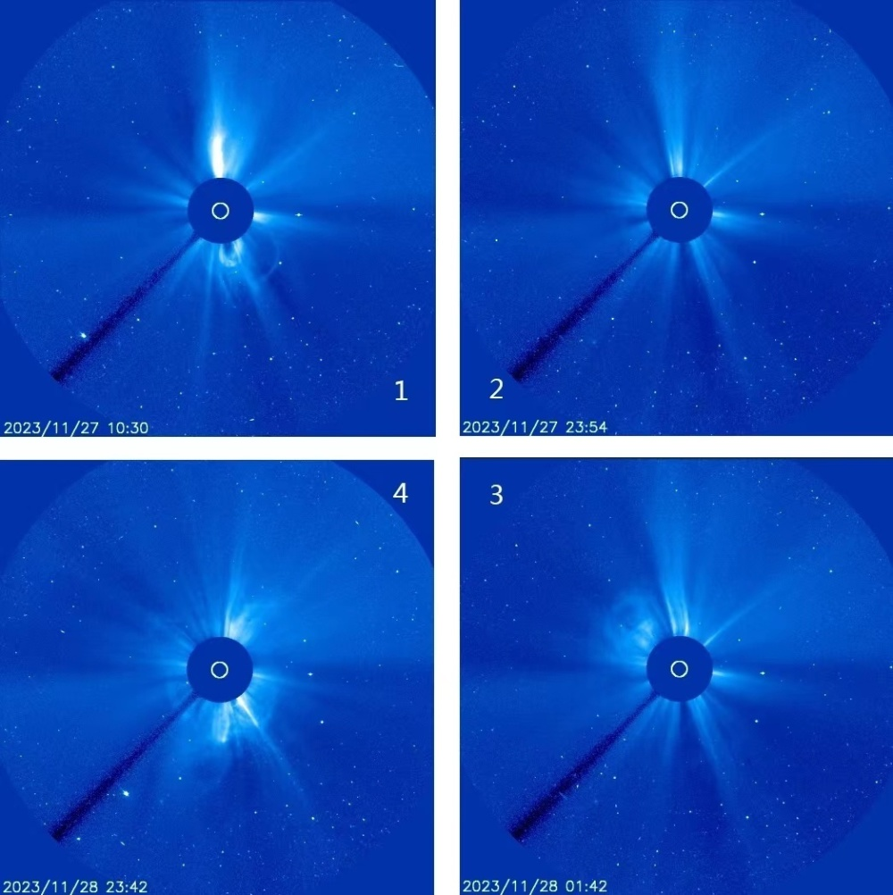
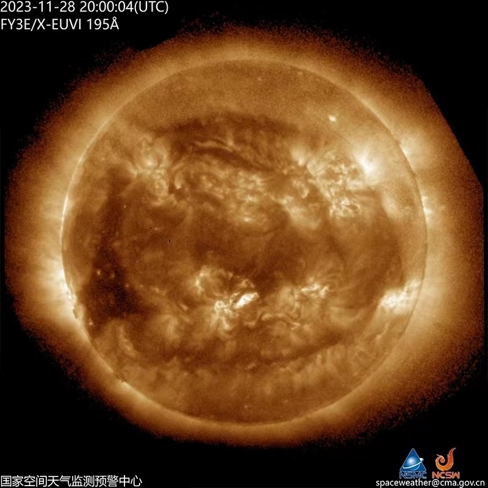

# 信鸽玩家和极光爱好者注意！中国气象局发布大地磁暴预警

据央视新闻消息，根据中国气象局空间天气中心监测，12月1日、2日，我国将可能出现地磁暴活动，其中12月1日可能发生中等以上地磁暴甚至大地磁暴，预计地磁活动将延续到12月2日。在此影响之下，空间站可能因大气拖拽造成轨道高度下降，卫星导航设备误差增大，航空飞行将面临通信环境变差和跨极区辐射的双重风险，对于公众，尤其是信鸽玩家和极光爱好者，未来几天要时刻注意空间天气信息。

（总台央视记者 吴薇 谷星月）

编辑 陈艳婷

