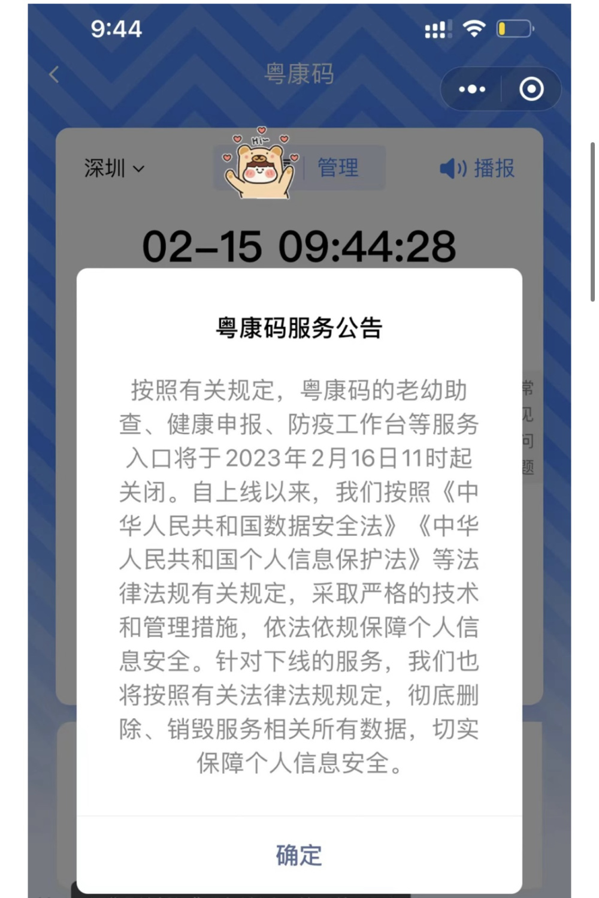

# 呼吸道传染高发期，有城市“绿码”被曝重出江湖？工作人员回应

顶端新闻首席记者 张逸菲

12月1日，有网友在网上爆料，各地已下线近一年的“绿码”在个别城市重现。恰逢各地呼吸道疾高发，“绿码”出现，是什么信号？

**一地绿码重现，工作人员称没事**

根据网友提供的图片，四川天府健康通、广东地区粤康码都显示“绿码”，实时时间均为12月1日下午5时左右。

顶端新闻记者通过微信小程序搜索广东政务小程序“粤省事”，首页左上角即为粤康码，但需验证身份。

 _网络传言和图片_

广州市民小冯登陆粤省事，发现确实能查到粤康码为“绿码”，“只是需要查询才能看到，没有疫情时查找容易。”

随后，她又通过广州市民常用的小程序穗好办查询健康码，发现也能查到，“很神奇，我记得健康码已经下线了。”

顶端新闻记者通过查询，发现早在2023年2月16日，粤康码就已下线，公告中称：针对下线的服务，我们也将按照有关法律法规规定，销毁服务相关所有数据，切实保障个人信息安全。

已下线近一年的绿码，重现“江湖”意味着什么？

顶端新闻记者以市民身份分别拨打广州市卫健委和市长热线，卫健委工作人员称，此事不由其管辖。

市长热线工作人员称，自己查询时，也能看到“绿码”，并询问是否对生活和出行产生影响。在得知并无后，工作人员说，“(疫情)已经过去了，没有事。”

顶端新闻记者通过支付宝查询健康码发现，界面显示：您访问的应用河南健康码已停止服务。

_曾经的公告_

