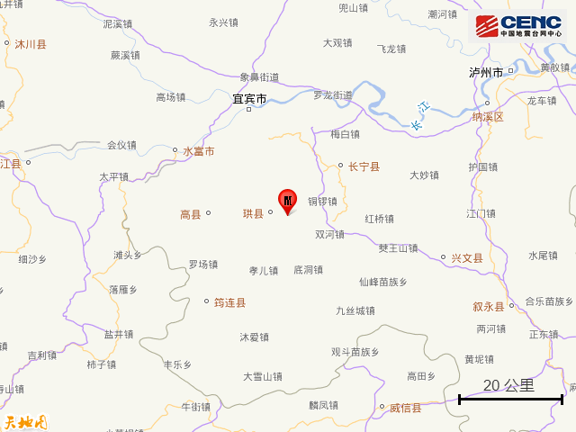
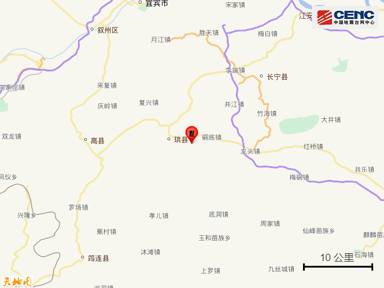
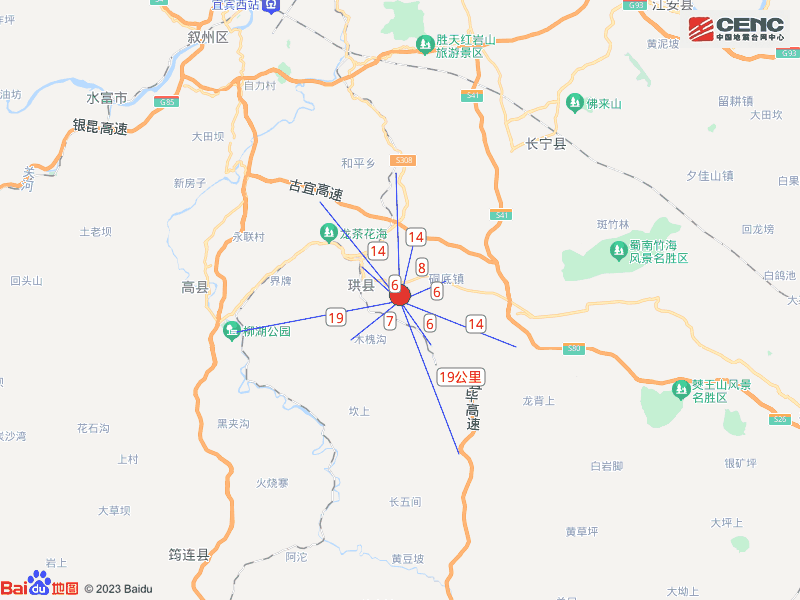
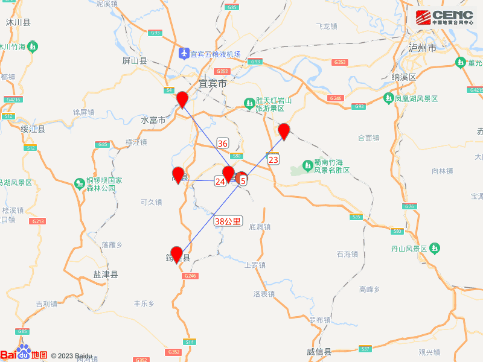
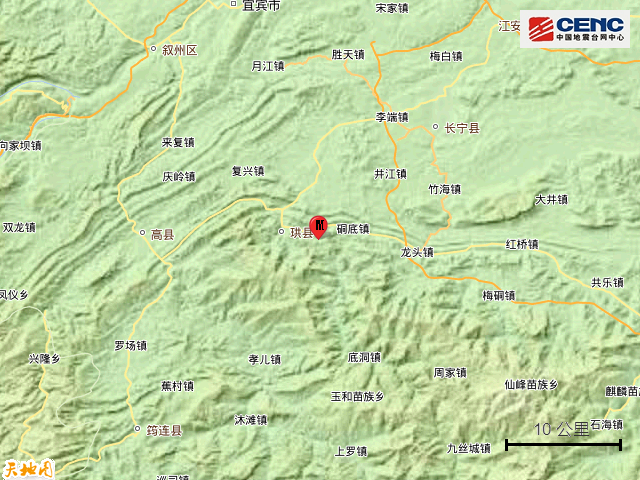
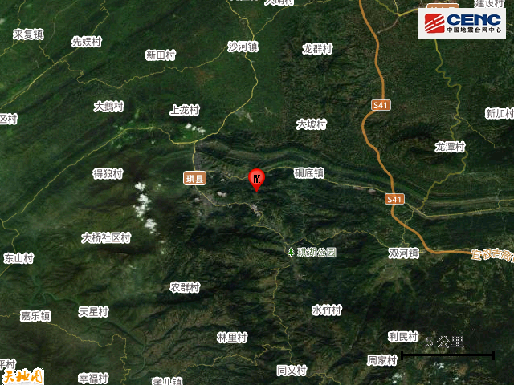
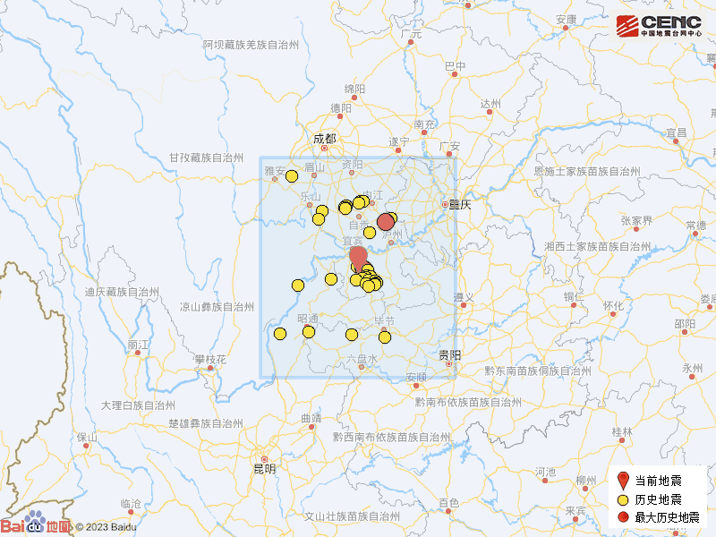

# 四川宜宾市珙县发生3.8级地震，震源深度8公里

据中国地震台网正式测定，12月1日4时36分在四川宜宾市珙县发生3.8级地震，震源深度8公里，震中位于北纬28.43度，东经104.76度。

本次地震周边5公里内的村庄有新房子、白岩村、鱼池村、廖家沟、过路田、四合头、白岩铺、沙心头、汪家村、罗村，20公里内的乡镇有硐底镇、巡场镇、珙泉镇、仁义乡、花滩镇、双河镇、复兴镇、沙河镇、底洞镇、文江镇。

震中距珙县5公里、距长宁县23公里、距高县24公里、距叙州区36公里、距筠连县38公里，距宜宾市38公里，距成都市248公里，距重庆市215公里。

震中5公里范围内平均海拔约568米。

根据中国地震台网速报目录，震中周边200公里内近5年来发生3级以上地震共308次，最大地震分别是2021年9月16日在四川泸州市泸县发生的6.0级地震（距离本次震中103公里）和2019年6月17日在四川宜宾市长宁县发生的6.0级地震（距离本次震中17公里），按震级大小前50次历史地震分布如图。

