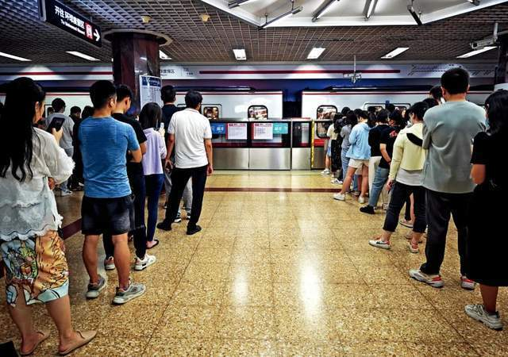
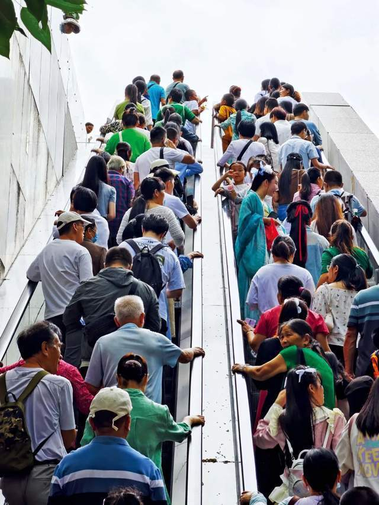

# 地铁普遍亏损背后：最赚钱的为何是武汉

今年，一些城市地铁刮起了“开源节流”风。

9月起，广州和佛山正式告别了“满15次后打6折”的地铁票价累次优惠。新方案实行“满额优惠”，普通乘客在一个自然月内，乘坐广州地铁公交累计实际支出票款满80元不满200元部分享受8折优惠，超出200元部分享受5折优惠。

按上班族每月工作22天、往返搭乘44次地铁计算，当单程票价超过9元时，乘客才能在新方案中享受更大优惠。对大多数普通打工人来说，地铁“暗中”涨价了。

杭州和北京则分别在节能上下功夫。今年4月起，杭州地铁公告，部分站点自动扶梯仅于工作日上下午开启。有网友调侃，“杭州地铁电梯率先实现了8小时工作制，还双休”。为节能减排，北京地铁6号线一期20座车站公共区更换了照明灯具。据估算，仅此一项改造，每年能节约520万度电，减少二氧化碳排放3141吨。

各大城市地铁在今年的频繁动作，都与“降本增效”密切相关，绝大多数城市地铁去年都亏了不少钱。截至2022年末，国内共有41座城市开通了地铁。从上海清算所、中国债券信息网等平台查询到，至少32个城市的地铁公司公布了2022年的业绩，扣除政府补助，仍实现盈利的城市仅有5个。

今年以来，多地地铁项目被叫停，再次引发人们对地铁建设与运营成本的关注。然而，放眼全球，90％的地铁线都在亏钱，对城市地铁运行效果的评判，也远不止能否盈利这一个指标。

_7月3日，乘客在北京地铁一号线内候车。本文图/视觉中国_

**地铁那么挤，为什么还亏钱？**

如果评选最“挤”地铁，北京地铁6号线、上海地铁9号线、广州地铁3号线和深圳地铁5号线，恐难分伯仲。

据中国城市轨道交通协会统计，以2019年数据来比较高峰期的拥挤度，北京地铁6号线、上海地铁11号线、上海地铁9号线、北京地铁4号线和上海地铁1号线分列前五名。其中，北京地铁6号线堪称最“挤”，高峰小时断面客流量最高，达到了6.32万人次。

当乘客被巨大的人流推进车厢，被迫与陌生人脸贴脸时，很难想象，很多拥挤的地铁居然是亏钱的。

翻开全国各大城市的地铁公司业绩，仅从归母净利润单一指标来看，除兰州、沈阳外，其余城市在大力补贴后，去年均实现盈利。但据时代周报等媒体统计，如果扣除财报中“与日常活动相关的政府补助”的“其他收益”，广州地铁“亏了”4.56亿元，杭州地铁“亏了”87.55亿元。

归母净利润排名第一的北京地铁“落差”最大。北京基础设施投资公司（下称京投）控股北京两家地铁运营公司，其官网及财报显示，2022年，公司归母净利润达到21.82亿元，是32个城市中唯一利润超20亿元的城市地铁运营商。不过，北京地铁的“其他收益”也即政府补助，达到262.86亿元，两相减除后，北京地铁扣除补助净利润为-241.04亿元，成为了唯一亏损超百亿的城市地铁。北京一直都是地铁补贴和亏损较大的城市，2021年京投运营的北京地铁获得补贴214.66亿元，扣除补贴亏损190.12亿元。

不含有轨电车，截至2022年底，北京地铁现有25条路线，由三家公司运营，分别为北京市地铁运营有限公司、北京市轨道交通运营管理有限公司、北京京港地铁有限公司。前两家是由北京基础设施投资公司（下称京投）控股，京港地铁则是港铁和北京首创集团的合资公司。

亏损如此之大，与地铁高运营成本相关。以北京市地铁运营有限公司为例，2022年主营业务成本115.55亿元，最大支出为人工成本（工资及相关费用），花费60.67亿元，占比超过一半。其次是业务成本，其中直接修理费成本较高，达到19.62亿元，直接电力、安检费用均超过13亿元，安检支出直接占主营业务成本的10％以上。

“人工成本是地铁日常运营成本中占比最高的部分，其次是能耗成本，生产维修及其他成本占比则相对较低。”杭州市地铁集团工作人员季欢在《地铁运营成本控制分析与启示》中指出，人工成本受地铁运行情况影响较大，以发车时间间隔为例，缩短发车时间间隔可以提高乘客的出行效率，但也需因此配备更多乘务及生产检修等工作人员，在一定程度上提高了每公里人员配置水平，进而影响该线路人工成本及运营总成本。

城市轨道交通建设本身就有前期投资高、回报期长的规律，一公里地铁造价在数亿元。城轨协会印发的《城市轨道交通发展战略与“十四五”发展思路报告》显示，2019年全国轨道交通企业运营成本（不含大修更新）的中位数为1126.15万元/公里，进入大修更新期的北上广深等轨道交通企业运营成本超过1500万元/公里。

不只是北京，深圳、武汉、济南等城市地铁的运营成本也一路走高。以郑州为例，其2022年地铁营业总收入6亿元，营业总成本81.38亿元，相差超过70亿元。常州、济南、杭州、重庆、宁波等20座城市2022年营收总成本较2021年增长超过10％。值得注意的是，常州、济南地铁公司成本增幅超过了200％，杭州、重庆地铁公司成本增幅超过了100％。

北京交通大学国家交通发展研究院副院长李红昌对《中国新闻周刊》分析，去年地铁运营成本普遍上涨与疫情防控有一定关联。大多数城市地铁并未停运，投入了大量防疫设备及人员等刚性支出。此外，地铁班次减少所节约的能耗有限，而养护工作如常，养护维修成本不会因此降低。而部分城市地铁运营成本大幅上涨，则主要由于地铁网络扩张，里程增加，运营投入也相应增加。

中国城市轨道交通协会发布的《城市轨道交通2022年度统计和分析报告》显示，去年共新增城轨交通运营线路长度达1080.63公里，北京、天津等20个城市均有新线或新段开通运营。其中，杭州新增174公里，排名全国第一。此外，深圳新增里程达136.11公里，重庆、福州等城市地铁增量也超过50公里。

收入来源单一，是不少城市地铁亏损的另一个重要因素。由于种种原因，北京地铁极少配有地下商业，地铁上盖商业的站点比例也非常低，往往出站后还要步行十几分钟才能抵达商圈。地铁票价是最主要的营收来源之一，但相对巨额成本来说，往往也是杯水车薪。

2022年，京投控股的两家地铁公司票款收入达46.24亿元，除以约10亿人次的客流量，相当于平均每位乘客的票价为4.6元。但两家公司的人均运营成本却高出几倍，分别为12.54元（地铁运营公司）和33.20元（轨道交通运营管理公司），这意味着，每乘坐一次这两家公司运营的地铁线路，政府就要分别补贴约8元或29.6元。

北京地铁起步票价经过多次调整，2000年曾上涨至3元，但在2007年又下降至2元。2014年，北京地铁票价再次上调至3元，同时建立了“每年一小调，五年一大调”的价格动态调整机制，明确增幅不高于北京市人均可支配收入的增幅。照此推算，2024年北京地铁票价将进入“五年一大调”的周期，不过目前北京市暂未公布相关计划。

“轨道交通是城市基础设施，本身的公益性决定了其票价偏低，市民可承受能力是价格底线，不可能完全按照市场方式定价，修建地铁也不是为了追求高盈利和高回报。”李红昌分析。

数据显示，2022年，北京地铁运营公司负责17条线路的运营，乘客人均运营成本为12.54元。京港地铁运营5条线路，乘客人均运营成本为20.64元。北京轨道公司运营3条线路，乘客人均运营成本最高，达到了33.20元。综合三家公司数据，北京地铁全网乘客的人均运营成本为14.32元，是平均票价的3倍多。

客流数据方面，据交通运输部发布的年度城市轨道交通运营数据速报，2022年，北京轨道交通（包括地铁）客运总量22.62亿人次，比2021年的30.66亿人次下降了22.62％。客流强度不足，又缺乏多元化业务支撑，大多数城市地铁公司只剩下依靠政府补贴这一条出路。

“世界范围内，也只有香港等极个别城市可以靠票价实现主营业务盈利。”李红昌分析，不考虑折旧等固定成本，平均票价收入基本能覆盖变动成本的65％，也就是说，客流多少并不能改变“票价收入无法覆盖成本”的亏损本质，“城市地铁集团赚钱，并不靠主营业务，而是副业”。

**票价不涨，地铁靠什么盈利？**

2019年，深圳地铁票价也曾陷入涨价风波。虽然最终决定暂不调整，但日常通勤族很快发现，深圳地铁多个站点打上了其自身开发的楼盘销售广告。

深圳地铁集团2022年报显示，公司实现经营收入239.76亿元，同比增长46％，实现全成本口径核算下实现利润总额23.29亿元，净利润8.66亿元。其盈利秘诀就是娴熟运用了“轨道+物业”的TOD模式。

该模式最早由美国建筑师彼得·卡尔索普提出，他认为城市高密度增长应当以公共交通为导向进行规划发展。换言之，就是以城市轨道交通为核心，高密度开发距核心半径距离
1000 米的区域，将核心区域开发建设成为多功能社区，使其可以满足居民居住、工作、休闲娱乐等多项需求。

港铁是全球少数几个实现盈利的城市地铁公司之一，也是TOD模式的“代言人”。过去40年，除2020年因封关影响亏损48亿港元外，港铁其余每年都在盈利。其2022年财报显示，公司营收478.12亿港元，归母净利润达98.27亿港元，同比增长2.9％。其中物业发展业务除税后利润达到了104.8亿港元。

 _11月12日，深圳地铁出站的乘客。_

港铁盈利的最大功臣，并非日常客运，而是其物业租赁及管理业务。地铁建造投资高，但带来的外延经济效益也显著，车站建成后，四周地价升值，“轨道+物业”模式的关键就是利用这份经济效益。港铁可管理物业，获得租金收入（物业租赁业务），也可出售楼盘，获得利润（物业发展业务），因此也常有人说“港铁其实是家从事地铁业务的房地产开发公司”。

与香港毗邻的深圳也是最早引进TOD模式的内地城市。深铁集团下属企业深圳地铁置业集团有限公司（简称深铁置业）负责站城开发业务，2022年，深圳地铁在站城一体化方面营收160.48亿元，在地铁公司中金额最高。

深铁集团年报显示，过去一年，公司“站城一体化开发”收入同比增长约68％，占公司总营收的66.9％。2017年以来，深铁置业已连续六年位列深圳市房地产开发企业综合实力前三甲，2022年跃居榜首。公司连续八年房地产销售额过百亿元，开发体量、销售业绩均处第一梯队。

相比之下，深铁集团2022年的地铁运营收入约为37亿元，较2021年减少近2亿元，仅占公司总营收的15.4％。深圳地铁当前盈利模式中，地铁运营业务持续亏损，投资收益及站城开发收益是弥补地铁运营亏损的主要手段。

不过，深圳TOD模式的成功存在一定特殊性，其土地资源较少，房价维持高位，但后续投资盈利能否继续维持当前的高回报、高增长存在不确定性。2022年，深铁集团在保持营收大幅增长的情况下，净利润缩水七成，仅有8.66亿元。叠加新开路线等因素导致的运营成本飙升，企业利润被大幅摊薄。

根据时代周报等媒体统计的32个城市地铁公司业绩表，扣除地方政府补贴后，仍有武汉、深圳、济南、上海、常州5个城市盈利。深圳排名第二，与“最赚钱”的武汉相差近10亿元。

2022年，武汉地铁归母净利润为15.7亿元，其他收益为0.87亿元，扣除补助，仍有14.83亿元盈利，是目前公布的32个城市中唯一除补助净利润超10亿元的城市。

对武汉地铁来说，资源一级开发收入与票款收入是武汉地铁主要业务。据年报显示，2022年，武汉地铁票款收入为31.27亿元，相较于54.12亿元的投入成本，净利润为-22.85亿元。但武汉地铁资源一级开发的收入为53.94亿元，成本为23.26亿元，净利润达到30.68亿元，反哺了地铁业务，扭亏为盈。

“武汉地铁同样采用的是TOD模式。”武汉大学城市设计学院院长李志刚告诉《中国新闻周刊》，武汉从2014年开始探索该模式，从规划角度看，武汉地铁TOD与深圳的差异是，将轨道交通与武汉都市圈建设相结合，利用轨道交通快运、量大、精准的特点，将“武鄂黄黄”四座城市的人口、资源要素衔接，从而提高人口规模、消费规模，提高“轨道+物业”营收的可持续性。

2022年，常州地铁杀出重围，扣除0.1亿元的其他收益，净利润为0.36亿元。属于二线城市的济南，2022年净利润增幅达191％，其最大推手也是“TOD模式”。早在济南第一条地铁还未开通时，济南轨道交通集团高层就曾对媒体表示，济南的轨道交通是朝着盈利的目标去奋斗的，力争地铁建设以及地铁运营不给政府欠下一堆债务。具体做法是“土地资源开发收益平衡地铁建设投入，物业开发和股权投资收益弥补运营亏损”。去年，济南市土地储备中心发布了《济南市TOD综合开发项目推介》，将再建21个TOD城市综合体。

在地铁盈利案例中，上海独树一帜，通过多元副业实现盈利。上海申通地铁集团是上海轨道交通投资、建设和运营的责任主体，并负责市域铁路线路的运营管理。据其财报显示，2022年贡献最大的是“融资租赁与商业保理”业务。上海申通地铁2022年度营业总收入为3.43亿元，其中融资租赁公司营业收入为0.76亿元，占全年营收的22％。另外，上海申通地铁还布局了光伏产业与充电桩产业，其下属的新能源公司在2022年度营业收入为0.28亿元，虽只占全年营收8％，但同比增长了74％。

除常规的开源节流的办法，去年实现盈利的武汉、深圳和济南都不约而同地加大了研发投入，以提高资源效率。年报数据显示，2022年，深圳地铁的研发费用达到1.16亿元，同比增长27％。武汉地铁研发费用910万元，同比增长85％。济南轨道交通研发费用为2602万元，增长了86％。

在传统模式下，每条新建线路的业务系统均独立建设信息化系统，建设成本高,资源利用率不足50％，数据孤岛严重，大量设备占用地铁车站宝贵的地下空间。地铁公司投入研发，推动智慧城轨建设，也是希望以此降本增效。

“地铁公司进行多元业务探索的前提是政府政策支持与优质资源注入，国内大多数城市未必具备这样的条件。”李红昌说，基于地铁的公益属性，多数地铁公司的票款与商业收入难以覆盖成本，自我造血能力不足，对政府补贴的依赖程度依旧较高。“不过，地铁亏钱在世界范围内都是常态。”

**亏损会放慢修地铁吗？**

各地争建地铁的热情并未被“亏损”阻挡。随着上一轮建设周期接近尾声，新一轮地铁建设申报工作已经开始。

今年7月，备受关注的深圳市轨道五期建设规划获批，规划线路11条，总长185.6公里，总投资1952亿元，跨市线路将突破行政区界，延伸至东莞。

不只是一线城市，常州第三条地铁路线已经开工建设。据不完全统计，包括芜湖、兰州、南通、太原、哈尔滨、大连等30多个城市开启了新一轮地铁建设规划报批或前期研究工作。

建设城市轨道交通是有门槛的。2015年，国家发展改革委基础司曾在发布会上表示，城市的GDP要超过1000亿元，财政收入要超过100亿元，市区主城区人口超过300万人以上，预测的客流强度每公里要3万人以上才能够修地铁。

2018年国务院《关于进一步加强城市轨道交通规划建设管理的意见》（下文简称《意见》）出台，进一步提高了门槛。根据《意见》，城市想要修地铁，地方GDP和财政收入分别需达到3000亿元和300亿元，是此前的3倍。

对中小城市来说，地铁不但能带来新的城市人口、产业，还能带动地价上涨，很多城市甚至县城也兴起建地铁热潮，不惜负债也要申报修建地铁。对“兜里”没那么多钱的城市来说，提高门槛，是对地方负债率的遏制。按照《意见》，对负债风险高的城市的审核必然趋于严格。

《意见》明确规定，地铁路线初期的客流强度至少要达到0.7万人次每日每公里，远期客流规模达到单向高峰小时3万人次以上。而如果严格按照《意见》要求，可能一批已建地铁城市的新申请也要被拦在门外。据中国城市轨道交通协会统计，2022年地铁客流强度超过及格线的城市只有广州、深圳、上海、北京、南京、沈阳、成都、西安和长沙。

今年以来，不少城市的地铁规划项目缩水，有分析将原因指向地铁亏损。“亏损可能是原因之一，但不是唯一，更不是最重要的因素。”李红昌分析，如出现“地铁线路缩水”的情况，大多出现在建设规划阶段，而不是项目规划期间。就建设规划而言，整个申报审批流程的每个环节都有诸多要求，如准备齐全详细的客流预测、环境评估、社会稳定性评估等等文件，才能开始层层向上报批，经过市、省、国家的多个部门和专家的评估后，“如砍掉部分线路，也是多种因素叠加的结果”。

“城市修建地铁并不只计算主营业务本身的得失，更要算经济大帐。”李红昌举例说，地铁修建本身就是一笔巨额投入，能有效拉动经济增长，同时促进当地产业的规模化发展，还能有效缓解城市地面交通拥堵问题，实现节能减排，提高城市影响力、竞争力。

地铁终点往往就是城市核心向外延展的边缘。中国交通运输协会新技术促进分会专家委员解筱文曾表示，地铁作为城市公共交通基础设施，具有重要的社会服务功能，甚至重要到了必不可少的程度。“虽然当前亏损，但从长远看，地铁建设产生的资产却是优良和稀缺资产，不仅不应该贬值，更是增值的优良资产。所以，不能单纯以狭义的效益和是否盈利来考量”。

记者：李明子

编辑：闵杰

