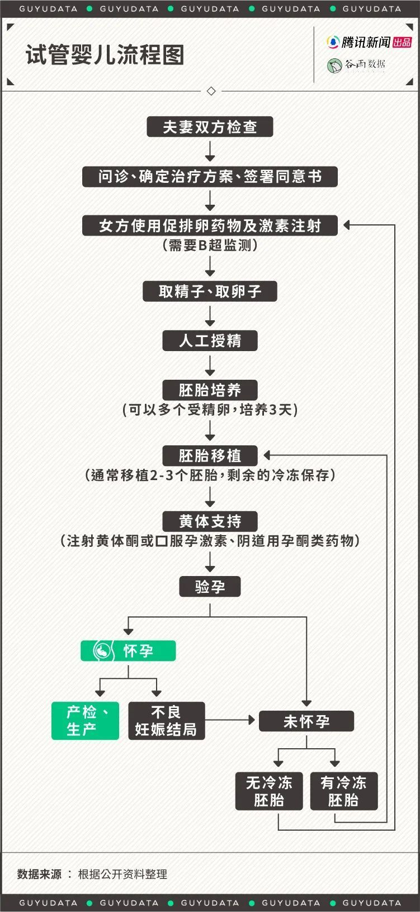
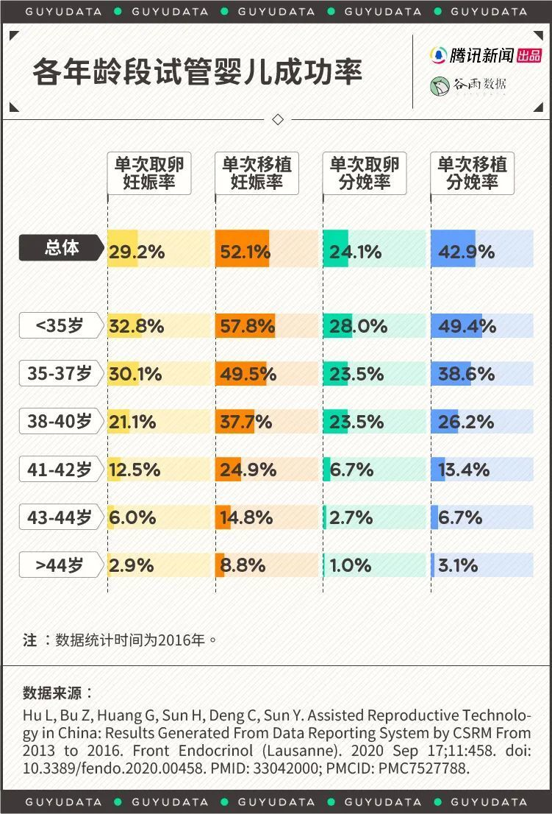
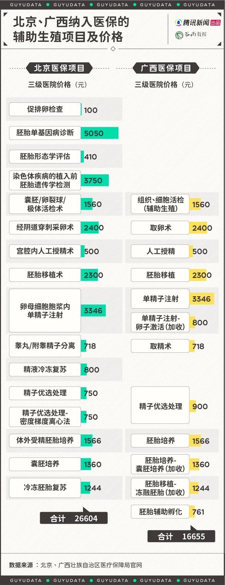

# 多地宣布试管婴儿纳入医保，不孕不育夫妻的春天来了？

今年11月，广西继北京之后，宣布试管婴儿中的部分治疗项目可以医保报销。这对于想要孩子的不孕群体来说，无疑是一个好消息。

但实际上，在不孕夫妻决定做试管婴儿过程中，远不止是时间、费用与身体上的压力，他们的生活也会有重大的影响，过程之中还有很多目前无解的问题……

有多少人需要试管婴儿

根据北京大学第三医院发起的全国育龄人群生育健康监测数据，我国育龄人群的不孕率在2007年为11.9%，到了2020年，则上升到了17.6%。

**不过，在目前的不孕不育的群体中，真正去做了试管且坚持到最后的，还是少数。**

据国家卫健委，近年来，我国每年辅助生殖技术的总周期数超过100万，出生婴儿数超过30万。如果按照每年出生的新生儿1000万左右来计算的话，试管婴儿的比例大约只占3%。

不孕不育人群中，女性输卵管因素导致的不孕、男性不育、女性卵巢功能衰竭，或是不明原因的不孕不育，一般才会被医生建议选择试管婴儿。

试管婴儿又分为三代。其中，使用最多的是一代试管婴儿，主要针对输卵管堵塞、排卵障碍等女性不孕的情况。二代试管婴儿对症的是少精症、弱精症等男性不育问题的情况。到了第三代试管婴儿，在前两代的基础上增加了胚胎进行遗传学诊断的环节，成功率高于前两代，但费用相对更高、可以选择的医院也更少。适合多次流产、试管多次染色体异常、存在单基因病遗传病、罕见病的情况。

做试管婴儿从确定治疗方案到胚胎移植，一个周期大概只需要2到3个月。但是，前期的摸索可能会耗费很长的时间，包括确定医院的选择，再到一步步进行检查、确诊不孕不育，再到决定做试管的合适方案，都需要时间。

单就确诊不孕不育、确定方案前的检查来说，女性就比男性要复杂得多，其中比如监测排卵、输卵管通畅、激素检查等，还需要在经期前后的不同特定时间来进行。

而整个试管婴儿流程中，除陪同外，男性去医院的次数一般在3次左右，而女性几乎需要从头到尾参与每一步检查和治疗，单在促排期间就常常需要天天去医院。

做试管一次成功的幸运儿少之又少，更多人需要面对2、3次甚至更多次的努力。如果中途失败，需要重复进行胚胎移植。而如果没有存储多个受精卵，则要从头开始再进行促排卵、取卵取精。

**试管婴儿做上3次才成功，其实是再正常不过的事。**

一个发布于2020年的研究显示，中国第一代试管婴儿的成功率是43%左右。分各个年龄段来看的话，最年轻的35岁以下年龄段，单次移植能进行到顺利分娩的比例也不到50%。如果按照取卵次数来算，平均每次取卵的顺利分娩比例不到30%，所以实际操作中也通常会一次取卵多个。

试管婴儿的价格，劝退了不少人

在无医保或保险报销的情况下，第一代试管婴儿，每周期花费大约在3万-4万元，第二代则是5万-7万元/周期，至于可以排查基因缺陷、成功率更高的第三代试管婴儿，一个周期至少需要8万元以上的花费。

而大多数人需要2-3次尝试才能成功，中间需要重复从胚胎移植或促排卵开始的步骤。

根据《中国辅助生殖研究报告2023》，最多的不孕不育夫妻放弃辅助生殖治疗的原因就是由于价格因素，比例高达55.7%。其次则是担心试管的成功率不高，有接近50%的人为此放弃辅助生殖。

最多人接受的价格是在3万元以下，还不够现在第一代试管婴儿做一个周期的费用。

今年7月，北京把试管婴儿中的16个治疗项目纳入医保报销的范畴。11月，广西也宣布试管婴儿中的12个治疗项目可以医保报销。另外，辽宁、浙江等省份也已经表态计划要把试管婴儿纳入医保。

纳入医保项目的总费用，北京大约是2万6千，广西则是1万6千。城镇职工可以报销这部分费用中70%的比例，城乡居民则是50%的比例。

这当然是一个好消息，但医保报销的范围仍然有限。即便是北京的医保中，也不包括促排卵的进口药物。

还有一个限制是，广西的医保，只限定了报销2个周期的费用。也就是说，如果2次没能成功生育，第3次开始就需要自费了。

试管的过程，也带来了相当大的压力

做试管婴儿的过程，除了费用和成功率，还需要担心很多事情。

就说选择医院和医生，真的是一门学问。相对于求子心切，医院是不是离家近、交通便利的考虑都要往后放一放了。尤其是对于已经尝试过试管婴儿，但是多次经历胎停或者流产，需要做第三代试管的不孕夫妻来说，可以选择的医院就有限了。

如果选择私立医院，服务和环境更好，排队时间相应会少，也有同样有明星医生。不过随之而来的问题是增加的费用。

试管纳入医保之前，公立和私立的费用相差不大。比如在西南证券的研报中，北京某私立医院的第二代试管婴儿价格是一个周期合计43106元。但是随着辅助生育的项目在北京等地纳入医保，自付部分的价差会更明显。

甚至也有夫妻选择出国。泰国、日本、美国都是可能的目的地。在小红书上，有卵巢衰退的高龄试管妈妈辗转看遍了医生，从内地到香港，去过泰国，又转战日本。香港、泰国都是大剂量激素促排卵，最后选择了日本，疗法更温和，平均就诊年龄有40岁，更具备高龄的亚洲女性促排卵经验。

另外，还有不少想要孩子的女性提到了试管过程中时间精力、上班请假的问题。也不乏备孕妈妈因为试管期间需要频繁请假，领导不批准，只能辞职、再找短期工作维持生计的情况。

以及女性在试管过程中，也需要承担诸多身体上的不适。比如促排卵药物，含有大量激素，不少女性会有头晕恶心的副作用。而取卵手术，相比起取精手术也复杂得多——每一次都需要进行局部麻醉甚至全麻，术后可能会引发卵巢过度刺激综合征，甚至可能会造成下肢的静脉血栓高。

**然而，即便已经很努力付出了时间和金钱，试管的成功与否也某种程度上需要靠运气。因此，更多的情绪压力也随之而来。**

另外有研究表明，显著影响不孕群体生活质量和关系的，不是不孕的年限、年龄，而是性别、城乡、是否接受过辅助生育技术。

女性在试管婴儿的过程中普遍比男性承担了更多的情绪压力。女性本身投入的精力也更多，除此之外，很多女性依旧认为自身需要承担生育责任。尤其是年龄比较大的女性，更容易高度精神紧张，产生对自己身体的自卑心理。

有博主说，“试管最痛苦的事不是打针不是取卵，是做过山车般的心情……做试管期间特别容易多愁善感，试管期间大哭过2次（我很少哭）。第一次养囊的第4天，害怕被告诉囊胎没养成，接到了一个陌生电话后莫名其妙地大哭一场”。

试管婴儿为不孕群体提供了生育的可能性，但这过程注定充满了压力、艰辛和不确定性。尤其对于女性，一旦选择了试管，就不得不变成勇士，在看不到未来的路上勇往直前。希望随着科技的进步，女性可以拥有真正的生育自由：想生就生。

作者｜Heather 设计丨镝数卢瑞丰 编辑丨赤耳

出品丨腾讯新闻 谷雨工作室

腾讯新闻出品内容，未经授权，不得复制和转载，否则将追究法律责任。

