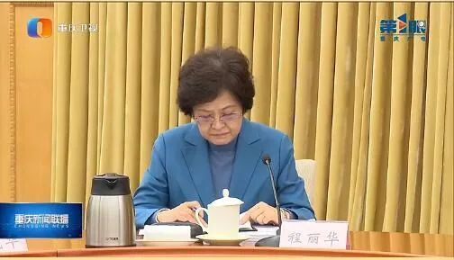
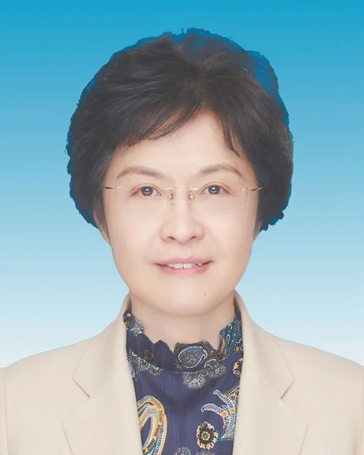

# 安徽省委副书记程丽华，赴重庆履新

 _重庆新闻联播截图_

据重庆新闻联播12月1日报道，12月1日下午，重庆市委常委会举行会议，市委书记袁家军主持会议并讲话。重庆新闻联播画面显示，程丽华出席会议。重庆市市长胡衡华和程丽华，坐在市委书记袁家军两侧。

程丽华，女，汉族，1965年4月生，中央党校研究生，中共党员。

程丽华是二十届中央委员。此前任安徽省委副书记，省委党校（安徽行政学院）校长（院长）（兼）。

来源：人民网安徽频道、重庆新闻联播

编辑：何钱源

