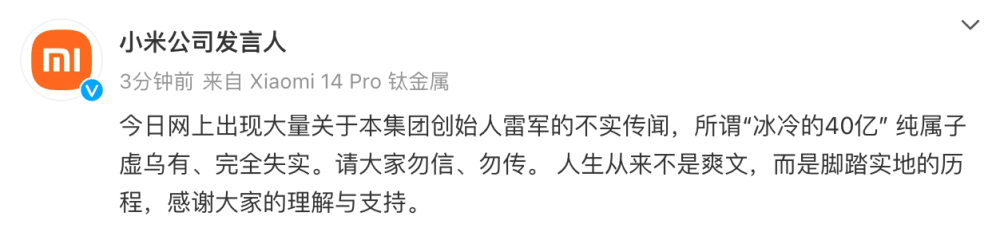
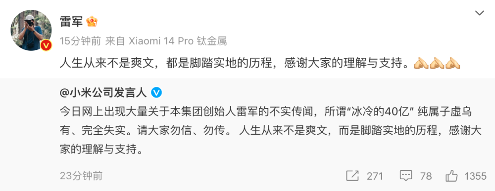

# 小米公司：所谓雷军“银行卡冰冷的40亿”传闻，纯属子虚乌有完全失实

腾讯科技讯 12月1日消息，小米公司发言人在官微上表示，今日网上出现大量关于本集团创始人雷军的不实传闻，所谓“冰冷的40亿”
纯属子虚乌有、完全失实。请大家勿信、勿传。 人生从来不是爽文，而是脚踏实地的历程，感谢大家的理解与支持。

随后，雷军也转发了该内容，并配文表示：人生从来不是爽文，都是脚踏实地的历程，感谢大家的理解与支持。

_此前网传图片_

今日，网上突然出现大量“冰冷的40亿”传闻，其中提到雷军在金山公司时期，“银行卡里只剩下冰冷的40亿”。此事迅速引发热议，还一度登上热搜。

