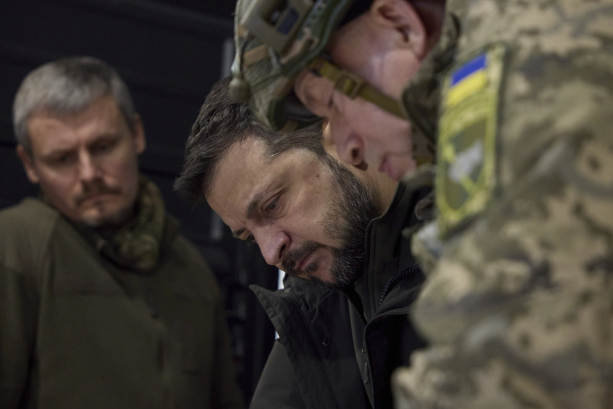
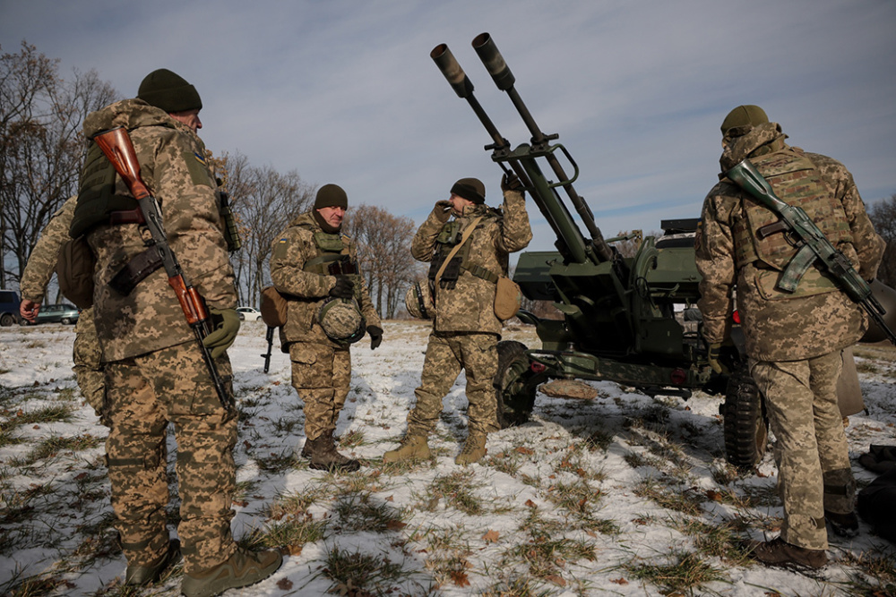
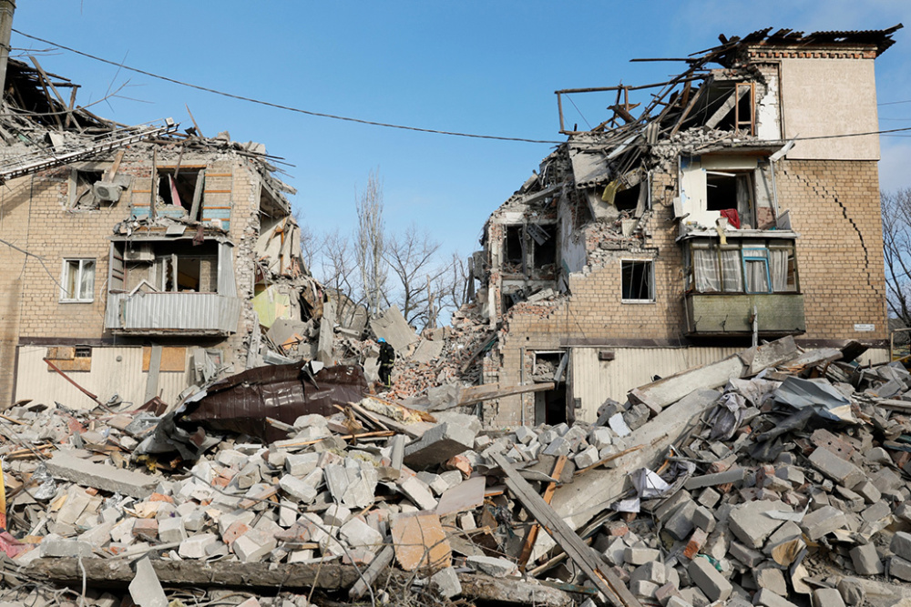

# 巴以问题使俄乌冲突失焦？泽连斯基：“不再是焦点”对俄方有利

据参考消息网12月1日援引日本共同社11月30日报道，乌克兰总统泽连斯基于11月28日在首都基辅的总统府会见了亚洲国家的部分媒体，明确表示“只要俄罗斯不从乌克兰撤军，乌克兰就不会同意停战”。

_当地时间2023年11月30日，乌克兰哈尔科夫州库皮扬斯克，乌克兰总统泽连斯基对前线指挥所进行视察，了解了目前作战情况并向士兵们授勋。本文图均为 澎湃影像
图_

**泽连斯基承认：夏季反攻行动未取得“令人满意”的结果**

当地时间11月30日，泽连斯基在乌克兰的哈尔科夫接受美媒采访时承认，乌克兰的夏季反攻行动“并没有产生许多人所希望的结果”，原因是乌克兰“没有从盟友那里得到所希望的武器”，导致乌克兰地面部队处于不利地位。

“我很满意，因为我们在与全球排名第二的（俄罗斯）军队作战时没有退缩。”泽连斯基随后补充道：“然而，我们的军队人数正在减少，这让我不满意。我们没有得到想要的所有武器，但我也不能抱怨太多。”

泽连斯基表示，冬季的到来标志着乌克兰与俄罗斯长达21个月的作战将迈入新阶段。严寒天气不仅会影响前线战场，还会影响城镇平民的生活以及粮食出口。泽连斯基预计，俄罗斯将对乌克兰采取猛烈的空袭行动，并表示此类行动在去年摧毁了乌克兰关键的民用基础设施，影响了该国的水电供应。

 _当地时间2023年11月30日，乌克兰基辅附近，俄乌冲突持续，乌克兰防空部队士兵坚守阵地。_

**乌克兰冬季反攻行动成效有待观望**

俄乌战争已经持续超过600天，乌克兰国内陆续出现质疑泽连斯基政府反攻行动成效的声音。

据参考消息网援引俄新社11月30日报道，泽连斯基在当天举行有关修筑防御工事和沿该国与俄罗斯和白俄罗斯边境全线建立加强防线的会议。乌克兰最高拉达（议会）议员阿列克谢·贡恰连科对此评论说，这表明乌军事实上在前线已陷入“无路可走”的境地，被迫转入防守而且再也无法继续发动进攻。

贡恰连科承认，俄罗斯军工复合体正在以“疯狂的速度”发展。他表示，在目前形势下，资源决定一切，“接下来将由俄罗斯出招”。

此前，乌克兰最高拉达议员玛丽亚娜·别祖格拉娅说，乌武装部队总司令瓦列里·扎卢日内和乌军所有将领均应受罚，原因是反攻失败且拿不出继续开展作战行动的计划。她还说，乌军总司令未提出明年的任何计划，“这样的领导人应当下台”。

除了国内的质疑声音，北约内部在援乌问题的分歧恐将进一步影响乌克兰反攻行动的成效。据中新网11月30日援引俄罗斯塔斯社11月29日的报道，匈牙利外交部长彼得·西雅尔多在北约外长会结束后的记者会上表示，乌克兰的反攻计划“已经失败”，并表示北约国家在乌克兰援助问题依然存在分歧。西雅尔多还特别强调，“必须尽一切努力避免北约与俄罗斯发生直接对抗”。

_当地时间2023年11月15日，顿涅茨克地区，当地遭俄军导弹袭击，住宅楼被摧毁。_

**泽连斯基誓言绝不停战**

11月28日，泽联斯基在接受媒体采访时表示，鉴于巴勒斯坦局势混乱，俄乌冲突“不再是（国际社会的）焦点”，目前出现了对俄方有利的局面。

针对欧美部分国家提出的“停战论”，泽连斯基表示，停战类似于“砍下自己的手交给别人”，直言乌克兰“无意以割让领土为代价获得和平”。

泽连斯基表示，只要俄罗斯军队留在乌克兰，在这种情况下的停火只相当于“冻结”冲突状态，导致俄罗斯有时间重新恢复战力，准备下一步的军事行动。据参考消息网援引日本共同社11月30日的报道，泽连斯基称“俄罗斯并不寻求和平”。

然而，据此前报道，俄罗斯总统普京曾表示，俄罗斯从未拒绝与乌克兰进行和平谈判。据环球时报11月24日援引俄罗斯“论据与事实”新闻网站23日的报道，
俄总统普京在11月22日出席G20领导人视频峰会时发表讲话称，“公开宣布退出和平谈判进程的不是俄罗斯，而是乌克兰。非但如此，乌克兰总统还签署了禁止与俄罗斯举行此类谈判的总统令。”

报道称，泽连斯基不仅坚决反对俄乌停战的倡议，还呼吁各方赞同他提出的要求俄军立即撤退的“和平方案”。泽连斯基透露，相关国家已经围绕和平方案召开了三次国际会议，他希望在明年1月发起第四次会议，并在之后举行首脑会晤并用半年时间起草一份“现成的文件”，目的是借助国际协议的力量，迫使俄罗斯撤退。

