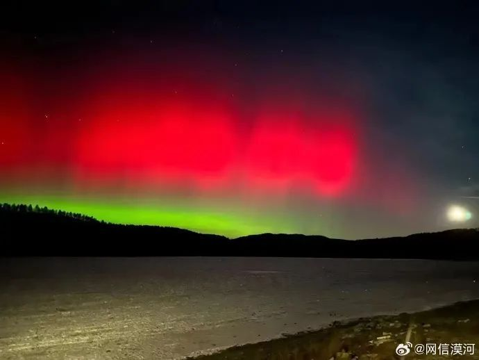
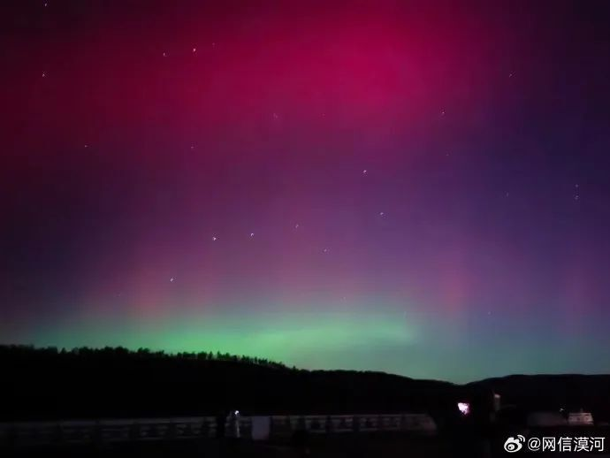

# 罕见！东北多地出现极光，中国气象局发布大地磁暴预警，未来几天注意

12月1日19点，黑龙江漠河北极村出现极光，许多网友在社交平台晒出拍到的极光照片。

极光是一种等离子体现象，主要发生在具有磁场和大气的行星上。地球上的极光是由于来自磁层和太阳风的带电高能粒子被地磁场导引带进地球大气层，并与高层大气中的原子碰撞造成的发光现象。极光最常见的颜色为绿色，此外还有红色、紫色等。

据@中国气象爱好者，太阳风暴正在给高纬度地区带去大范围极光，黑龙江北部、内蒙古呼伦贝尔等地今晚再次记录到极光！就连大庆也有人拍摄到红色极光！今夜东北的朋友可以留意天空，理论上最南到北京也能看到微弱的极光。

据此前媒体报道，11月5日夜至11月6日凌晨发生磁暴活动，黑龙江大兴安岭、新疆多地出现绚丽的极光。其中黑龙江漠河拍摄到的极光格外震撼，画面中红色与绿色极光交相舞动，姿态万千。据悉，这为我国首次视频记录到绿色极光舞动。

中国气象局发布大地磁暴预警

未来几天请注意！

根据中国气象局空间天气中心监测，12月1日、2日，我国将可能出现地磁暴活动，其中12月1日可能发生中等以上地磁暴甚至大地磁暴，预计地磁活动将延续到12月2日。在此影响之下，空间站可能因大气拖拽造成轨道高度下降，卫星导航设备误差增大，航空飞行将面临通信环境变差和跨极区辐射的双重风险，对于公众，
**尤其是信鸽玩家和极光爱好者，未来几天要时刻注意空间天气信息。**

来源：网信漠河、新华社、人民日报、@中国气象爱好者、央视新闻

