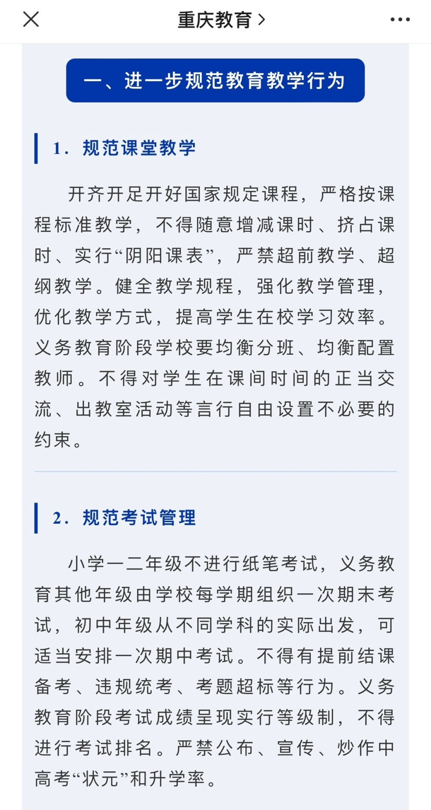

# 重庆市教委严禁中小学给家长布置作业：可电话举报，违规者取消评先评优资格

11月30日，重庆市教委印发《关于进一步规范普通中小学办学行为的通知》（下称《通知》），就进一步规范普通中小学办学行为提出要求，其中包括严禁给家长布置作业，严禁要求家长检查、批改作业。

《通知》还提到，对违反规定的区县教育部门、学校、教师和个人，取消市级评先评优资格。

 _《关于进一步规范普通中小学办学行为的通知》图/重庆市教会基教处_

《通知》印发后，有家长留言称，“我都不知道写了多少份心得了，开一次家长会要写一次，参加一次实践活动要写一次心得。这个政策非常好，值得全国推广。”“我们下班回家要辅导孩子，时不时还要做手工手抄报，完成各种打卡，家长也缺少休息时间。”“老师除了备课授课，还有其他繁重的任务，不如多留点时间给老师，专心教学。”

12月1日，重庆市教育委员会值班室的工作人员表示，该《通知》印发之日起，重庆市中小学一律按照文件要求规范办学行为，“如遇到学校让家长检查和批改作业的情况，可直接拨打市教委值班室的电话举报，说明学校名称和相应情况，我们会联系学校处理。”

**《通知》全文如下：**

**【1】规范教育教学行为：不得约束学生在课间出教室活动**

规范课堂教学。开齐开足开好国家规定课程，严格按课程标准教学，不得随意增减课时、挤占课时、实行“阴阳课表”，严禁超前教学、超纲教学。健全教学规程，强化教学管理，优化教学方式，提高学生在校学习效率。义务教育阶段学校要均衡分班、均衡配置教师。不得对学生在课间时间的正当交流、出教室活动等言行自由设置不必要的约束。

规范考试管理。小学一二年级不进行纸笔考试，义务教育其他年级由学校每学期组织一次期末考试，初中年级从不同学科的实际出发，可适当安排一次期中考试。不得有提前结课备考、违规统考、考题超标等行为。义务教育阶段考试成绩呈现实行等级制，不得进行考试排名。严禁公布、宣传、炒作中高考“状元”和升学率。

规范作业管理。加强作业设计指导，鼓励布置分层、弹性和个性化作业，坚决克服机械、无效作业，杜绝重复性、惩罚性作业。全面压减作业总量和时长，确保小学一二年级不布置书面家庭作业，小学三至六年级书面作业平均完成时间不超过60分钟，初中书面作业平均完成时间不超过90分钟。统筹作业管理，教师要认真批改作业，不得要求学生自批自改作业。严禁给家长布置或变相布置作业，严禁要求家长检查、批改作业。

规范作息时间。小学上午上课时间一般不早于8:20，中学一般不早于8:00。学校不得要求学生提前到校参加统一的教育教学活动，对于个别因特殊情况提前到校的学生，学校应提前开门、妥善安置。合理安排寄宿制学生就寝时间，小学生就寝时间一般不晚于21:20，初中生一般不晚于22:00，高中生一般不晚于23:00。保障小学、初中、高中学生睡眠时间分别不少于10小时、9小时、8小时。严禁寒暑假、节假日统一组织学生补课或上新课。

规范体育活动。课堂教学、课外训练和竞赛活动一体化推进，帮助学生掌握1-2项运动技能。每天安排不少于30分钟的大课间体育活动，保障学生每天校内1小时体育活动时间。每年至少开展1次全员运动会和全员体育竞赛活动。建立学生体质健康电子档案，定期发布中小学生体质健康情况，及时开出个性化运动处方，确保学生体质健康水平全面提升。

规范课后服务。充分利用课后服务时间，着重指导学生完成书面家庭作业，组织学科教师进行课业答疑和个别辅导。开展丰富多彩的科普、文体、艺术、劳动、阅读、兴趣小组及社团活动等，为学有余力的学生拓展学习空间。严禁学校利用课后服务时间讲授新课、变相补课。

规范从教行为。持续加强师德师风建设，严禁教师组织、参与有偿补课，或为校外培训机构和他人介绍生源、提供学生及家长信息等。严禁在教育教学活动中不公正对待学生，体罚和以侮辱、歧视等方式变相体罚学生。

规范教辅选用。坚持“一教（科）一辅”原则，学生自愿购买使用教辅材料，不得强制或变相强制学生购买教辅材料，不得代购教辅材料。校本课程原则上不编写出版教材，确需编写出版的应报区县教育主管部门备案。原则上校本课程教材不得跨校使用。鼓励开发运用多形态课程资源。

**【2】规范招生行为：严禁学校自行组织初升高保送工作**

规范招生时间。所有公办、民办义务教育学校每年6月20日同步开展招生录取工作。学校私自提前组织开展的任何招生考试行为均违反招生考试规定。学校提前招生录取的结果和私自与家长、学生签订的录取协议，各级教育部门一律不予认可。严禁学校和个人收取与入学挂钩的保证金等费用。

规范考试组织。所有公办、民办义务教育学校实行“免试就近”入学。任何义务教育学校不得自行或委托校外机构组织幼升小、小升初考试，也不得依据校外机构测试结果开展招生。普通高中招生工作均由市教委或区县教育部门统一组织，严禁学校自行组织初升高保送工作。严禁普通高中学校面向初中未毕业学生提前开展高中课程学习。严禁中学面向小学未毕业学生提前开展初中课程学习。学校自行组织的招生考试结果，各级教育部门一律不予认可。

规范学籍管理。逐步建立全市统一的中小学招生录取平台，并与中小学学籍系统进行数据对接，对平台外违规招收的学生不予注册学籍。加强中小学学籍系统管理，严格实行“一人一籍、籍随人走”，严格学生跨区县就学手续办理，加强问题学籍核查处理。普通中小学不得借读，防止“人籍分离、考籍分离”。

**【3】规范社会事务进校园：比赛不得设置点赞、投票等环节**

规范进校园活动。严禁组织教师、学生、家长参与各类与教育教学无关的问卷调查、信息采集等活动，严禁组织或推荐学生参加未经教育主管部门同意的评优、推优及竞赛活动，严禁对参加活动设置硬性指标、要求学生家长打卡，并依据参与情况对班级、教师和学生进行排名。严禁任何商业广告、商业活动进入中小学校园。所有涉及中小学学校、教师和学生的比赛、评选等活动，原则上不得设置点赞、投票等类似环节，不得将浏览量、粉丝量、人气指数等数据作为评选结果参考指标。

规范课外读物。严把课外读物进校园的“入口关”，防止“问题课外读物”进入中小学校园。进校园课外读物推荐目录要向学生家长公开，坚持自愿购买原则，严禁强制或变相强制学生购买课外读物。任何单位和个人不得在校园内通过举办讲座、培训等活动销售课外读物。受捐赠课外读物要明确来源，由学校或上级教育主管部门进行审核把关。

**【4】规范学校收费行为：班费每学期结算、公开一次**

规范收费政策。严禁擅自设立收费项目、扩大收费范围和提高收费标准，严格执行教育收费公示制度。服务性收费和代收费必须坚持学生自愿和非营利原则，严禁强制或变相强制提供服务并收费，严禁在代收费中获取差价或收取回扣。

规范班费收支。学校要健全班费使用管理制度，指导各班级成立由家长代表、学生代表和教师代表组成的班费管理小组。班费收取应坚持自愿原则，提倡一事一收、一事一结、一事一公开。班费管理实行钱账分离、相互制约、定期结算、定期公开，至少每学期结算、公开一次。不得将班费用于教室电费、试卷等本应由学校承担的学杂费用以及为老师购买礼物等。坚决防止班费成为老师的“小金库”、“自留地”，杜绝高额班费、违规支出。

**【5】压实工作责任：如有违规办学行为，将取消市级评先评优资格**

强化责任追究。各区县教育部门要切实履行好属地责任，各中小学校要切实履行好主体责任，严格对标对表，开展自查自纠。市教委每学年至少开展一次中小学违规办学行为专项检查工作，建立中小学违规办学行为通报督办制度，并逐步将违规办学行为纳入区县经济社会发展业绩考核和区县人民政府履行教育职责评价。对违反规定的区县教育部门、学校、教师和个人，取消市级评先评优资格，并依法依规依纪予以严肃处理。

**九派新闻记者 黄巧文**

**编辑 刘萌 肖洁**

【来源：九派新闻】

版权归原作者所有，向原创致敬

