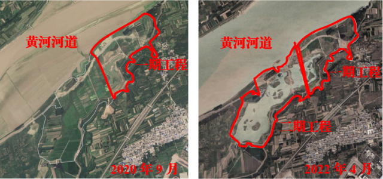
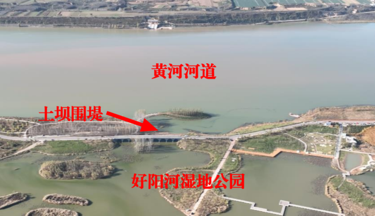
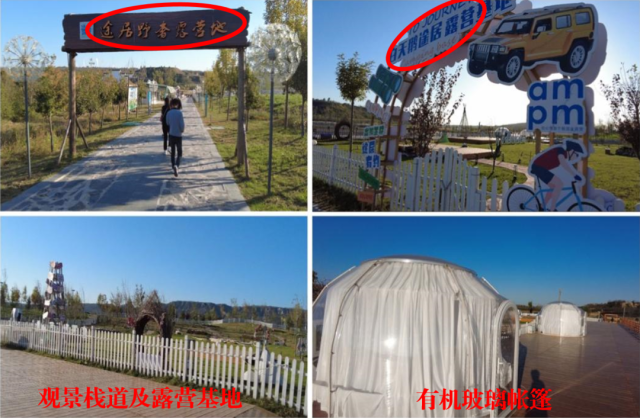

# 中央生态环保督察通报后，河南省长赴三门峡现场督导整改

12月1日，第三轮第一批中央生态环保督察集中公开通报一批典型案例。其中就包括了“河南省三门峡市城乡一体化示范区以生态修复之名违规挖湖造景”案例。

案例提到：河南省三门峡市城乡一体化示范区以河道生态修复之名，违规占用耕地挖湖造景；违反河道管理条例有关规定，阻断黄河干支流正常连通影响行洪安全；违反自然保护区要求建设旅游服务设施。

据“河南发布”微信公众号消息，12月2日，省长王凯到三门峡市督导检查生态环境保护工作，研究部署中央生态环境保护督察公开通报典型案例整改。他强调，要深入贯彻习近平生态文明思想，进一步提高政治站位，压紧压实责任，加强生态保护治理，确保整改工作取得实实在在成效，推动黄河流域生态环境质量持续稳定向好。

王凯深入三门峡市城乡一体化示范区好阳河中央生态环境保护督察反馈问题现场实地了解，认真察看土地复垦、河道治理等情况，并现场研究整改工作。他指出，要严守耕地保护红线，高标准高质量推进土地复垦，确保耕地面积不减少、质量不降低。要巩固拓展河湖“清四乱”工作成果，抓实抓细黄河流域干支流妨碍河道行洪突出问题治理，确保母亲河长久安澜。

随后，王凯主持召开座谈会，听取三门峡市整改工作情况汇报。他指出，要深入贯彻习近平总书记关于黄河流域生态保护和高质量发展的重要讲话重要指示，心怀“国之大者”，坚决扛起政治责任和历史担当，树立正确政绩观，全面彻底完成中央生态环境保护督察反馈问题整改，以实际行动拥护“两个确立”、做到“两个维护”。

王凯强调，要坚持立行立改，完善工作机制，科学严谨制定整改方案，实事求是、依法依规推进问题整改，坚决杜绝形式主义，确保整改成效经得起历史和人民检验。要压实属地和部门责任，深排细查，举一反三，适时开展上一轮中央生态环境保护督察反馈问题整改“回头看”，不断提升生态保护治理水平。要加大政策宣传，引导形成全社会共同关心支持生态环境保护的良好氛围。

根据通报，2023年11月，中央第二生态环境保护督察组督察河南省发现，三门峡市城乡一体化示范区（以下简称三门峡城乡示范区）以河道生态修复之名，违规占用耕地挖湖造景，影响河道行洪安全。

一、基本情况

三门峡市地处黄河中游、河南省西部，是黄河流入中原的第一站，全市黄河段长度为206公里。三门峡城乡示范区于2016年挂牌成立，距市中心城区15公里，规划面积341.3平方公里。好阳河是黄河一级支流，流经三门峡城乡示范区后汇入黄河，其入河口位于河南黄河湿地国家级自然保护区和黄河河道管理范围。

二、主要问题

一是以生态修复之名违规占用耕地挖湖造景。国家2020年9月印发的《关于坚决制止耕地“非农化”行为的通知》（以下简称《通知》）要求，禁止以河流、湿地、湖泊治理为名，擅自占用耕地及永久基本农田挖田造湖、挖湖造景。2020年3月，三门峡城乡示范区在未办理规划许可和建设用地审批手续的情况下，违规启动建设包含好阳河湿地公园的黄河一级支流生态修复项目。在2020年9月《通知》下发时，规划面积约660亩、挖土面积约50亩的湿地公园一期工程正在施工，三门峡城乡示范区不仅未及时纠正违规建设行为，反而于2021年8月继续违规开工建设规划面积约930亩、挖土面积约400亩的二期工程，并于2022年8月全部建成两期工程。在好阳河入黄河口不足10米宽的河道基础上实施大面积开挖作业，严重破坏河道附近耕地、林地等原生地貌，总挖方量约27万立方米，且未经许可违规取用黄河水25万立方米，形成约450亩水面、9个人工岛屿的好阳河湿地公园。国土“三调”及年度国土变更调查数据显示，工程实际违规占用耕地490.77亩，其中包括“三区三线”划定的14.17亩永久基本农田。

_图1 2020年9月与2022年4月好阳河湿地公园区域卫星影像对比图_

_图2 2023年11月5日，督察组暗查发现，违规占用耕地建成的好阳河湿地公园_

二是违规阻断黄河干支流正常连通影响行洪安全。根据《河南省黄河河道管理办法》划定范围，好阳河湿地公园所在的入黄河口区域是黄河的河道管理范围，三门峡城乡示范区未按规定将好阳河湿地公园建设方案报黄河河道主管部门审核，而且违反河道管理条例关于“在河道管理范围内，禁止修建围堤、阻水渠道、阻水道路”等管理规定，在好阳河入黄河口处违规修筑土坝围堤，防止黄河高水位时淹没好阳河湿地公园，从而阻断黄河干流与好阳河正常连通，影响河道行洪安全。

_图3 2023年11月6日，督察组暗查发现，湿地公园项目违规修筑土坝围堤_

三是违反自然保护区要求建设旅游服务设施。好阳河湿地公园约75%的面积位于河南黄河湿地国家级自然保护区实验区。2018年4月起施行的《在国家级自然保护区修筑设施审批管理暂行办法》规定，在国家级自然保护区修筑临时设施和永久设施，应当经国家有关部门审查批准。督察发现，三门峡城乡示范区未经国家有关部门审查批准，擅自在保护区内的好阳河湿地公园建设停车场、钢结构木质平台、有机玻璃帐篷、露营基地、观景栈道、餐饮等旅游服务设施，与自然保护区管理目标明显不符，且其中大部分项目已开始营业。

 _图4 2023年11月5日，督察组暗查发现，好阳河湿地公园内违规建设旅游服务设施_

三、原因分析

三门峡城乡示范区资源节约和生态保护法治意识不强，违规占用耕地挖湖造景，自然保护区和河道管理不到位，相关部门监督管理不力。督察组将进一步调查核实有关情况，并按要求做好后续督察工作。

