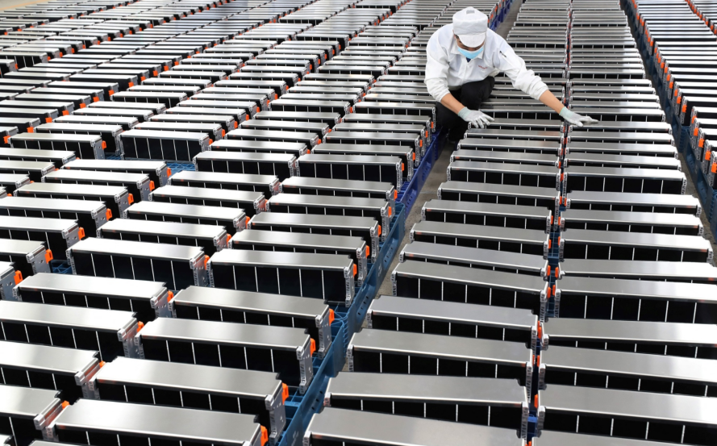

# 又打压！外媒：美国发布电动汽车税收减免拟议新规则，限制中国企业

【环球网报道】据法新社、路透社等多家外媒12月1日报道，美国政府当天发布关于电动汽车税收减免的拟议新规则，对何种电动汽车有资格享受税收减免待遇进行说明，并对电动汽车生产商从中国或其他竞争对手国家采购电池材料作出限制。

报道声称，根据美国财政部等部门周五（12月1日）发布的拟议指南，为加强美国供应链的安全，从2024年开始，符合减免条件的电动车辆不得包含任何由“受关注的外国实体（FEOC）”制造或组装的电池组件，并且从
2025 年开始，符合减免条件的电动车辆不得包含任何由 FEOC提取、加工或回收的关键矿物。

 _中国南京的一家电动汽车电池工厂，一名工人正在整理锂电池 图源：外媒_

报道宣称，新规则旨在落实美国《通胀削减法案》中的相关要求。法案对FEOC的定义包括由中国、俄罗斯或伊朗等国拥有或受其管辖的所有公司。如果一家公司在上述国家注册成立，或者相关国家所有权达到25%的门槛，则该公司可能会被视为FEOC。

法新社称，发布上述指南之际，华盛顿正在努力减少其电动汽车行业对中国的依赖。据美国“政治新闻网”欧洲版12月1日报道，该媒体认为，美国政府这一最新“打压中国”的行为可能会使拜登自身发展电动汽车行业的野心面临风险，因为新规可能会使有资格获得税收减免的电动汽车数量减少，减缓美国汽车行业从化石燃料向新能源的过渡。

美媒称，新的拟议规则将有几周的公众评论期，以听取汽车业界领袖们的反馈，收到业界建议后，新规则有可能被修改。

自去年开始，美国陆续出台《两党基础设施法案》《芯片和科学法案》《通胀削减法案》等法案，其中都包含了歧视性的电动汽车补贴条款，目的就是刺激美国本土新能源汽车发展，并遏制中国车企。今年8月，中国数实融合50人论坛智库专家洪勇接受《环球时报》记者采访时表示，中国在新能源汽车领域的领先地位可能会让一些国家担忧失去自己的竞争优势。因此，它们可能采取保护主义措施，试图限制中国新能源汽车在本国市场的份额。洪勇认为，所谓的“国家安全”只是实施贸易保护主义、用行政手段人为破坏产业链的一种借口。但这种人为干扰市场经济、违反市场规律的行为可能会产生相反的效果，损人不利己，并不利于本国产业发展的长远利益。

