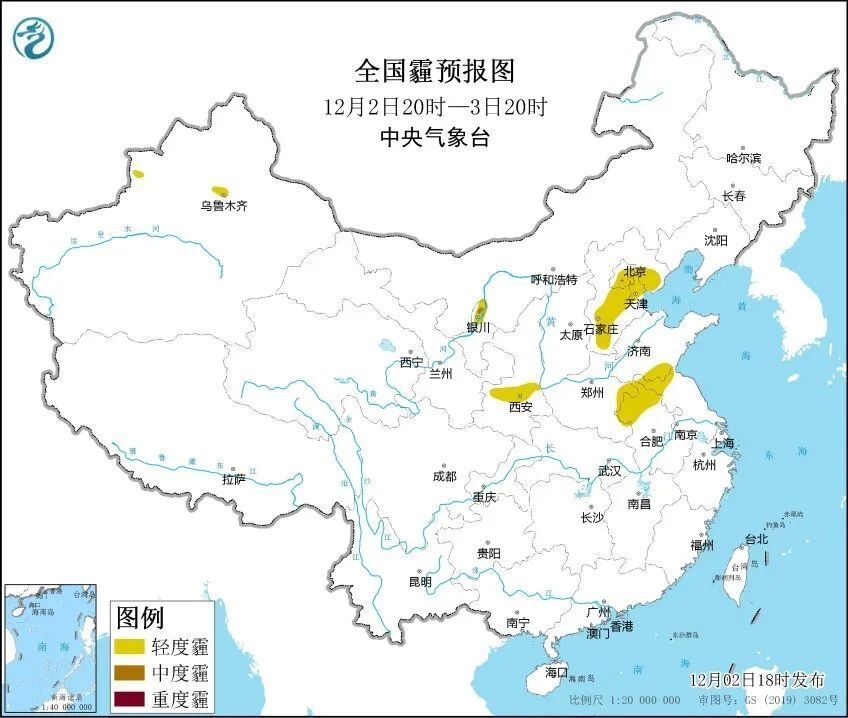

# 局地升温15℃！我国多地将经历12月少见的暖

据国家气候中心最新消息，今年秋季（9至11月），全国平均气温比常年同期偏高1.1℃，为1961年以来同期最高，其中甘肃敦煌等66个国家气象站日最高气温突破或追平当地秋季历史极值。

秋季气温异常，12月开端的这波大回暖浪潮中，多地也可能还要经历同期少见的暖！

昨天白天北方率先迎来升温，今明两天升温范围逐渐扩展至全国多数地方。一派升温景象↓↓

各地纷纷挤进升温群聊，应了此前天星儿说的，群聊被挤爆的节奏。

此轮回暖过程累计升温幅度大、持续时间长，北方5日之前都会保持回暖的态势，南方更是会持续约一周的时间，最高气温累计升幅普遍可以达到6~12℃，贵州、湖南的部分地区升幅可以达到15℃左右。

南方地区最高气温升幅更加明显，北方最低气温升幅比较显著。下周三前后，气温将达到阶段性高点，最高气温10℃线一路北抬到华北中南部一带，最高气温20℃线将再度向北跨过长江，黄淮一带多地最高气温将达到20℃左右。

升温过后，各地气温将普遍回升至较常年同期偏高的水平，郑州、合肥、南京、济南、太原等地或将体验到12月少见的暖意；此时应该进入冬天的杭州，未来几天却暖得不像话。

天气一冷一暖易感冒，小伙伴们要关注气温变化随时增减衣物~

伴随回暖而来的还有见缝插针的雾和霾天气，预计明天至5日，华北中南部、黄淮、汾渭平原等地大气扩散条件较差，有轻至中度霾天气，局地短时重度霾。

至于水汽，主要供给南方，北方空气依然干燥，感受下这干掉“渣”的空气湿度。

未来三天南方阴雨天气还是比较广泛，西南地区东部、江南大部、华南北部等地的部分地区有小雨。

来源 中国天气网

编辑 莫凡

流程编辑 刘伟利

